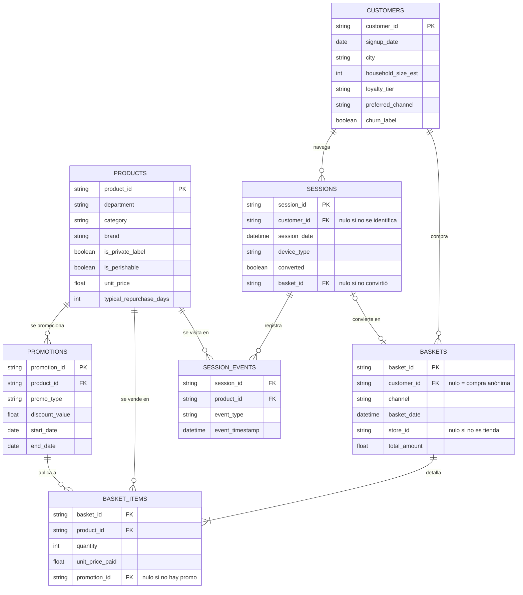

# Grocery Retail — Recommender & Next Best Action

Recomendador de cesta y capa de *Next Best Action* sobre un supermercado online simulado.
El proyecto empieza donde suelen empezar los problemas reales — **no hay dataset**: se
genera, con sus ciclos de reposición, su estacionalidad, su señal de abandono y sus
defectos de calidad deliberados — y sigue con el ETL, el modelado y la comunicación de
resultados, hasta una demo web que enseña el sistema funcionando.

Es la **fase 2 del ciclo de vida del cliente en retail** que empezó en
[`sports-rental-analytics`](https://github.com/DiegoPrieto23/sports-rental-analytics), con
un stack distinto a propósito: allí dbt sobre Databricks, aquí **PySpark** de punta a
punta.

> Todos los datos son **100 % sintéticos**. No contienen información real de ningún
> cliente, producto, tienda ni retailer.

---

## Estado actual

| Fase | Qué es | Estado |
| --- | --- | :---: |
| 0 · Setup | Estructura, entorno reproducible, CI | ✅ |
| 1 · Generador de datos | 7 tablas con reglas de negocio y defectos inyectados | ✅ |
| 2 · ETL y features | Limpieza, Data Trust Score, RFM, recompra, afinidad, EDA | ✅ |
| 3 · Recomendador de cesta | Candidatos (popularidad + co-compra + ALS) → ranker LightGBM | ✅ |
| 4 · Next Best Action | Modelo de propensión + política de valor esperado | ✅ |
| 5 · Empaquetado y storytelling | Impacto en €, informe de hallazgos, MLflow | ✅ |
| 6 · Demo web | Catálogo con fotos reales + Streamlit con la cesta en vivo | ✅ |
| 7 · Fidelidad de producto | Fidelidad de marca en el generador y todo lo anterior rehecho encima | ✅ |

El plan completo, con cómo se verifica cada punto, está en [`ROADMAP.md`](ROADMAP.md), y el
enunciado del reto en [`CHALLENGE.md`](CHALLENGE.md). **Todas las cifras de este README son
las del dataset de la Fase 7**; donde se comparan con las anteriores, se dice.

**Lo que ya se puede enseñar:** 3,1 M de líneas de ticket generadas de forma reproducible,
un ETL en PySpark que las limpia y documenta cada corrección, un Data Trust Score que pasa
de **91,42 (C) a 100,00 (A)**, cuatro tablas de features listas para modelar, un
[notebook de EDA](notebooks/01_eda.ipynb) con 9 preguntas de negocio resueltas en Spark SQL,
un recomendador de cesta de dos etapas que acierta la categoría en el **71,8 %** de las
cestas y el SKU exacto en el **54,2 %** (NDCG@5 graduada = 0,2148 [0,2120, 0,2177]), una política de Next Best
Action que decide en euros, dos documentos que traducen todo eso a negocio — el
[resumen de impacto](IMPACT.md) y el
[informe de hallazgos](reports/insights/business_findings.md) — y una
[demo en Streamlit](#fase-6--demo-web) donde se ve todo funcionando sobre cestas reales.

---

## Cómo reproducirlo

Requiere **Python 3.10+** y una **JVM 17** (PySpark). Con Python 3.13 en Windows hay una
pega conocida: ver [Notas de entorno](#notas-de-entorno).

```bash
python -m venv .venv && .venv\Scripts\activate        # Linux/macOS: source .venv/bin/activate
pip install -r requirements.txt -c constraints.txt

python -m data_generation.generate_dataset            # ~3 min  → data/raw/    (7 CSV)
python -m data_generation.verify_dataset              # comprueba los patrones inyectados
python -m src.etl.run_etl                             # ~4 min  → data/processed/ + reports/etl/
python -m src.recommender.pipeline                    # ~28 min → models/ + predictions/ + reports/recommender/
python -m src.recommender.demo_profiles               # los 4 perfiles, con un caso de cada uno
python -m data_generation.export_oracle               # ~3 min  → data/oracle/ (probabilidades reales de las cestas de test)
python -m src.recommender.verify_recommender_diagnostics  # ~6 min → baselines + techo teórico en reports/recommender/
python -m src.nba.pipeline                            # ~6 min  → models/ + predictions/ + reports/nba/
python -m src.impact.pipeline                         # ~5 s    → IMPACT.md + reports/impact/
python -m src.eda.findings                            # ~1 min  → reports/insights/ (informe + 8 figuras)
python -m src.serving.export_bundle                   # fuentes de candidatos para servir sin Spark → data/serving/
python -m src.catalog.build_assets --offline          # mapeo producto → foto (las fotos ya están en assets/)
streamlit run streamlit_app.py                        # la demo, en http://localhost:8501
pytest                                                # 377 tests
```

El dataset **no se versiona** (`data/` está en `.gitignore`): se regenera con la semilla
fija y sale byte a byte idéntico. Lo que sí está en el repo son los informes de
`reports/`, el notebook ya ejecutado con sus figuras, los dos documentos de negocio
([`IMPACT.md`](IMPACT.md) y
[`reports/insights/business_findings.md`](reports/insights/business_findings.md)) y las
fotos del catálogo en `assets/`, que se descargaron una sola vez de Pexels y no se
regeneran (ver [Fase 6](#fase-6--demo-web)).

Para abrir el notebook hace falta además `pip install jupyterlab`. Y con
`pip install mlflow`, las Fases 3 y 4 registran además cada ejecución como un experimento
— ver [Registro de experimentos](#registro-de-experimentos-mlflow).

---

## Estructura del repositorio

```
grocery-retail-recommender/
├── data_generation/          # FASE 1 — el dataset no se descarga, se genera
│   ├── catalog.py            #   parametrización de dominio: 62 categorías, lealtad, afinidad, estacionalidad
│   ├── generate_dataset.py   #   las 7 tablas + los defectos de calidad deliberados
│   ├── export_oracle.py      #   probabilidades reales de las cestas de test, para el oráculo (fuera de data/raw)
│   └── verify_dataset.py     #   recalcula desde los CSV cada patrón que dice haber inyectado
├── src/
│   ├── etl/                  # FASE 2 — PySpark
│   │   ├── session.py        #   fábrica de la SparkSession (UTC, Arrow)
│   │   ├── schemas.py        #   esquemas explícitos, lectura y escritura
│   │   ├── cleaning.py       #   limpieza de las 7 tablas + traza de lo corregido
│   │   ├── data_trust.py     #   Data Trust Score (Tarea 1)
│   │   ├── rfm.py            #   RFM y segmento por cliente
│   │   ├── repurchase.py     #   due_for_repurchase (Tarea 2)
│   │   ├── affinity.py       #   co-ocurrencia y FP-Growth
│   │   └── run_etl.py        #   orquestador
│   ├── eda/                  # FASE 2/5 — las 9 preguntas de negocio, como funciones
│   │   ├── questions.py      #   Tarea 1: una función por pregunta, con tests
│   │   └── findings.py       #   el informe de hallazgos de la Fase 5
│   ├── recommender/          # FASE 3 — dos etapas
│   │   ├── config.py         #   ventanas temporales, tamaños de pool, hiperparámetros
│   │   ├── splits.py         #   split por cesta, prefijo/target y los 4 perfiles
│   │   ├── candidates.py     #   popularidad, co-compra (SKU y categoría), historial, ALS
│   │   ├── history.py        #   historial del cliente al día de cada cesta (as-of, punto A1)
│   │   ├── formulas.py       #   fórmulas de reposición compartidas por Spark y pandas (punto B2)
│   │   ├── features.py       #   60 features del par (query, candidato) y relevancia graduada
│   │   ├── ranker.py         #   LightGBM LambdaRank
│   │   ├── evaluate.py       #   NDCG@5 graduada (principal), NDCG@5, Recall@5, F1@5, SKU / categoría y baselines
│   │   ├── oracle.py         #   oráculo bayesiano: el techo teórico con los pesos reales del generador
│   │   ├── pipeline.py       #   orquestador
│   │   ├── verify_recommender_diagnostics.py  # baselines + techo teórico, reproducibles (diagnóstico A3/A6/M8)
│   │   └── demo_profiles.py  #   un caso legible de cada perfil
│   ├── nba/                  # FASE 4 — propensión + política
│   │   ├── config.py         #   cortes, catálogo de acciones y TODOS los supuestos
│   │   ├── targets.py        #   las dos etiquetas, construidas por corte
│   │   ├── features.py       #   features de cliente y de cliente × categoría
│   │   ├── propensity.py     #   los dos LightGBM binarios y sus métricas
│   │   ├── policy.py         #   valor esperado, baselines y sensibilidad
│   │   └── pipeline.py       #   orquestador
│   ├── impact/               # FASE 5 — de NDCG y AUC a euros
│   │   ├── config.py         #   los supuestos económicos, todos juntos
│   │   ├── model.py          #   la aritmética, en funciones puras
│   │   └── pipeline.py       #   mide, aplica y escribe IMPACT.md
│   ├── tracking.py           # FASE 5 — MLflow opcional; sin él, no-op
│   ├── catalog/              # FASE 6a — grupos visuales y fotos de Pexels (se ejecuta una vez)
│   ├── serving/              # FASE 6b — inferencia del recomendador sin Spark
│   │   ├── export_bundle.py  #   vuelca las fuentes de candidatos ya ajustadas a data/serving/
│   │   └── recommend.py      #   el mismo top-5 que el pipeline, con pandas
│   └── demo/                 # FASE 6b — lo que la app pinta: catálogo, motivos, cestas reales, aciertos
├── streamlit_app.py          # FASE 6b — la demo (solo dibuja; la lógica está en src/)
├── assets/                   # FASE 6a — 60 fotos + el mapeo producto → foto (versionados)
├── notebooks/01_eda.ipynb    # reconocimiento de tablas + calidad + 9 preguntas de negocio
├── tests/                    # 377 tests
├── reports/etl/              # informes que genera run_etl (versionados)
├── reports/recommender/      # métricas de la Fase 3, demo de los 4 perfiles, baselines/techo y las referencias congeladas
├── reports/nba/              # métricas de la Fase 4, barridos de sensibilidad y la referencia pre-Fase 7
├── reports/impact/           # el detalle numérico de IMPACT.md
├── reports/insights/         # informe de hallazgos de negocio + sus 8 figuras
├── docs/CLEANING.md          # el porqué de cada decisión de limpieza
├── docs/VISUAL_CATALOG.md    # cómo se agruparon los productos y se eligieron las fotos
├── data/{raw,processed,serving}/  # generados, no versionados
├── IMPACT.md                 # el impacto de negocio estimado, en euros
├── DATA_SPEC.md              # esquema columna a columna, crudo y procesado
├── CHALLENGE.md              # el reto
├── ROADMAP.md                # plan por fases
└── CLAUDE.md                 # convenciones del proyecto
```

---

## Fase 1 — Generación de los datos

`data_generation/generate_dataset.py` construye siete tablas relacionadas que simulan dos
años completos de operación (2024-2025) de un supermercado con canal físico y online.

| Tabla | Filas | Grano |
| --- | ---: | --- |
| `customers` | 20.000 | Un cliente |
| `products` | 496 | Un producto (8 departamentos, 62 categorías, 8 referencias en cada una) |
| `promotions` | 300 | Una promoción con su ventana de vigencia |
| `baskets` | 600.174 | Un ticket |
| `basket_items` | 3.103.685 | Una línea de ticket |
| `sessions` | 150.000 | Una sesión online |
| `session_events` | 897.674 | Un evento (`view` / `add_to_cart`) dentro de una sesión |

### Modelo relacional



### La lógica que hace el dato interesante

Un generador que sólo tirase dados daría un dataset inútil: sin correlaciones no hay nada
que aprender y cualquier modelo empataría con el azar. Estas son las reglas que se
inyectan, todas parametrizadas en `catalog.py` con los valores exactos de `DATA_SPEC.md`:

- **Ciclos de reposición.** Cada cliente tiene su propio intervalo por categoría, partiendo
  del típico de la categoría (leche ~6 días, detergente ~45, protector solar ~200),
  escalado por el tamaño del hogar y con ruido gaussiano. La probabilidad de que una
  categoría entre en la cesta crece según se acerca la fecha de reposición.
- **Fidelidad de marca** (Fase 7a). La primera compra de un cliente en una categoría le
  fija una referencia preferida, que repite después con la lealtad de esa categoría: 0,75-0,85
  en las de hábito (café, detergente, champú, pienso) y 0,25-0,40 en las de exploración
  (fruta, snacks, vino). Es lo que hace un cliente real con su leche de siempre, y es la
  señal que un recomendador de SKU necesita. Sin ella, el cliente cambiaba de referencia
  casi en cada compra (ver [Fase 7](#fase-7--fidelidad-de-producto)).
- **Afinidad de cesta.** 10 pares de categorías cuya probabilidad conjunta se multiplica
  cuando la disparadora ya está en la cesta: cerveza→snacks (3,0x), pañales→toallitas
  (4,0x), detergente→suavizante (3,5x)... Es la señal que explota el recomendador.
- **Estacionalidad.** 9 categorías con multiplicador en su mes pico: turrón en diciembre
  (8,0x), protector solar en verano (6,0x), torrijas en Cuaresma (5,0x).
- **Uplift de promoción.** Un producto en promoción triplica su peso dentro de su categoría
  mientras la ventana está activa. Como se aplica encima de la fidelidad de marca, solo
  puede llevarse la parte no fiel de la categoría, y el uplift observado se queda en
  **1,97x** — que es lo que pasa en gran consumo al promocionar contra un hábito.
- **Restricciones de hogar.** Sólo los hogares con bebé compran pañales, sólo los que
  tienen mascota compran pienso. Esto hace que el bloque de bebé sea una señal real y no
  ruido — y tiene una consecuencia medible que aparece en el EDA.
- **Churn progresivo.** A los clientes marcados como abandono se les reduce gradualmente
  frecuencia y ticket en las 6-8 semanas previas a su última compra, en vez de cortar en
  seco. Sin esa rampa, el churn no sería aprendible.
- **Defectos de calidad deliberados.** Duplicados de línea, cantidades negativas,
  categorías mal escritas, nulos, fechas incoherentes y outliers de importe. Son el
  material de trabajo de la Fase 2.

### Reproducibilidad

Semilla fija (`SEED = 42`) propagada a numpy, `random` y Faker, con un generador
independiente por etapa. Dos ejecuciones producen ficheros idénticos, y el manifiesto
guarda el `sha256` de cada tabla. Hay un test que lo comprueba.

`verify_dataset.py` cierra el círculo: recalcula desde los CSV el lift de cada par de
afinidad, el índice estacional, el uplift promocional, los ciclos observados, la
repetición de referencia y la señal de churn, y los compara con el objetivo. Cualquier
cifra de este README sale de ahí o de otro script, nunca copiada a mano de un notebook.

---

## Fase 2 — ETL y feature engineering (PySpark)

`python -m src.etl.run_etl` lee `data/raw`, mide la calidad, limpia las 7 tablas, construye
4 tablas de features y deja todo en `data/processed/` (Parquet) con los informes en
`reports/etl/`.

### Limpieza

El detalle está en [`docs/CLEANING.md`](docs/CLEANING.md) y los recuentos en
[`reports/etl/cleaning_report.md`](reports/etl/cleaning_report.md). Las tres decisiones que
importan:

**1. Corregir el signo antes de deduplicar.** El generador duplica líneas y *después*
invierte el signo de una muestra. Cuando la línea invertida es copia de una duplicada, el
par `(+2, −2)` deja de ser un duplicado exacto y sobrevive a cualquier `dropDuplicates`:

| Orden | Filas resultantes | `(basket_id, product_id)` duplicados |
| --- | ---: | ---: |
| Deduplicar → corregir signo | 3.058.211 | **386** |
| Corregir signo → deduplicar | 3.057.825 | **0** |

**2. Las cantidades negativas se corrigen, no se descartan.** Una devolución real tiene
enfrente la venta que anula. De las 12.314 líneas negativas, sólo 386 tienen una línea
positiva del mismo producto en la misma cesta — y esas 386 se explican por el mecanismo de
duplicados. El 97 % restante no anula nada: son ventas mal firmadas. Descartarlas sesgaría
los ciclos de recompra de la Tarea 2.

**3. `total_amount` se recalcula desde el detalle.** Incluso con la valla de valores
extremos (`Q3 + 3·IQR`), un filtro por IQR marca 3.477 cestas (0,58 %) cuando los outliers
inyectados son 1.192 (0,2 %): dos de cada tres serían cestas grandes legítimas.
Recalculando desde las líneas limpias no hace falta adivinar, y quedan descuadradas
exactamente esas **1.192** — el resto de descuadres los causaban los duplicados y los
signos.

Además: las 82 grafías de categoría se normalizan a las 62 canónicas deduciéndolas del
propio dato (la mayoritaria de cada clave normalizada), sin mirar el catálogo del
generador; se corrigen 58 altas posteriores a la primera compra; y **no se descarta ni una
fila** por tener un nulo legítimo — las 18.000 compras anónimas siguen ahí.

### Data Trust Score (Tarea 1)

79 comprobaciones en cinco dimensiones — *completeness, uniqueness, validity, consistency,
integrity*. Informe completo en
[`reports/etl/data_trust.md`](reports/etl/data_trust.md).

| Dataset | Score | Nota | Comprobaciones con fallos |
| --- | ---: | :---: | ---: |
| `data/raw` | 91,42 | **C** | 9 de 79 |
| `data/processed` | 100,00 | **A** | 0 de 79 |

Cada dimensión mezcla a partes iguales dos lecturas: la **tasa de filas** que pasan cada
regla y la **tasa de reglas** que pasan sin una sola fila mala. Sólo con la primera, cuatro
defectos que afectan al 1-9 % de las filas quedan diluidos entre setenta reglas que pasan y
el dataset crudo saca un 99,6 con nota A — que no sirve para decidir nada.

(Con el dataset anterior a la Fase 7 el crudo sacaba 89,99 con 10 fallos. No es que se
inyecten menos defectos: al mover las altas corregidas, ninguna cae ya fuera del periodo
simulado, así que una comprobación deja de fallar. El detalle está en el `ROADMAP.md`, 7b.)

### Tablas de features

| Tabla | Filas | Qué contiene |
| --- | ---: | --- |
| `rfm` | 20.000 | Recencia, frecuencia, gasto, quintiles y segmento por cliente |
| `repurchase_features` | 608.885 | `due_for_repurchase` por cliente y categoría (Tarea 2) |
| `affinity_category` | 3.780 | Pares de categorías con soporte, confianza, lift y Jaccard |
| `affinity_product` | 8.438 | Top-20 consecuentes por producto, para los candidatos de la Fase 3 |

**`due_for_repurchase`** usa la cadencia observada del propio cliente cuando hay al menos
dos compras previas de esa categoría (el 76,5 % de los pares), y cae al intervalo típico de
la categoría ajustado por tamaño de hogar cuando no la hay. En la foto final, el 52,4 % de
los pares cliente-categoría tienen la recompra vencida.

**La afinidad** reproduce los 10 pares declarados en `DATA_SPEC.md`, todos con lift
claramente por encima de 1, y las cifras coinciden **hasta el segundo decimal** con las que
calcula `verify_dataset.py` en pandas sobre el dato crudo — dos implementaciones
independientes:

| Disparadora → Asociada | Lift objetivo | Lift medido |
| --- | ---: | ---: |
| Pañales → Toallitas húmedas | 4,0 | **13,39** |
| Detergente → Suavizante | 3,5 | 3,60 |
| Champú → Acondicionador | 3,0 | 3,55 |
| Pasta → Salsa de tomate | 2,5 | 2,43 |
| Cerveza → Snacks | 3,0 | 2,39 |
| Vino → Queso | 2,5 | 2,33 |
| Café → Azúcar | 2,0 | 2,29 |
| Palomitas → Refrescos | 2,0 | 1,95 |
| Cereales → Leche | 2,8 | 1,96 |
| Pan → Embutido | 2,2 | 1,84 |

Las dos desviaciones grandes tienen explicación, y son más interesantes que los aciertos:

- **Pañales → Toallitas se dispara a 13,4** porque ambas categorías están restringidas a
  hogares con bebé (18 % de la base). El lift observado suma la regla de afinidad *y* la
  composición de la clientela. Se ve claro en que todo el bloque de bebé — leche infantil,
  potitos — aparece arriba del ranking con lift ~4,7 **sin que exista ninguna regla que los
  una**. Para el recomendador sigue siendo señal útil, pero conviene saber de dónde viene.
- **Cereales → Leche se queda en 1,96** por efecto techo: la leche ya está en más de una de
  cada cuatro cestas, y cuando el consecuente es tan habitual el lift no tiene margen. La
  confianza (>50 %) sí refleja la asociación.

La fidelidad de marca de la Fase 7 no movió ni un decimal de esta tabla: decide *qué
referencia* se lleva el cliente dentro de una categoría ya elegida, y la afinidad se mide
entre categorías.

---

## El EDA

[`notebooks/01_eda.ipynb`](notebooks/01_eda.ipynb) — ejecutado de principio a fin, con las
salidas y las figuras guardadas. Abre con un **reconocimiento de las tablas** (esquema,
primeras filas, estadísticos y verificación de las 14 relaciones por las que se unen), sigue
con el **Data Trust Score** y después resuelve nueve preguntas de negocio, cada una con su
consulta Spark SQL sobre vistas temporales y su visualización.

Las nueve consultas **no viven en el cuaderno**: viven en
[`src/eda/questions.py`](src/eda/questions.py), una función por pregunta, y el notebook las
invoca. El motivo es que una consulta dentro de una celda no se puede comprobar más que
mirándola — y una que esté mal devuelve igualmente una tabla con pinta razonable. Sacadas a
funciones, las nueve están fijadas por
[`tests/test_eda_questions.py`](tests/test_eda_questions.py) sobre un dataset diminuto donde
cada respuesta se calcula a mano, y las reutiliza el
[informe de hallazgos](reports/insights/business_findings.md) de la Fase 5 sin duplicar una
línea de SQL.

| # | Pregunta | Alimenta a |
| --- | --- | --- |
| Q1 | ¿Quién sostiene la facturación? | Segmentación, NBA |
| Q2 | ¿Qué se vende y cuánta marca blanca hay? | Catálogo del recomendador |
| Q3 | ¿Qué categorías son estacionales? | Candidatos por estacionalidad |
| Q4 | ¿Cómo es la cesta media por canal? | Contexto de la cesta en curso |
| Q5 | ¿Qué se compra junto? | **Candidatos de co-compra (Fase 3)** |
| Q6 | ¿Cuál es el ciclo de recompra? | **`due_for_repurchase` (Tarea 2)** |
| Q7 | ¿Qué diferencia a quien abandona? | **Propensión de churn (Fase 4)** |
| Q8 | ¿Funcionan las promociones? | Feature del ranker |
| Q9 | ¿Cómo es el embudo online? | Señal de sesión |

Tres hallazgos que condicionan lo que viene:

- **El nivel de fidelidad no cambia el ticket, cambia la frecuencia.** Los clientes `gold`
  son el 13,2 % de la base y traen el 21,7 % de la facturación, pero su ticket medio
  (28,95 €) es casi idéntico al de un `bronze` (28,82 €). La palanca sobre un cliente
  valioso es que vuelva antes, no que se lleve más.
- **El ciclo observado reproduce el teórico** con una correlación de rangos de Spearman de
  **0,978**, y se acorta de forma monótona al crecer el hogar. Eso es lo que respalda el
  ajuste por `household_size_est` de la Tarea 2 en vez de dejarlo como suposición.
- **⚠️ La señal de sesión estaba contaminada, y se arregló.** El solapamiento entre lo
  añadido al carrito y lo comprado salía del **100,0 %**: el generador emitía un
  `add_to_cart` por cada producto de la cesta y ninguno más, así que `add_to_cart` *era*
  el ticket escrito de otra forma. Al abordar la Fase 3 se comprobó que los `view` estaban
  igual de contaminados (cubrían también el 100 % de la cesta), así que la salida no podía
  ser "usar sólo las vistas": se arregló el generador. Ver [Fase 3](#fase-3--recomendador-de-cesta).

---

## Fase 3 — Recomendador de cesta

`python -m src.recommender.pipeline` entrena y evalúa el sistema de dos etapas de la
Tarea 3a, y deja el modelo en `models/`, las predicciones en `predictions/` y los informes
en [`reports/recommender/`](reports/recommender/).

### El split, que es donde se gana o se pierde la credibilidad

Temporal **y a nivel de cesta**, en tres ventanas:

```
    |<---------- fuentes ---------->|<-- ranker -->|<-- test -->|
    2024-01-01                 2025-09-01     2025-11-01   2026-01-01
```

Ninguna cesta se parte entre train y test, y las fuentes de candidatos se **reajustan dos
veces**: una con el historial hasta septiembre, para las cestas con las que se entrena el
ranker, y otra con el historial hasta noviembre, para las de test. Sin ese doble ajuste el
ranker aprendería con *features* que ya contienen la respuesta — "lo que el cliente ya
compró" — y en test se desplomaría.

Dentro de cada cesta de test se simula un instante de la compra: un **prefijo** (lo que ya
está en el carrito) y un **target** (lo que falta por añadir). **El orden de las líneas no
aporta información.** En las cestas con sesión, el generador asigna los `add_to_cart` con
una permutación aleatoria del ticket, y en las demás el orden lo pone un hash. Un prefijo
de `k` líneas es, en la práctica, un subconjunto aleatorio de la cesta: el problema es
completar la cesta, no adivinar el siguiente artículo. La cifra de cabecera usa **un corte
por cesta**, igual que siempre, para no romper la serie: carrito vacío en la mitad de las
cestas y la mitad del ticket en la otra mitad, según un hash del `basket_id`
([`splits.py`](src/recommender/splits.py)). El pipeline evalúa además **todos los cortes
`k = 1..n-1`** de una muestra de cestas, o `m` fracciones aleatorias con semilla
(`--cuts random_fractions`), y los desglosa por `prefix_size` y por fracción del ticket en
[`cuts.md`](reports/recommender/cuts.md).

### Las cinco fuentes de candidatos

| Fuente | De dónde sale | Perfiles que cubre |
| --- | --- | --- |
| Popularidad × estacionalidad | Ventas de los últimos 90 días × índice estacional del mes | los cuatro (es el respaldo) |
| Co-compra de SKU | `affinity_product` recalculada sobre la ventana | 2 y 4 |
| Co-compra de categoría | `affinity_category` + los más vendidos de cada categoría | 2 y 4, y llega a la cola larga |
| Historial + recompra | Lo que el cliente ha comprado hasta el día anterior a la cesta, priorizando lo que "toca" (Tarea 2) | 3 y 4 |
| ALS implícito (Spark MLlib) | `customer_id × product_id` | 3 y 4 |

Unidas dan **140 candidatos por cesta** de los 496 del catálogo, y el pool contiene ya el
**77,8 %** de lo que hay que adivinar. Sobre ellos, un **LightGBM `LambdaRank`** de 70
árboles con 60 *features*, entrenado con relevancia graduada (SKU exacto y categoría),
ordena, y un re-ranking final (una referencia por categoría, nada de lo que ya hay en el
carrito) devuelve el top-5.

### La métrica principal: NDCG@5 graduada

El recomendador se juzga con una sola cifra, fijada en [`CHALLENGE.md`](CHALLENGE.md): la
**NDCG@5 con relevancia graduada**. Cada hueco del top-5 vale 3 si es el SKU exacto de algo
que el cliente acabó comprando, 1 si solo acierta la categoría y 0 si no acierta nada
(`label_gain = [0, 1, 3]`). Siempre se publica junto a las dos cifras que se leen en
negocio: `cat_hit_rate@5`, que es lo que enseña la demo, y `sku_hit_rate@5`.

Hasta el punto A4 del [diagnóstico](docs/diagnostico-fase7.md) el LambdaRank optimizaba la
NDCG@5 binaria de SKU exacto, mientras la demo presumía de acierto de categoría. Por eso,
en categoría, empataba con un baseline trivial ("las categorías que más compra el
cliente, dobladas si ya le toca reponer"). Reentrenado con la relevancia graduada, sobre
las mismas cestas, el mismo pool y el mismo re-ranking:

| | Relevancia binaria de SKU | **Relevancia graduada (servida)** | Mejor baseline | Techo (oráculo) |
| --- | ---: | ---: | ---: | ---: |
| NDCG@5 graduada | 0,2083 | **0,2148** | 0,1680 | 0,2340 |
| `cat_hit_rate@5` | 67,8 % | **71,8 %** (+4,1 pp [+3,6, +4,5]) | 67,9 % | 78,2 % |
| `sku_hit_rate@5` | 55,1 % | **54,2 %** (−0,9 pp [−1,4, −0,5]) | 42,1 % | 59,2 % |
| NDCG@5 de SKU | 0,2048 | 0,2006 | 0,1374 | 0,2269 |

El techo es el mejor de los dos oráculos del diagnóstico en cada fila. El cambio es un
intercambio consciente: casi 4 puntos más de cestas con la categoría acertada a cambio de
uno menos con el SKU exacto. Entre corchetes, el intervalo de confianza al 95 % de la
diferencia (bootstrap pareado por cesta, ver
[más abajo](#cuánto-ruido-hay-en-estas-cifras)). El LambdaRank pasa de empatar con el mejor
baseline de categoría a sacarle **3,9 pp [+3,3, +4,6]**, y alcanza el **91,9 %** del techo
teórico de categoría y el **91,5 %** del de SKU. La categoría mejora en los cuatro perfiles
(de +0,5 a +4,4 pp), más en los recurrentes.

Dos matices:

- **El re-ranking pasa a ser imprescindible.** La relevancia graduada premia cualquier
  referencia de una categoría que toca, así que sin la regla de una referencia por
  categoría el 65 % de las listas repetiría categoría.
- **El ranking personal de categorías no aporta.** Se añadieron tres *features* que
  comparan la categoría del candidato con el resto de categorías del cliente
  (`cat_freq_rank`, `cat_freq_share` y `cat_due_rank`, la última con el mismo criterio
  que el mejor baseline). Quedan en los puestos 6, 9 y 10 de 60 por ganancia, pero la
  ablación sin ellas da lo mismo: −0,1 pp de categoría, con un intervalo de [−0,5, +0,3] y
  p = 0,57. El árbol ya sacaba esa señal de las *features* de reposición y de `hist_rank`.

La idea más ambiciosa del punto A4, un modelo jerárquico (primero qué categoría toca,
después qué referencia), está valorada en el
[`ROADMAP.md`](ROADMAP.md#objetivo-del-ranker-y-arquitectura-jerárquica-punto-a4) y **no
se implementa**: con el 92 % del techo alcanzado y la señal de categoría ya en el
objetivo, el margen no compensa hoy dos modelos más, duplicados en Spark y en la demo.
Todo se recalcula con `python -m src.recommender.pipeline` (sección "Objetivo del ranker"
de [`metrics.md`](reports/recommender/metrics.md)) y `python -m
src.recommender.verify_recommender_diagnostics` (baselines y techo). El modelo de antes
está congelado en [`baseline_pre_a4.json`](reports/recommender/baseline_pre_a4.json).

### El historial, al día de cada cesta

Popularidad, co-compra y ALS se ajustan una vez por ventana, que es el patrón habitual de
reentrenamiento periódico. El historial personal no: la fuente de historial, su
`due_for_repurchase` y las *features* de cliente, cliente × producto y cliente × categoría
se calculan **con todas las cestas del cliente anteriores al día de cada query**
([`history.py`](src/recommender/history.py)), también las de dentro de la ventana.

Hasta el punto A1 del [diagnóstico](docs/diagnostico-fase7.md) eran una foto del inicio de
la ventana. Una cesta del 20 de diciembre no veía lo que el cliente había comprado el 5 o el
18, y el modelo daba por vencida una categoría recién repuesta, justo donde el generador más
penaliza volver a comprar. El 15,6 % de los huecos del top-5 caía en categorías compradas en
los 7 días anteriores, con un 4,7 % de acierto de SKU. Tras el cambio son el 2,4 %, y
aciertan el 16,7 %:

| | Antes (historial congelado) | Después (as-of, antes del punto A4) |
| --- | ---: | ---: |
| `cat_hit_rate@5` | 61,7 % | **67,4 %** (+5,8 pp) |
| `sku_hit_rate@5` | 49,5 % | **54,9 %** (+5,4 pp) |
| NDCG@5 | 0,1759 | **0,2028** |
| Huecos en categorías compradas hace ≤ 7 días (precisión SKU) | 15,6 % (4,7 %) | 2,4 % (16,7 %) |
| Huecos en categorías compradas hace ≤ 14 días (precisión SKU) | 27,2 % (7,7 %) | 9,9 % (16,3 %) |

En las 6.693 cestas donde el modelo de antes gastaba algún hueco en una categoría repuesta
hace ≤ 7 días, la precisión de SKU del top-5 pasa del 11,4 % al 15,5 % y el acierto de
categoría del 56,8 % al 69,6 %. Las cifras las recalculan `python -m
src.recommender.pipeline` y `python -m src.recommender.verify_recommender_diagnostics`
(sección "Huecos en categorías recién compradas" de
[`metrics.md`](reports/recommender/metrics.md)). El modelo de antes está congelado en
[`baseline_pre_a1.json`](reports/recommender/baseline_pre_a1.json).

Los baselines del diagnóstico también usan el historial as-of, para que la comparación
sea justa. Con él, "frecuencia personal × `due_for_repurchase`" sube del 65,9 % al
**67,9 %** de acierto de categoría y pasa a ser el mejor baseline. Sigue **0,5 pp por
delante** del LambdaRank; antes, el mejor baseline (frecuencia personal, 66,1 %) le sacaba
4,4 pp. Alinear el objetivo del ranker con la categoría (punto A4, arriba) le da la vuelta.

La lógica existe en Spark (entrenamiento) y en pandas (demo). Las fórmulas del ciclo de
reposición se escriben una sola vez ([`formulas.py`](src/recommender/formulas.py)) y las
usan los dos motores y el ETL de la Tarea 2. Los joins siguen duplicados y los atan
`tests/test_asof_features.py` y `tests/test_serving_parity.py`.

### La señal de sesión, que obligó a arreglar el generador

Se resolvió la deuda del EDA regenerando `sessions` y `session_events` con abandono de
carrito, productos que sólo se miran y un retardo entre ver y añadir. Ahora acaba en el
ticket el 88,0 % de lo añadido al carrito y el 59,0 % de lo que solo se mira, y sólo el
85,0 % de las líneas del ticket deja rastro online: ninguna de las tres cifras es 1. El
ranker la consume con un **corte temporal estricto** (`cut_ts`): sólo entran los eventos
anteriores al último `add_to_cart` del carrito simulado. Un test lo fija.

Aporta, y de forma medible pero modesta — lo que debe ser, porque sólo el 9 % de las cestas
tiene sesión detrás:

| Sistema | NDCG@5 | Recall@5 | hit_rate@5 |
| --- | ---: | ---: | ---: |
| Popularidad reciente × estacionalidad (sin aprendizaje) | 0,0881 | 0,0793 | 27,0 % |
| LambdaRank sin señal de sesión | 0,1938 | 0,1854 | 53,4 % |
| **LambdaRank completo** | **0,2006** | **0,1910** | **54,2 %** |

Las tres filas pasan por el mismo re-ranking final y son métricas de SKU exacto. La sesión
suma un **+3,5 %** de NDCG@5 (+0,0069 [+0,0055, +0,0084], p < 0,001), pequeño pero fuera
del ruido. Antes de la Fase 7 sumaba un +13 %: con el
historial prediciendo bien la referencia, lo que el cliente mira en la web aporta menos
información nueva.

### Resultado por perfil

Sobre 18.000 cestas de test. El ranker es **el mismo** para los cuatro perfiles: lo que
cambia es qué fuentes tienen algo que decir.

| Perfil | Cestas | NDCG@5 graduada | Acierta categoría | Acierta SKU | NDCG@5 SKU | Recall@5 |
| --- | ---: | ---: | ---: | ---: | ---: | ---: |
| 1 · nuevo, carrito vacío | 521 | 0,1520 | 59,7 % | 40,3 % | 0,1317 | 0,1175 |
| 2 · nuevo, con artículos | 421 | 0,1110 | 44,7 % | 22,6 % | 0,0994 | 0,1062 |
| 3 · recurrente, carrito vacío | 8.713 | 0,2393 | 79,0 % | 61,9 % | 0,2136 | 0,1801 |
| 4 · recurrente, con artículos | 8.345 | 0,1984 | 66,5 % | 48,6 % | 0,1965 | 0,2112 |
| **Total** | **18.000** | **0,2148** | **71,8 %** | **54,2 %** | **0,2006** | **0,1910** |

El cold-start rinde peor, como se esperaba, pero no se desploma: **el perfil 2 es el peor**
(NDCG@5 graduada 0,1110, un 44 % por debajo del 4). Tiene sentido — no tiene historial anterior a
la ventana ni ALS, como mucho las pocas compras que haya hecho desde entonces, y encima su
cesta ya va por la mitad, así que lo fácil de acertar ya está dentro. Y el perfil 3 es el
mejor en `hit_rate` (61,9 %) porque evalúa la cesta entera: cinco huecos contra 5,0
productos por adivinar en vez de 2,9.

### Cuánto ruido hay en estas cifras

Todas las métricas son medias por cesta, y con 421 cestas un *hit rate* se mueve varios
puntos por puro azar. Desde el punto M4 del [diagnóstico](docs/diagnostico-fase7.md), cada
cifra de cabecera de [`metrics.md`](reports/recommender/metrics.md) lleva su **intervalo de
confianza al 95 %**: bootstrap percentil con 1.000 remuestreos de cestas
(`evaluate.bootstrap_means`). Las comparaciones entre sistemas usan un **bootstrap
pareado** (`evaluate.paired_bootstrap`): cada remuestreo sortea las mismas cestas para los
dos sistemas, así que la dificultad de cada cesta se cancela y se ven diferencias pequeñas.
El p-valor es bilateral y no está corregido por comparaciones múltiples.

| LambdaRank servido frente a… | NDCG@5 graduada | `cat_hit_rate@5` | `sku_hit_rate@5` |
| --- | ---: | ---: | ---: |
| Mejor baseline (frecuencia personal × `due`) | +0,0468 [+0,0446, +0,0491] | +3,9 pp [+3,3, +4,6] | +12,0 pp [+11,3, +12,7] |
| Popularidad, mismo pool | +0,0944 [+0,0916, +0,0972] | +13,6 pp [+12,8, +14,4] | +27,2 pp [+26,3, +28,0] |
| Relevancia binaria de SKU | +0,0065 [+0,0053, +0,0079] | +4,1 pp [+3,6, +4,5] | −0,9 pp [−1,4, −0,5] |
| Sin señal de sesión | +0,0056 [+0,0045, +0,0068] | +0,4 pp [+0,0, +0,7] | +0,7 pp [+0,4, +1,1] |
| Sin *features* de carrito | +0,0009 [−0,0002, +0,0018] | +0,5 pp [+0,1, +0,8] | +0,0 pp [−0,4, +0,4] |
| Sin ranking personal de categorías | −0,0001 [−0,0014, +0,0010] | −0,1 pp [−0,5, +0,3] | +0,1 pp [−0,3, +0,5] |

Lo que se sostiene: el LambdaRank supera a todos los baselines, el objetivo graduado cambia
SKU por categoría y la sesión aporta poco pero algo. Las *features* de carrito solo suman
medio punto de categoría (p = 0,02, en el límite con tantas comparaciones), porque el
re-ranking ya hace casi todo ese trabajo. El ranking personal de categorías no aporta nada.

**Reentrenar también mueve las cifras.** El entrenamiento del LambdaRank no es
determinista entre ejecuciones: con el mismo código y los mismos datos, la ejecución que
añadió los intervalos paró en 70 árboles (antes, 150) y movió la NDCG@5 graduada de 0,2138
a 0,2148, dentro de su propio intervalo. Las cifras de este README son las de esa
ejecución.

**Cold-start con más cestas.** Los perfiles 1 y 2 son solo 942 de las 18.000 cestas de la
muestra. Por eso el pipeline evalúa además **todas** las cestas de la ventana de test sin
compras anteriores: 3.140 (1.495 anónimas y 1.645 de 496 clientes nuevos), cada una con
los dos cortes de cabecera, 6.092 queries en total. Esos clientes no aparecen en ninguna
fuente de candidatos ni en el entrenamiento del ranker, así que ningún modelo los ha visto.
Con el mismo modelo y las mismas fuentes:

| Perfil | Cestas | NDCG@5 graduada | Acierta categoría | Acierta SKU |
| --- | ---: | ---: | ---: | ---: |
| 1 · nuevo, carrito vacío | 3.140 | 0,1494 [0,1434, 0,1555] | 59,5 % [57,9, 61,2] | 38,8 % [37,0, 40,4] |
| 2 · nuevo, con artículos | 2.952 | 0,1161 [0,1103, 0,1224] | 45,8 % [44,1, 47,6] | 26,6 % [25,0, 28,2] |

Los intervalos pasan de ±4–5 puntos a ±1,5. Las cifras son compatibles con las de la
muestra de cabecera, salvo el SKU del perfil 2 (26,6 % frente a 22,6 % [18,5, 26,4]), que
en la muestra salía algo bajo. Frente a la popularidad sobre el mismo pool, el LambdaRank gana
+3,2 pp de categoría en el perfil 1 y +4,2 pp en el 2, ambos con p < 0,001. Se eligió
sobremuestrear en vez de un split por `customer_id`: las ventanas temporales ya dejan fuera
de todo entrenamiento a estos clientes, así que no hace falta reentrenar sin una parte de
la base ni romper la serie de la cabecera. Detalle en la sección "Cold-start
sobremuestreado" de [`metrics.md`](reports/recommender/metrics.md).

### Cuando el carrito se llena

La cabecera usa un corte por cesta. [`cuts.md`](reports/recommender/cuts.md) evalúa
**todos** los cortes `k = 1..n-1` de 2.947 cestas de la muestra de test (12.400 queries,
intervalos por cesta):

| Parte del ticket ya en el carrito | Queries | NDCG@5 graduada | Acierta categoría | Acierta SKU | Productos por adivinar |
| --- | ---: | ---: | ---: | ---: | ---: |
| hasta el 25 % | 2.723 | 0,2661 [0,2568, 0,2745] | 83,5 % | 66,2 % | 5,3 |
| 25–50 % | 4.239 | 0,2166 [0,2091, 0,2246] | 71,8 % | 53,6 % | 3,5 |
| 50–75 % | 3.506 | 0,1676 [0,1598, 0,1753] | 56,9 % | 38,6 % | 2,1 |
| más del 75 % | 1.932 | 0,1224 [0,1128, 0,1322] | 39,5 % | 24,6 % | 1,1 |

El acierto cae a medida que el carrito se llena, en buena parte porque queda menos que
adivinar (de 5,3 a 1,1 productos): el `recall` apenas se mueve (de 0,19 a 0,23). Como el
orden de las líneas es aleatorio, un corte tardío es una cesta con más contexto y menos
target, no "el final de la compra".

### Categoría frente a SKU

La misma lista, puntuada dos veces. "Acierta la categoría" es recomendar un producto de una
categoría que el cliente sí compró, aunque fuera otra referencia:

| | Acierta la categoría | Acierta el SKU |
| --- | ---: | ---: |
| Al menos uno en el top-5 | **71,8 %** | **54,2 %** |
| Precisión media del top-5 | 22,7 % | 14,5 % |

La distancia entre las dos columnas es la parte del error que está en *elegir la
referencia* y no en *saber qué categoría toca*. Hoy es pequeña: el 75 % de las cestas que
aciertan la categoría aciertan también el SKU (el 81 % antes del punto A4, que cambió algo
de SKU por bastante más categoría). **Antes de la Fase 7 era el 23 %**, y esa
brecha es la historia de la [Fase 7](#fase-7--fidelidad-de-producto).

### Carrito y diversidad

Con una línea por categoría en cada cesta, recomendar otra leche cuando ya hay leche en el
carrito, o dos leches en el mismo top-5, es regalar un hueco. Antes del punto A2 del
[diagnóstico](docs/diagnostico-fase7.md) pasaba en el 4,2 % de los huecos: el 13,6 % de
las listas repetía categoría y el 28,3 % de las listas con carrito tenía algún hueco
regalado. Tres *features* de carrito (`cat_in_cart`, `dept_n_in_cart`,
`dept_share_in_cart`) y un re-ranking final (`src/recommender/rerank.py`, el mismo en la
evaluación y en la demo) lo dejan en **0 %** y suben el acierto de categoría **+1,5 pp**
(60,2 % → 61,7 %, antes del punto A1) sin mover el de SKU. El desglose por variante está en
[`metrics.md`](reports/recommender/metrics.md#carrito-y-diversidad-punto-a2).

### F1@5 frente a Kaggle

Para tener un orden de magnitud externo, el pipeline calcula también Precision@5
(**0,1451**) y F1@5 (**0,1649**; **0,1552** promediando el F1 de cada cesta) y lo pone al
lado del primer puesto de *Instacart Market Basket Analysis* (F1 ≈ 0,41).

**No es una comparación equivalente**, y el
[informe](reports/recommender/metrics.md#f15-frente-a-kaggle-instacart-market-basket-analysis)
lo dice al lado de la tabla: Instacart predice solo recompras, con un conjunto de tamaño
variable elegido para maximizar el F1 de cada pedido; aquí el top-5 es fijo, mezcla
recompra con descubrimiento, el ranker optimiza NDCG graduada y se predice a mitad de cesta. Con
3,9 productos por adivinar de media, un top-5 fijo pone techo a la vez a la precisión y al
recall.

### Un caso de cada perfil

[`reports/recommender/profiles_demo.md`](reports/recommender/profiles_demo.md) enseña la
mecánica con una cesta real de cada perfil, incluyendo qué fuente propuso cada
recomendación. La tabla que lo resume:

| Perfil | Popularidad | Co-compra SKU | Co-compra categoría | Historial | ALS |
| --- | ---: | ---: | ---: | ---: | ---: |
| 1 · nuevo, carrito vacío | 91 % | 0 % | 0 % | 24 % | 0 % |
| 2 · nuevo, con artículos | 84 % | 19 % | 22 % | 21 % | 0 % |
| 3 · recurrente, carrito vacío | 60 % | 0 % | 0 % | 99 % | 46 % |
| 4 · recurrente, con artículos | 58 % | 11 % | 17 % | 98 % | 43 % |

Con fidelidad de marca, el historial personal está detrás de casi todas las
recomendaciones a clientes recurrentes (antes, del 42-49 %). Desde el punto A1 también
aparece en los perfiles 1 y 2: son clientes sin compras antes de la ventana, pero con
alguna dentro de ella antes de la cesta.

---

## Fase 4 — Next Best Action

`python -m src.nba.pipeline` entrena los dos modelos de propensión de la Tarea 3b y resuelve
la política de valor esperado, dejando la tabla `customer_id → acción → valor esperado` en
`predictions/nba_actions.parquet` y el informe en [`reports/nba/`](reports/nba/).

### El split, otra vez temporal

Cuatro **cortes** de entrenamiento (abril a agosto de 2025), validación en septiembre y test
en noviembre. Un corte parte el mundo en dos: lo anterior es lo único que puede mirar una
feature, lo posterior lo único que puede definir una etiqueta. Un test lo fija añadiendo una
compra posterior al corte y comprobando que **ninguna feature se mueve**.

**No se usa `customers.churn_label` como target.** Está definido respecto al final del
dataset (60 días sin comprar hasta el 31-12-2025), así que en un corte de abril sería pedirle
al modelo que adivine algo de ocho meses después, y como *feature* sería fuga pura. El churn
se construye por corte de forma observacional, y `churn_label` se reserva para una
comprobación de cordura: coinciden en el **83,4 %**.

### Los dos modelos

| Modelo | Grano | Tasa base | AUC | PR-AUC | Lift decil 1 |
| --- | --- | ---: | ---: | ---: | ---: |
| Churn a 4 semanas | cliente | 0,4759 | **0,8527** | 0,8550 | 2,07x |
| Compra en categoría a 7 días | cliente × categoría | 0,0619 | **0,7630** | 0,2185 | 3,50x |

El PR-AUC se lee contra la tasa base, no contra 0,5. Y conviene un matiz honesto sobre el
primero: con una cadencia media de visita de ~24 días, **no comprar en 4 semanas le pasa a
media base sin ser abandono**. Las features dominantes (`n_baskets_90d`,
`avg_days_between_baskets`, `recency_days`) confirman que buena parte de lo que acierta es
frecuencia de compra. Es un modelo de inactividad a 4 semanas más que de churn, y queda
anotado como deuda en el `ROADMAP.md`.

### La política

    acción* = argmax_a ( P(conversión | a) × margen_esperado(a) − coste(a) )

Con tres decisiones de diseño que evitan hacer trampa:

- **Todo se mide incremental sobre no actuar**, así `ninguna_accion` vale 0 por construcción
  y una acción sólo gana si su efecto paga su coste.
- **El coste se parte en dos.** `send_cost` se paga siempre; el `discount` del cupón sólo si
  el cliente compra, así que entra multiplicado por la probabilidad y no como coste fijo.
- **Margen bruto por departamento** (18 % en Frescos, 35 % en Droguería/Higiene), y valor
  facial del cupón anclado a la media real de los cupones de `promotions`: 2,54 €.

| Política | Valor incremental | Actúa sobre |
| --- | ---: | ---: |
| No actuar siempre | 0 € | 0 % |
| Actuar siempre: recomendar | 907 € | 83,2 % |
| Actuar siempre: cupón | **−1.592 €** | 83,2 % |
| **Política de valor esperado** | **3.938 €** | **75,2 %** |

Sobre 18.729 clientes: **+3.938 €** frente a no actuar y **+3.030 €** frente a la mejor
alternativa trivial. Mandar el cupón a todo el mundo **destruye valor**.

### Lo que este dataset no puede medir

`P(conversión | acción)` **no es identificable aquí**. El generador aplica su
`PROMO_UPLIFT = 3.0` al reparto de cuota *dentro* de una categoría — qué SKU se elige —, no
a la probabilidad de comprar la categoría ni a la de volver: el tratamiento nunca varía. Las
propensiones se miden; el efecto de cada acción es un **supuesto declarado**.

Barrer ese supuesto cambió la lectura del resultado. El barrido obvio — el uplift de
conversión del cupón — resultó ser el parámetro equivocado: moverlo de 1,00 a 2,00 lleva el
total de 3.866 € a 4.761 €, apenas nada. La razón es económica: con un cupón de 2,54 €
persiguiendo un margen esperado de ~1,4 €, **el descuento es mayor que el margen**, así que
por cross-sell el cupón destruye valor haga lo que haga la conversión. Todo lo que aporta
viene de la retención, y el barrido que importa es el de `churn_reduction`:

| `churn_reduction` | Valor de la política | Cupones repartidos |
| ---: | ---: | ---: |
| **0,00** (no retiene a nadie) | **1.189 €** | 0 % |
| 0,05 | 1.706 € | 43,7 % |
| **0,10** (el supuesto) | **3.938 €** | 66,2 % |
| 0,20 | 8.662 € | 72,0 % |

La conclusión robusta es la primera fila: **incluso suponiendo que el cupón no retenga a
nadie, la política sigue ganando** — 1.189 € frente a los 907 € de "recomendar siempre" —, y
en ese escenario deja de repartir cupones por completo. Lo que depende del supuesto es el
tamaño del premio, no el signo.

Rehacer la fase sobre el dataset de la Fase 7 no movió nada de esto (AUC 0,8531 → 0,8527,
política 4.012 € → 3.938 €): el NBA trabaja a nivel de cliente y categoría, y la fidelidad
de marca cambia qué referencia se compra, no cuándo ni en qué categoría.

---

## Fase 5 — Empaquetado y storytelling

Las dos fases anteriores dejan métricas. Esta las convierte en algo que se pueda contar:
qué valen en euros, qué dicen del negocio, y cómo se comparan dos ejecuciones entre sí.

### El impacto de negocio, en euros

`python -m src.impact.pipeline` escribe [`IMPACT.md`](IMPACT.md) y el detalle en
[`reports/impact/impact.json`](reports/impact/impact.json). No es un documento redactado a
mano: lee las métricas de las Fases 3 y 4 y mide el resto sobre `data/processed`.

La estructura es la misma que la de la Fase 4 — separar lo medido de lo supuesto — porque
el problema es el mismo. **El `hit_rate@5` mide relevancia, no causalidad**: un acierto
significa que el producto estaba en la cesta de test, es decir que el cliente iba a
comprarlo igualmente. Convertir eso en venta extra exige una **tasa de incrementalidad**
que este dataset no permite estimar (haría falta un A/B con el panel apagado), así que va
declarada en `src/impact/config.py` y barrida entera en el informe.

Por **100.000 clientes activos y 100.000 cestas online al mes**:

| Pieza | Al mes | Al año |
| --- | ---: | ---: |
| Cross-sell del recomendador (margen, con incrementalidad al 10 %) | 3.694 € | 44.327 € |
| Política de Next Best Action | 21.024 € | 252.286 € |
| **Total** | **24.718 €** | **296.614 €** |

Dos lecturas que conviene no maquillar:

- **La mayor parte del valor sigue viniendo del NBA** (85 % del total). Tiene sentido: la
  política decide sobre el cliente entero y el recomendador sólo sobre cinco huecos de una
  cesta. Antes de la Fase 7 el recomendador ponía el 2 % (5.721 €/año); el cambio lo cuenta
  [`IMPACT.md`](IMPACT.md), con las cifras viejas congeladas en
  [`reports/impact/baseline_fase5.json`](reports/impact/baseline_fase5.json).
- **La cifra que no lleva supuestos dentro es la relativa**: el ranker deja una sugerencia
  relevante en el **doble de cestas** que el baseline de popularidad (54,2 % frente a
  27,0 %, +101 %). El resto de la cadena hasta el euro son multiplicaciones sobre esa base.

### El informe de hallazgos de negocio

`python -m src.eda.findings` escribe
[`reports/insights/business_findings.md`](reports/insights/business_findings.md) con ocho
hallazgos y sus figuras, cruzando el dato de la Fase 2 con lo que hacen los modelos. Los
tres que no estaban en ninguna fase anterior:

- **La política no responde a quien se va, sino a quien todavía vale algo.** La correlación
  entre el valor esperado de la acción y `P(churn)` es **−0,62** — negativa — y con el gasto
  de los últimos 90 días, **+0,95**. En el decil de más riesgo de fuga la política actúa
  sólo sobre el 22 % de los clientes y saca 0,009 € por cabeza; en el de menos riesgo actúa
  sobre todos y saca 0,671 €. Un AUC de 0,85 invita a perseguir al que más riesgo tiene, y
  la economía no lo sostiene: el valor de retener es `P(churn) × valor_de_retener`, y en un
  cliente hibernado el segundo factor es casi cero. **Un buen modelo de churn no es, por sí
  solo, una política de retención.**
- **La política se va al margen.** Droguería e Higiene son el 18,4 % de la venta y se llevan
  el 52,4 % de las acciones; Frescos, un tercio de la venta, se queda en un índice de
  0,20. Es aritmética: un cupón de 2,54 € se paga con el margen del ticket que provoque, y
  al 18 % de Frescos harían falta más de 14 € de compra sólo para empatar.
- **⚠️ Y ahí aparece un punto ciego nuevo.** La categoría que más elige la política es
  **protector solar**, que en el mes del corte (noviembre) vende **5,5 veces menos** que
  en su pico de junio. El modelo de propensión **no tiene ni una feature de calendario**, así
  que no puede descontar una categoría de temporada fuera de temporada, y la economía
  (precio unitario medio de 11,30 € × 35 % de margen) hace el resto. Queda anotado como
  deuda en el [`ROADMAP.md`](ROADMAP.md); es barato de arreglar, porque el índice
  estacional ya se calcula en la Fase 2.

### Registro de experimentos (MLflow)

[`src/tracking.py`](src/tracking.py). Opcional y desacoplado: si MLflow está instalado, las
Fases 3 y 4 registran cada ejecución; si no, no hacen nada y corren igual — que es lo que
pasa en la CI, donde MLflow no se instala.

```bash
pip install mlflow -c constraints.txt
python -m src.nba.pipeline
mlflow ui --backend-store-uri sqlite:///mlflow.db
```

El diseño separa **qué** se registra de **dónde**. Los constructores de parámetros y
métricas son funciones puras sobre la configuración y el resultado del pipeline, así que
están cubiertos por `tests/test_tracking.py` sin necesidad de MLflow; el gestor de contexto
`track` abre el run o devuelve uno inerte, y los pipelines llaman igual en los dos casos.

Se registran las tres variantes del recomendador en el **mismo** run — modelo completo,
ablación sin señal de sesión y baseline de popularidad — porque la comparación entre ellas
*es* el resultado. Y en el NBA se registran los supuestos económicos (`coupon_discount`,
`coupon_conversion_uplift`, `coupon_churn_reduction`) como parámetros: sin ellos, comparar
dos runs de la política sería adivinar.

Tres cosas que sólo aparecen al enchufarlo de verdad, y que están en el docstring del
módulo con su porqué:

- **El backend por defecto es SQLite**, no el almacén de ficheros: en MLflow 3 ese almacén
  está en modo mantenimiento y lanza una excepción, y además su URI `file://` no sobrevive a
  una ruta con espacios (`C:\Users\Diego Prieto\…` acaba en `PermissionError` sobre
  `C:\Users\Diego%20Prieto`).
- **MLflow no admite `@` en el nombre de una métrica.** Las métricas de ranking de este
  proyecto se llaman `ndcg@5`, así que el primer intento tumbó el pipeline *después* de
  haber escrito modelos e informes. `sanitize_name` traduce la arroba a `_at_`.
- **Y por eso el registro es ahora a prueba de fallos.** Cualquier error de MLflow se avisa
  por consola y se traga: es un canal lateral, y no puede llevarse por delante 20 minutos de
  entrenamiento ya terminado. Hay tests para las dos cosas.

---

## Fase 6 — Demo web

El entregable central del reto: una tienda online simulada donde se ve el recomendador y el
NBA trabajando, sin leer una métrica. Solo hace **inferencia** sobre lo ya entrenado: no
reentrena nada y no sale a internet.

```bash
streamlit run streamlit_app.py
```

### 6a · Un catálogo con fotos reales

Los productos se pintan como tarjetas con una **foto real** — de stock, ninguna generada
por IA — y la foto es **una por grupo visual**, no una por producto: 496 fotos distintas de
un dataset sintético no dirían nada que no diga ya la categoría. `category` resultó ser el
nivel justo (ni tan amplio como el departamento ni tan concreto como el SKU), con dos
fusiones de categorías que en la estantería son el mismo objeto: **62 categorías → 60
`visual_group`**.

`python -m src.catalog.build_assets` buscó una foto por grupo en la API de Pexels — con una
puntuación que descarta personas, cocinas y bodegones, y una huella perceptual para que dos
grupos no acaben con la misma imagen — y la guardó en `assets/`. **Es la única parte del
proyecto que usa internet**, se ejecutó una vez y el resultado está versionado: las
búsquedas de Pexels no son reproducibles por semilla, así que se tratan como un fixture. La
clave (`PEXELS_API_KEY`) vive en un `.env` que no se versiona. El criterio completo, con las
fotos que hubo que corregir a mano, está en
[`docs/VISUAL_CATALOG.md`](docs/VISUAL_CATALOG.md).

Cuando la Fase 7 renumeró los productos, las 60 fotos siguieron valiendo (el mapa va por
categoría) y solo hubo que regenerar el mapeo, con `--offline` y **cero llamadas a
Pexels**. Hubo que aprender una cosa: el mapeo viejo **seguía cruzando** con los ids nuevos,
porque son correlativos, y la demo pintaba nombres y fotos de otra categoría sin ningún
error. Ahora la app se niega a arrancar con un mapeo que no corresponde al catálogo, y un
test lo fija.

### 6b · La cesta en vivo

- **Cliente recurrente o nuevo**, que decide qué fuentes de candidatos tienen señal. La
  página dice en todo momento en cuál de los **4 perfiles** está.
- **Catálogo navegable** por departamento y categoría, con buscador insensible a tildes.
- **Top-5 recalculado con cada cambio de la cesta**, con un motivo en cada tarjeta ("te
  toca reponerlo", "va con tu cesta", "clientes como tú"...) que sale de las mismas
  *features* con las que ordenó el ranker, no de una explicación escrita a posteriori.
- **Banner de Next Best Action** con la acción, la categoría objetivo, el valor esperado y
  las dos probabilidades.
- **Cestas reales de la ventana de test**: el carrito se siembra con lo que el cliente
  llevaba en el instante del corte — con el día y el canal de esa compra —, y la demo
  compara el top-5 con lo que añadió después.

La inferencia no levanta Spark: `src/serving/` reimplementa el top-5 en pandas sobre un
volcado de las fuentes ya ajustadas (`python -m src.serving.export_bundle`). Que sea **el
mismo** top-5 no se supone: `tests/test_serving_parity.py` lo compara con el pipeline
offline producto a producto, con el mismo orden y los mismos scores.

**Cómo comunica el acierto.** Sobre una cesta real, la demo dice

> **2 de 5** acertaron la categoría de lo que el cliente añadió después; de esas, **0**
> eran el producto exacto.

y marca las tarjetas en dos colores: "lo compró de verdad" y "categoría acertada". Antes
solo enseñaba el acierto exacto, y un "0 de 5" se leía como que el sistema no acierta
nada cuando había recomendado otra leche a quien compró leche. El número exacto sigue ahí,
en la misma frase; lo que se añade es contexto, con la misma definición de categoría que
usa el informe del recomendador y, debajo, la media del test (0,88 de 5 aciertan la
categoría y 0,64 el producto exacto) leída de `reports/recommender/metrics.json`.

La demo necesita `data/processed/`, `data/serving/`, `models/`,
`predictions/nba_actions.parquet` y `assets/`, es decir, haber ejecutado antes la secuencia
de [Cómo reproducirlo](#cómo-reproducirlo). Si falta el bundle o el mapeo de fotos, el error
dice qué comando los genera; sin la tabla del NBA la app arranca igual y el banner avisa de
que no hay acción calculada. La verificación de punta a punta (arranque real, carga de cestas y fotos
servidas) está en el `ROADMAP.md`, Fases 6 y 7e.

---

## Fase 7 — Fidelidad de producto

La motivó un hallazgo de uso, no una métrica: en la demo, casi todas las pruebas daban
"0 de 5" y parecía que el sistema no acertaba nada. El diagnóstico ya estaba en la Fase 3,
y apuntaba al dato.

### El problema

Con el generador original, el sistema acertaba la **categoría** en el 51,4 % de las cestas y
el **SKU** en el 11,8 %. Dos comprobaciones decían que no era el modelo:

- **Ampliar el pool no servía de nada.** Pasar de 92 a 155 candidatos por cesta subió el
  `pool_recall` del 21,7 % al 31,1 % y el NDCG@5 se quedó donde estaba (0,0344 → 0,0343).
- **La fidelidad del cliente estaba en la categoría, no en la referencia.** El 88,6 % de las
  líneas de una cesta futura eran de una categoría que ese cliente ya compraba, pero sólo el
  29,7 % eran un producto que ya había comprado. Con ~24 referencias por categoría elegidas
  casi al azar, un cliente se llevaba 0,85 referencias distintas por compra: casi nunca
  repetía SKU. Ningún modelo puede predecir algo aleatorio por construcción.

### El arreglo, y rehacerlo todo encima

- **7a · Generador.** Fidelidad de marca por categoría y un surtido de 8 referencias por
  categoría (496 productos en vez de 1.500). Las referencias distintas por compra bajan de
  0,850 a **0,440** y la cuota de la referencia favorita sube de 0,301 a **0,697**. El
  resto de patrones no se mueve, y dos ejecuciones siguen dando el mismo `sha256`.
- **7b · ETL.** Mismo código sobre el dato nuevo; no hizo falta tocar una línea.
- **7c · Recomendador.** Reentrenado sin cambios de código, con Precision@5 y F1@5 añadidas
  a la evaluación y la comparación con Kaggle.
- **7d · NBA.** Reentrenado; ninguna conclusión cambia.
- **7e · Demo.** Mapeo de fotos regenerado sin llamar a Pexels, y el acierto de categoría
  al lado del exacto.

### El resultado

Mismo código, mismas ventanas y mismas 18.000 cestas de test; cambia el dato. Las cifras de
antes están congeladas en `reports/recommender/baseline_fase3.json` y el pipeline hace la
comparación él mismo:

| Métrica | Antes | Después | Cambio |
| --- | ---: | ---: | ---: |
| NDCG@5 | 0,0343 | **0,1752** | ×5,1 |
| Recall@5 | 0,0332 | **0,1678** | ×5,1 |
| hit_rate@5 (SKU) | 11,8 % | **49,5 %** | ×4,2 |
| hit_rate@5 (categoría) | 51,4 % | **60,0 %** | ×1,2 |
| Cestas que aciertan la categoría y también el SKU | 23,0 % | **82,4 %** | ×3,6 |
| `pool_recall` | 31,1 % | **76,9 %** | ×2,5 |

La categoría apenas se mueve y el SKU se multiplica: la brecha casi se cierra, que es
justo el efecto que se buscaba. **Parte de la subida es el catálogo más pequeño**, porque
con 496 productos cualquier ordenación acierta más: el baseline de popularidad también pasa
de 0,0200 a 0,0868. Lo que es mérito del ranker es la distancia a ese baseline, que crece
de ×1,71 a **×2,02**.

---

## Tests

**355 tests** (`pytest`), verdes en CI sobre Ubuntu con Python 3.11 y JVM 17. Los que
necesitan artefactos que no se versionan (el bundle de serving, las tablas procesadas) se
saltan solos en un repo recién clonado.

| Fichero | Tests | Qué fija |
| --- | ---: | --- |
| `test_generate_dataset.py` | 36 | Reproducibilidad, volúmenes, patrones del generador, fidelidad de marca y el embudo online |
| `test_cleaning.py` | 23 | Cada regla de limpieza con un caso mínimo comprobable a mano |
| `test_data_trust.py` | 26 | Un defecto → la dimensión que le toca, sobre un dataset impecable |
| `test_eda_questions.py` | 39 | Las 9 preguntas de negocio de la Tarea 1, con las respuestas calculadas a mano |
| `test_repurchase.py` | 19 | Cadencias de 7 y 4 días, efecto del hogar, tolerancia (Tarea 2) |
| `test_affinity.py` | 13 | Soporte, confianza y lift calculados a mano sobre 10 cestas |
| `test_rfm.py` | 13 | Quintiles, segmentos y clientes sin compras |
| `test_schemas.py` | 16 | Tipos al leer, ida y vuelta a Parquet por los dos motores |
| `test_recommender.py` | 17 | Que no hay fuga: ni entre ventanas, ni del target al pool, ni de la sesión pasado el corte; y Precision/F1 a mano |
| `test_evaluation_robustness.py` | 19 | Varios cortes por cesta sin solapes y con su propio `cut_ts`, muestra por cesta, cold-start, y el bootstrap (por cesta y pareado) contra casos conocidos |
| `test_cart_rerank.py` | 11 | Re-ranking por categoría y carrito, huecos regalados a mano, y features de carrito iguales en Spark y en pandas |
| `test_nba.py` | 25 | Que las features no miran tras el corte, y la aritmética del valor esperado a mano |
| `test_impact.py` | 18 | La cadena de multiplicaciones que lleva de `hit_rate@5` a euros |
| `test_tracking.py` | 19 | Qué se registra en MLflow, y que ni su ausencia ni sus fallos estorban |
| `test_catalog.py` | 30 | Grupos visuales, puntuación de fotos, huella perceptual y que el mapeo corresponde al catálogo actual |
| `test_serving_parity.py` | 6 | Que la inferencia sin Spark da el mismo top-5 que el pipeline, en el mismo orden y con los mismos scores |
| `test_demo_baskets.py` | 11 | Que la cesta real que siembra la demo es el carrito del corte, y lo que compara, el target del split |
| `test_demo_hits.py` | 12 | El acierto en dos niveles, sin perder nunca el número exacto, y la guarda contra un mapeo obsoleto |

Dos criterios que se repiten en toda la suite:

- **Los tests de calidad no comprueban "el score bajó".** Parten de un dataset diminuto y
  perfecto que puntúa 100 e introducen **un solo** defecto, verificando que lo detecta la
  comprobación concreta que le corresponde.
- **Las funciones de las Tareas 1 y 2 se ejercitan sobre datasets construidos para que cada
  cifra se pueda recalcular de cabeza**: cadencias de 7 y 4 días exactos en el ciclo de
  recompra, cinco cestas con importes redondos en las preguntas de negocio. Si un test
  falla, el número esperado se comprueba a mano en un minuto.

---

## Notas de entorno

**PySpark 3.5 no soporta oficialmente Python 3.13**: el worker de Python casca al arrancar
en Windows. Por eso todo el ETL está escrito para ejecutarse **íntegramente en la JVM** —
DataFrame API, Spark SQL y MLlib, sin UDFs de Python, sin `.rdd` y sin `createDataFrame`
sobre listas, que son las tres cosas que levantan un worker. Para construir DataFrames
pequeños (tests, notebooks) se usa pandas + Arrow, que viaja por la JVM. La CI usa Python
3.11, donde nada de esto aplica.

**Escritura de Parquet en Windows**: si falta `hadoop.dll` en `%HADOOP_HOME%\bin`,
`df.write.parquet()` falla con `UnsatisfiedLinkError: NativeIO$Windows.access0`
(`winutils.exe` por sí solo no basta). El ETL lo detecta con un sondeo único y cae a
escribir con pyarrow desde el driver; a esta escala es incluso más rápido. Poniendo el
`hadoop.dll` que corresponda a tu `winutils.exe` vuelve a usarse la escritura nativa sin
tocar nada.

**Zona horaria**: la sesión de Spark trabaja en UTC para que el calendario sea continuo y
los `datediff` no dependan del cambio de hora. Al traer un `timestamp` al driver con
`collect()`, PySpark lo convierte a la zona del sistema, así que el `datetime` de Python
sale desplazado respecto al CSV; el valor almacenado y todo el cálculo en SQL son
correctos. Conviene extraer la fecha o la hora **dentro** de Spark.

---

## Qué viene ahora

Las siete fases están cerradas. Un **dashboard en Power BI** estuvo planteado como pieza de
BI Engineering de la Tarea 4 y queda **fuera de alcance por ahora** a favor de la demo —
está declarado como tal en el [`ROADMAP.md`](ROADMAP.md), no es trabajo a medias.

Quedan tres deudas anotadas, ninguna bloqueante:

- **El "modelo de churn" es en realidad un modelo de inactividad a 4 semanas** (Fase 4). Un
  target honesto pediría una ventana más larga o condicionar por la cadencia de cada cliente.
- **El modelo de propensión no tiene features de calendario** (detectado en la Fase 5). Por
  eso la política elige protector solar en noviembre. El índice estacional ya se calcula en
  la Fase 2: es meterlo en `src/nba/features.py`.
- **El entrenamiento del ranker no es determinista entre ejecuciones.** Con los mismos
  datos, la parada temprana cae en un número de árboles distinto (70 frente a 150) y la
  cabecera se mueve en la tercera decimal. Los intervalos de confianza lo cubren, pero una
  serie histórica limpia pediría fijar el orden de las filas y `deterministic=True` en
  LightGBM.
- **Los topes de candidatos no se han reajustado al catálogo de 496 productos** (Fase 7c).
  Se dejaron como estaban para que la comparación con la Fase 3 fuera limpia; con el pool
  cubriendo ya el 76,9 % del target, afinarlos es margen, no un arreglo.

---

## Resumen: qué hay implementado, fase por fase

| Fase | Qué se construyó | Cómo se verifica | Resultado |
| --- | --- | --- | --- |
| **0 · Setup** | Estructura del repo, entorno con `constraints.txt` y CI en GitHub Actions | El workflow instala y ejecuta la suite | ✅ |
| **1 · Generador** | `data_generation/generate_dataset.py`: 7 tablas, 3,1 M de líneas de ticket, con ciclos de reposición, fidelidad de marca, afinidad de cesta, estacionalidad, uplift de promoción, churn progresivo, embudo online y defectos de calidad inyectados a propósito | 36 tests; dos ejecuciones dan `sha256` idénticos | ✅ |
| **2 · ETL y features** | PySpark: limpieza documentada, Data Trust Score, RFM, `due_for_repurchase` (Tarea 2), afinidad de cesta y las 9 preguntas de negocio como funciones | 149 tests; informes regenerables en `reports/etl/` | Data Trust **91,42 (C) → 100,00 (A)** |
| **3 · Recomendador** | Dos etapas: cinco fuentes de candidatos (popularidad estacional, co-compra de SKU y de categoría, historial con recompra, ALS) + ranker LightGBM `LambdaRank` con relevancia graduada. Split temporal **y por cesta**, con las fuentes reajustadas por ventana | Tests de fuga de datos, historial as-of, paridad con la demo y objetivo; `reports/recommender/` y `verify_recommender_diagnostics` | **NDCG@5 graduada = 0,2148** [0,2120, 0,2177] · categoría 71,8 % · SKU 54,2 % · 91,9 % del techo teórico de categoría |
| **4 · Next Best Action** | Dos modelos de propensión (churn a 4 semanas, compra en categoría a 7 días) sobre cortes temporales, y política de valor esperado con catálogo de acciones y economía por departamento | 25 tests, incluida la aritmética del valor esperado a mano; `reports/nba/` | **AUC 0,8527 / 0,7630** · política **+3.938 €** vs. no actuar |
| **5 · Empaquetado** | Resumen de impacto en euros con su barrido de supuestos, informe de 8 hallazgos de negocio con figuras, y registro opcional de experimentos en MLflow | 37 tests; `IMPACT.md` y `reports/insights/` se regeneran con un comando | **296.614 €/año** por cada 100.000 clientes y 100.000 cestas online/mes |
| **6 · Demo** | Catálogo con 60 fotos reales de Pexels, inferencia sin Spark y app en Streamlit con cesta en vivo, top-5 explicado, NBA y cestas reales de test | 59 tests, incluida la paridad con el pipeline; arranque real verificado | ✅ acierto de categoría y exacto, lado a lado |
| **7 · Fidelidad de producto** | Fidelidad de marca y surtido de 8 referencias en el generador, y las Fases 2, 3, 4 y 6 rehechas encima | Tests nuevos del generador; comparación con las cifras congeladas en `reports/*/baseline_*.json` | **NDCG@5 ×5,1** · SKU acertado en el 49,5 % de las cestas (antes 11,8 %) |

Fuera de alcance por ahora, declarado y no a medias: el **dashboard en Power BI** de la
Tarea 4.

### Los cuatro hallazgos que dan forma al proyecto

Cada fase produjo algo que no estaba en el plan y que cambió lo que vino después. Los cuatro
tienen la misma estructura: una métrica que parecía buena o mala resultó estar midiendo otra
cosa.

1. **La señal de sesión estaba contaminada** (detectado en la Fase 2, resuelto en la 3). El
   generador emitía un `add_to_cart` por cada producto del ticket y ninguno más, así que la
   sesión *era* el ticket escrito de otra forma; los `view` estaban igual. Usarla como
   feature habría dado un NDCG@5 espectacular y falso. Se arregló el generador con abandono
   de carrito, productos que sólo se miran y un retardo entre ver y añadir.
2. **El techo del recomendador lo ponía el dato, no el modelo** (Fase 3, resuelto en la 7).
   El sistema acertaba la categoría en el 51,4 % de las cestas y el SKU sólo en el 11,8 %, y
   ampliar el pool no movía el NDCG: dentro de una categoría la elección de referencia era
   casi aleatoria por construcción. Con fidelidad de marca en el generador, el mismo código
   pasó a acertar el SKU en el 49,5 % y el NDCG@5 se multiplicó por cinco.
3. **El efecto de una acción no es medible con este dataset** (Fase 4). El `PROMO_UPLIFT` del
   generador reparte cuota dentro de una categoría, no crea demanda ni retiene. Así que el
   uplift es un supuesto declarado, y al barrerlo apareció lo importante: el cupón sólo se
   justifica por retención, nunca por margen, porque su valor facial supera al margen que
   persigue.
4. **Un buen modelo de churn no es una política de retención** (Fase 5). La correlación
   entre el valor esperado de la acción y `P(churn)` sale **negativa** (−0,62), y con el
   gasto reciente **+0,95**. Con un AUC de 0,85 la tentación es perseguir al que más riesgo
   tiene; la economía dice lo contrario, porque en un cliente hibernado ya no queda nada que
   salvar.

Lo que estos cuatro tienen en común es el criterio que sigue todo el repo: **ninguna cifra
del README se copia a mano de un notebook**. Todas salen de ejecutar un script — `run_etl`,
`verify_dataset`, `recommender.pipeline`, `nba.pipeline`, `impact.pipeline`, `eda.findings`
— y las que sostienen una afirmación de negocio están fijadas por un test.
