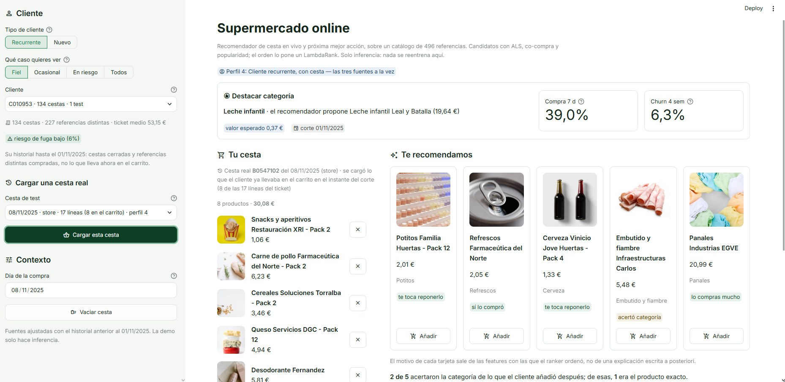
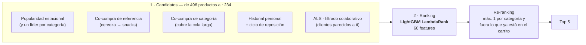
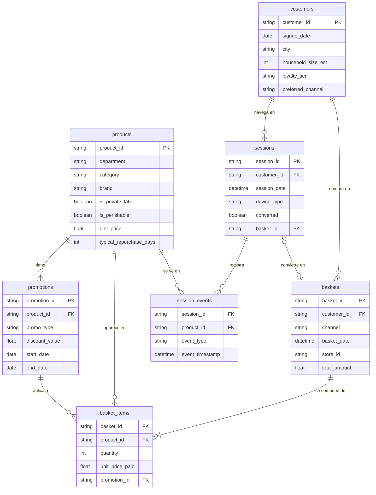

# 🛒 Recomendador de supermercado — cesta en vivo y Next Best Action

**Dos decisiones que un retailer toma miles de veces al día:** qué productos enseñarle a
quien está llenando la cesta ahora mismo, y qué hacer con un cliente que hoy no está
comprando. Este proyecto las resuelve con dos modelos sobre un supermercado online
simulado de 20.000 clientes y 4,4 millones de líneas de ticket, y las enseña funcionando
en una demo web.

### 👉 **[Ver el recomendador de supermercado en vivo](https://grocery-retail-recommender.streamlit.app)**

[](https://grocery-retail-recommender.streamlit.app)

> Todos los datos son **100 % sintéticos**: no hay información real de ningún cliente,
> producto, tienda ni retailer. El dataset se genera con reglas de negocio explícitas
> —ciclos de reposición, estacionalidad, fidelidad de marca, misiones de compra— para poder
> comprobar después que el modelo recupera justo la señal que se inyectó.

---

## Las dos preguntas

Se parecen, pero no son la misma, y confundirlas es el error clásico de un equipo de CRM:

| | Recomendador de cesta | Next Best Action |
| --- | --- | --- |
| **Pregunta** | ¿Qué añadirá el cliente a *esta* cesta? | ¿Qué hago hoy con *este* cliente? |
| **Grano** | Una cesta cortada en un instante | Un cliente (y cliente × categoría) |
| **Horizonte** | El resto de la compra en curso | 7 días para la compra, 28 para la fuga |
| **Salida** | Cinco productos, ordenados | Una acción, o ninguna |
| **Se evalúa con** | NDCG@5, acierto de categoría y de referencia | AUC y **euros de valor incremental** |

El recomendador vive en el momento de la compra; el NBA, en el hueco entre dos compras.

---

## El recomendador de cesta

### Cómo funciona

No es un modelo, son **dos etapas** — el patrón habitual en retail, y el que permite servir
en milisegundos sobre CPU sin *deep learning*:



**Por qué cinco fuentes y no una.** Una cesta se explica por señales distintas a la vez, y
ninguna sirve siempre: un cliente nuevo no tiene historial que mirar, una cesta vacía no
tiene con qué calcular afinidad. Las cinco juntas cubren el **100 % de las categorías** que
el cliente acabará comprando, en los cuatro perfiles (cliente nuevo o recurrente × cesta
vacía o empezada). Eso importa para saber dónde está el margen de mejora: si el *pool* ya
contiene la respuesta, cualquier fallo es del ranker y no de la primera etapa.

**Qué mira el ranker.** 60 features en cinco familias: la señal que aporta cada fuente de
candidatos, la relación del cliente con ese producto y con esa categoría (recencia,
frecuencia, si le toca reponer), atributos del producto (precio, marca blanca, promoción
vigente, popularidad reciente) y el contexto de la sesión (qué ha mirado o añadido al
carrito antes de cerrar la compra).

**Todo lo que el modelo sabe del cliente está fechado el día de la cesta**, no el primero de
la ventana: una cesta del 20 de diciembre ve lo que ese cliente compró el 5, el 12 y el 18.
Es la diferencia entre un sistema que se puede desplegar y uno que solo funciona en el
cuaderno.

### Qué tan bien acierta

Sobre **18.000 cestas reales** que el modelo no vio nunca. El corte es temporal y por cesta,
así que ni dos productos de la misma compra caen a los dos lados, ni el modelo aprende de
datos posteriores a lo que predice:

| Métrica | Valor |
| --- | ---: |
| **NDCG@5 graduada** (métrica principal) | **0,3015** [0,2981 – 0,3052] |
| Acierta la **categoría** de algo que el cliente compró después | **79,5 %** de las cestas |
| Acierta la **referencia exacta** | **61,6 %** de las cestas |
| Distancia al techo teórico de categoría | se queda al **94,9 %** |
| Frente al mejor baseline (reglas de asociación) | **+3,6 pp** [+3,0 – +4,2] |

La métrica principal puntúa **2 si acierta la referencia exacta y 1 si acierta la
categoría**, porque las dos cosas valen para el negocio y no valen lo mismo.

**El 79,5 % no dice nada por sí solo.** ¿Es mucho? La única forma de responder es saber
cuánto de lo que falta es mejorable y cuánto es azar irreducible, así que el proyecto
construye un **oráculo**: un recomendador imaginario que conoce las probabilidades exactas
con las que el generador montó cada cesta. Ese es el techo que nadie puede superar, y el
sistema se queda al 94,9 % de él. Lo que falta, en su mayor parte, no es un modelo mejor:
es ruido.

Los corchetes son intervalos de confianza al 95 % por *bootstrap* de cestas. No son adorno:
sin ellos es fácil celebrar como mejora algo que cabe dentro del ruido.

---

## El Next Best Action

### Qué es

Que un modelo prediga que un cliente se va a ir **no es una decisión**. El *Next Best
Action* es la capa que convierte esa probabilidad en algo que alguien puede ejecutar: para
cada cliente, la mejor acción de negocio *ahora mismo* — incluida la opción de no hacer
nada.

Tres acciones posibles, y la tercera es la que casi nadie modela:

| Acción | Qué hace | Qué cuesta |
| --- | --- | ---: |
| `recomendar_categoria` | Empuja una categoría en la app o el email | Ruido, poco más |
| `enviar_cupon_categoria` | Descuento dirigido a una categoría | 2,54 € de media |
| `ninguna_accion` | Dejar al cliente en paz | 0 € |

### Cómo decide

Dos modelos de propensión y una regla de decisión en euros. La propensión no elige nada por
sí sola: alimenta una cuenta.

```
V(a)    = P(compra | a) × (margen − descuento(a)) − coste_envío(a)
Δ(a)    = V(a) − P(compra) × margen  +  retención(a)
acción  = argmax Δ(a)
```

Es decir: **cada acción se compara con no hacer nada**, no con las demás. Una campaña que
convierte al 30 % no vale nada si ese 30 % iba a comprar igual.

| Modelo de propensión | Qué predice | AUC |
| --- | --- | ---: |
| Fuga | Que el cliente no vuelva en 28 días | **0,853** |
| Compra de categoría | Que compre una categoría concreta en 7 días | **0,759** |

| Política | Valor incremental |
| --- | ---: |
| No actuar nunca | 0 € |
| Cupón a todo el mundo | **−5.032 €** |
| Recomendar categoría a todo el mundo | +670 € |
| **Política de valor esperado** | **+3.078 €** |

Que el cupón masivo salga en negativo es el resultado más útil de la tabla: **regalar margen
a quien iba a comprar de todas formas cuesta dinero**, y es exactamente lo que hace una
campaña sin modelo detrás.

### Lo que este dataset no permite afirmar

Los *uplifts* de cada acción son **supuestos declarados, no estimaciones**: sin un test A/B
no hay forma de identificar el efecto causal de un cupón. Por eso las cifras van acompañadas
de barridos de sensibilidad que dicen a partir de qué supuesto la política deja de ganar. Un
número al que se le conoce el punto de ruptura es utilizable; uno al que no, no.

### La capa que comparten los dos modelos

`P(compra en categoría a 7 días)` del NBA y la «necesidad de categoría» del recomendador son
casi la misma cantidad con horizontes distintos, así que comparten fórmula.

No es una simplificación estética. Mientras la retención del NBA no dependió de la
categoría, la política acababa mandando el cupón a la categoría que el cliente **casi seguro
no iba a comprar** —la que menos margen regalaba—, que es un modelo optimizando contra el
negocio:

| Categoría elegida para el cupón | Antes | Ahora |
| --- | ---: | ---: |
| Que el recomendador da por **no** vencida | 88,5 % | **23,2 %** |
| Recién repuesta | 73,3 % | **2,0 %** |
| Tasa real de compra a 7 días | 1,5 % | **4,3 %** |

Arreglarlo **bajó** el valor de la política, de 3.842 € a 3.078 €. Esos 764 € eran retención
apuntada a ofertas que no retenían a nadie.

---

## El modelo de datos

Siete tablas crudas que imitan lo que sale de un sistema de caja y de la analítica web de un
supermercado, con la línea de ticket como hecho central:



| Tabla | Filas | Qué representa |
| --- | ---: | --- |
| `customers` | 20.000 | Quién compra: hogar, ciudad, nivel de fidelización, canal preferido |
| `products` | 496 | El surtido: 8 referencias × 62 categorías × 8 departamentos |
| `promotions` | 300 | 2x1, descuentos y cupones, con su ventana de vigencia |
| `baskets` | 600.174 | La cabecera del ticket — dos años de compras (2024-2025) |
| `basket_items` | 4.357.007 | La línea de ticket: **el hecho central de todo el proyecto** |
| `sessions` | 150.000 | La visita online, convierta o no |
| `session_events` | 1.106.225 | Qué se miró y qué se añadió al carrito dentro de la visita |

Las compras anónimas (sin `customer_id`) y las visitas sin identificar son legítimas y están
a propósito: en un supermercado real existen, y un pipeline que las trata como error se
rompe el primer día.

**Por qué 8 referencias por categoría y no 24.** El catálogo original repartía 1.500
productos, y acertar la referencia exacta entre 24 equivalentes era imposible por
construcción: el techo lo ponía el tamaño del surtido, no el modelo. Ocho referencias es lo
que ve un cliente delante del lineal, y deja que la señal de referencia la ponga la
**fidelidad de marca** —cada cliente tiene su marca preferida en cada categoría— en vez del
azar.

### La señal que hay debajo

Un dataset sintético solo vale si el comportamiento que contiene es el que los modelos
tienen que encontrar. Estas son las reglas que el generador inyecta, y que después se
verifican recalculándolas desde los CSV:

- **Ciclos de reposición** — cada categoría tiene su cadencia (la leche cada 6 días, el
  detergente cada 45) y cada hogar la modula: uno de seis personas repone antes que uno de
  una.
- **Misiones de compra** — una cesta no es una muestra aleatoria del catálogo. Hay grandes
  compras de reposición, compras de urgencia de cuatro líneas y compras de fin de semana, y
  cada misión tiene su tamaño y su mezcla de departamentos.
- **Afinidad de cesta** — 30 pares diseñados a propósito (cerveza y snacks, pañales y
  toallitas, pasta y tomate frito) que después tienen que salir con el *lift* que se buscaba.
- **Fidelidad de marca, con sustitución** — cuando el cliente no encuentra su marca se lleva
  otra de la misma categoría; no se va sin comprar.
- **Estacionalidad** — helados en agosto, turrón en diciembre, protector solar en verano.
- **Embudo online** — abandono de carrito línea a línea y productos que se miran sin
  comprarse, para que la señal de sesión aporte algo que el ticket no diga ya.
- **Defectos de calidad deliberados** — duplicados, nulos, categorías mal escritas,
  cantidades negativas e importes de cabecera que no cuadran con las líneas.

Esos defectos están porque el dato real llega así. Un **Data Trust Score** de 79
comprobaciones en 5 dimensiones los mide antes y después de la limpieza: pasa de **91,38 (C)
a 100,00 (A)**, que es una medida objetiva de que el ETL hace su trabajo y no una afirmación
en un README.

### De las siete tablas a lo que comen los modelos

Ni el recomendador ni el NBA tocan el dato crudo. Entre medias hay un ETL en PySpark que
deja cuatro tablas de features, y las dos las comparten:

| Tabla de features | Grano | Para qué |
| --- | --- | --- |
| `rfm` | Cliente | Recencia, frecuencia, gasto y segmento — la base de casi todo |
| `repurchase_features` | Cliente × categoría | `due_for_repurchase`: si ya le toca reponer, con **su** cadencia |
| `affinity_category` | Par de categorías | Soporte, confianza y *lift* de la co-compra |
| `affinity_product` | Par de referencias | Lo mismo, referencia a referencia, para los candidatos |

---

## La demo

La [app](https://grocery-retail-recommender.streamlit.app) es el sistema entero funcionando
sobre datos que el modelo no vio: eliges un cliente real —fiel, ocasional o en riesgo de
fuga—, cargas una de sus cestas de test y ves el top-5 que el recomendador propone en el
instante del corte.

Lo que la hace útil más allá de la foto:

- **Cada tarjeta dice por qué está ahí** — «te toca reponerlo», «lo compras mucho», «va con
  lo que llevas» — y ese motivo sale de las features con las que el ranker ordenó, no de una
  explicación escrita a posteriori.
- **Se ve si acertó.** Como la cesta es real, la demo compara el top-5 con lo que el cliente
  metió de verdad después del corte: cuántas categorías acertó y cuántas referencias exactas.
- **El banner del NBA dice con qué fecha de corte se decidió la acción.** La decisión se
  resuelve el 1 de noviembre y se enseña junto a cestas posteriores; ocultarlo sería enseñar
  una decisión tomada con información que entonces no existía.
- **Los productos se ven, no se leen**: cada referencia lleva la foto real de su grupo
  visual, y el catálogo se puede recorrer por departamento o buscar por texto.
- **Solo hace inferencia**: carga los modelos ya entrenados, no reentrena nada ni sale a
  internet.

---

## Seguir leyendo

| | |
| --- | --- |
| [**README técnico**](README_TECNICO.md) | Arquitectura, pipeline, tests, decisiones de ingeniería y deudas abiertas |
| [**Cómo arrancarlo**](GETTING_STARTED.md) | Clonar, generar el dataset y levantar la demo en local |
| [**Los dos modelos en lenguaje llano**](docs/como-funcionan-recomendador-y-nba.md) | Con glosario, para quien no viene de *machine learning* |
| [**Impacto de negocio**](IMPACT.md) | De NDCG y AUC a euros, con los supuestos encima de la mesa |
| [**Informe de hallazgos**](reports/insights/business_findings.md) | Lo que dicen los datos, con sus figuras |
| [**Esquema del dataset**](DATA_SPEC.md) | Columna a columna, crudo y procesado |
| [**Despliegue de la demo**](docs/DESPLIEGUE.md) | Cómo se publica la app |

**Stack:** PySpark · Spark MLlib (ALS) · LightGBM (LambdaRank) · scikit-learn · MLflow ·
Streamlit · Python 3.10+

Es la **segunda fase del ciclo de vida del cliente en retail** que empezó en
[`sports-rental-analytics`](https://github.com/DiegoPrieto23/sports-rental-analytics), con un
stack distinto a propósito: allí dbt sobre Databricks, aquí PySpark de punta a punta.
