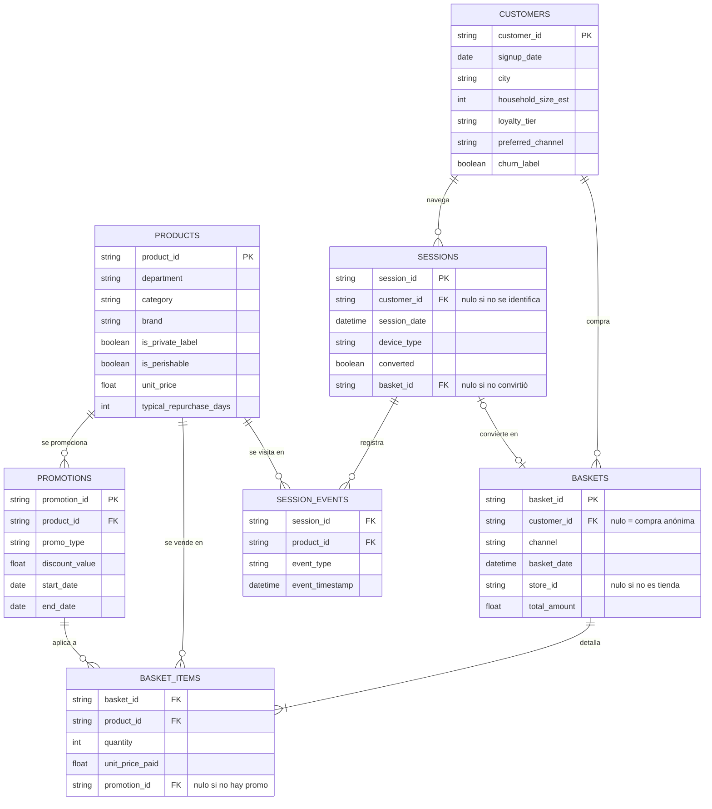

# Grocery Retail — Recommender & Next Best Action

Recomendador de cesta y capa de *Next Best Action* sobre un supermercado online simulado.
El proyecto empieza donde suelen empezar los problemas reales — **no hay dataset**: se
genera, con sus ciclos de reposición, su estacionalidad, su señal de abandono y sus
defectos de calidad deliberados — y sigue con el ETL, el modelado y la comunicación de
resultados.

Es la **fase 2 del ciclo de vida del cliente en retail** que empezó en
[`sports-rental-analytics`](https://github.com/DiegoPrieto23/sports-rental-analytics), con
un stack distinto a propósito: allí dbt sobre Databricks, aquí **PySpark** de punta a
punta.

> Todos los datos son **100 % sintéticos**. No contienen información real de ningún
> cliente, producto, tienda ni retailer.

---

## Estado actual

| Fase | Qué es | Estado |
| --- | --- | :---: |
| 0 · Setup | Estructura, entorno reproducible, CI | ✅ |
| 1 · Generador de datos | 7 tablas con reglas de negocio y defectos inyectados | ✅ |
| 2 · ETL y features | Limpieza, Data Trust Score, RFM, recompra, afinidad, EDA | ✅ |
| 3 · Recomendador de cesta | Candidatos (popularidad + co-compra + ALS) → ranker LightGBM | ✅ |
| 4 · Next Best Action | Modelo de propensión + política de valor esperado | ⬜ |
| 5 · Empaquetado y Power BI | Star schema, `.pbip`, resumen de impacto | ⬜ |
| 6 · Demo web | Streamlit con simulación de cesta en vivo | ⬜ |

Este README cubre lo que existe hoy (Fases 0-3). El plan completo está en
[`ROADMAP.md`](ROADMAP.md) y el enunciado del reto en [`CHALLENGE.md`](CHALLENGE.md).

**Lo que ya se puede enseñar:** 3,1 M de líneas de ticket generadas de forma reproducible,
un ETL en PySpark que las limpia y documenta cada corrección, un Data Trust Score que pasa
de **89,99 (C) a 100,00 (A)**, cuatro tablas de features listas para modelar, un
[notebook de EDA](notebooks/01_eda.ipynb) con 9 preguntas de negocio resueltas en Spark SQL,
y un recomendador de cesta de dos etapas con su evaluación honesta y su diagnóstico de por
qué la métrica sale donde sale.

---

## Cómo reproducirlo

Requiere **Python 3.10+** y una **JVM 17** (PySpark). Con Python 3.13 en Windows hay una
pega conocida: ver [Notas de entorno](#notas-de-entorno).

```bash
python -m venv .venv && .venv\Scripts\activate        # Linux/macOS: source .venv/bin/activate
pip install -r requirements.txt -c constraints.txt

python -m data_generation.generate_dataset            # ~3 min  → data/raw/    (7 CSV, ~155 MB)
python -m data_generation.verify_dataset              # comprueba los patrones inyectados
python -m src.etl.run_etl                             # ~8 min  → data/processed/ + reports/etl/
python -m src.recommender.pipeline                    # ~33 min → models/ + predictions/ + reports/recommender/
python -m src.recommender.demo_profiles               # los 4 perfiles, con un caso de cada uno
pytest                                                # 158 tests
```

El dataset **no se versiona** (`data/` está en `.gitignore`): se regenera con la semilla
fija y sale byte a byte idéntico. Lo que sí está en el repo son los informes de
`reports/etl/` y el notebook ya ejecutado con sus figuras.

Para abrir el notebook hace falta además `pip install jupyterlab`.

---

## Estructura del repositorio

```
grocery-retail-recommender/
├── data_generation/          # FASE 1 — el dataset no se descarga, se genera
│   ├── catalog.py            #   parametrización de dominio: 62 categorías, afinidad, estacionalidad
│   ├── generate_dataset.py   #   las 7 tablas + los defectos de calidad deliberados
│   └── verify_dataset.py     #   recalcula desde los CSV cada patrón que dice haber inyectado
├── src/
│   ├── etl/                  # FASE 2 — PySpark
│   │   ├── session.py        #   fábrica de la SparkSession (UTC, Arrow)
│   │   ├── schemas.py        #   esquemas explícitos, lectura y escritura
│   │   ├── cleaning.py       #   limpieza de las 7 tablas + traza de lo corregido
│   │   ├── data_trust.py     #   Data Trust Score (Tarea 1)
│   │   ├── rfm.py            #   RFM y segmento por cliente
│   │   ├── repurchase.py     #   due_for_repurchase (Tarea 2)
│   │   ├── affinity.py       #   co-ocurrencia y FP-Growth
│   │   └── run_etl.py        #   orquestador
│   ├── recommender/          # FASE 3 — dos etapas
│   │   ├── config.py         #   ventanas temporales, tamaños de pool, hiperparámetros
│   │   ├── splits.py         #   split por cesta, prefijo/target y los 4 perfiles
│   │   ├── candidates.py     #   popularidad, co-compra (SKU y categoría), historial, ALS
│   │   ├── features.py       #   54 features del par (query, candidato)
│   │   ├── ranker.py         #   LightGBM LambdaRank
│   │   ├── evaluate.py       #   NDCG@5, Recall@5 y el desglose SKU / categoría
│   │   ├── pipeline.py       #   orquestador
│   │   └── demo_profiles.py  #   un caso legible de cada perfil
│   └── nba/                  # FASE 4 — vacío por ahora
├── notebooks/01_eda.ipynb    # reconocimiento de tablas + calidad + 9 preguntas de negocio
├── tests/                    # 158 tests
├── reports/etl/              # informes que genera run_etl (versionados)
├── reports/recommender/      # métricas de la Fase 3 y demo de los 4 perfiles
├── docs/CLEANING.md          # el porqué de cada decisión de limpieza
├── data/{raw,processed}/     # generados, no versionados
├── DATA_SPEC.md              # esquema columna a columna, crudo y procesado
├── CHALLENGE.md              # el reto
├── ROADMAP.md                # plan por fases
└── CLAUDE.md                 # convenciones del proyecto
```

---

## Fase 1 — Generación de los datos

`data_generation/generate_dataset.py` construye siete tablas relacionadas que simulan dos
años completos de operación (2024-2025) de un supermercado con canal físico y online.

| Tabla | Filas | Grano |
| --- | ---: | --- |
| `customers` | 20.000 | Un cliente |
| `products` | 1.500 | Un producto (8 departamentos, 62 categorías) |
| `promotions` | 300 | Una promoción con su ventana de vigencia |
| `baskets` | 600.174 | Un ticket |
| `basket_items` | 3.103.684 | Una línea de ticket |
| `sessions` | 150.000 | Una sesión online |
| `session_events` | 945.676 | Un evento (`view` / `add_to_cart`) dentro de una sesión |

### Modelo relacional



### La lógica que hace el dato interesante

Un generador que sólo tirase dados daría un dataset inútil: sin correlaciones no hay nada
que aprender y cualquier modelo empataría con el azar. Estas son las reglas que se
inyectan, todas parametrizadas en `catalog.py` con los valores exactos de `DATA_SPEC.md`:

- **Ciclos de reposición.** Cada cliente tiene su propio intervalo por categoría, partiendo
  del típico de la categoría (leche ~6 días, detergente ~45, protector solar ~200),
  escalado por el tamaño del hogar y con ruido gaussiano. La probabilidad de que una
  categoría entre en la cesta crece según se acerca la fecha de reposición.
- **Afinidad de cesta.** 10 pares de categorías cuya probabilidad conjunta se multiplica
  cuando la disparadora ya está en la cesta: cerveza→snacks (3,0x), pañales→toallitas
  (4,0x), detergente→suavizante (3,5x)... Es la señal que explota el recomendador.
- **Estacionalidad.** 9 categorías con multiplicador en su mes pico: turrón en diciembre
  (8,0x), protector solar en verano (6,0x), torrijas en Cuaresma (5,0x).
- **Uplift de promoción.** Un producto en promoción triplica su probabilidad de entrar en
  la cesta mientras la ventana está activa.
- **Restricciones de hogar.** Sólo los hogares con bebé compran pañales, sólo los que
  tienen mascota compran pienso. Esto hace que el bloque de bebé sea una señal real y no
  ruido — y tiene una consecuencia medible que aparece en el EDA.
- **Churn progresivo.** A los clientes marcados como abandono se les reduce gradualmente
  frecuencia y ticket en las 6-8 semanas previas a su última compra, en vez de cortar en
  seco. Sin esa rampa, el churn no sería aprendible.
- **Defectos de calidad deliberados.** Duplicados de línea, cantidades negativas,
  categorías mal escritas, nulos, fechas incoherentes y outliers de importe. Son el
  material de trabajo de la Fase 2.

### Reproducibilidad

Semilla fija (`SEED = 42`) propagada a numpy, `random` y Faker, con un generador
independiente por etapa. Dos ejecuciones producen ficheros idénticos, y el manifiesto
guarda el `sha256` de cada tabla. Hay un test que lo comprueba.

`verify_dataset.py` cierra el círculo: recalcula desde los CSV el lift de cada par de
afinidad, el índice estacional, el uplift promocional, los ciclos observados y la señal de
churn, y los compara con el objetivo. Cualquier cifra de este README sale de ahí o del
ETL, nunca copiada a mano de un notebook.

---

## Fase 2 — ETL y feature engineering (PySpark)

`python -m src.etl.run_etl` lee `data/raw`, mide la calidad, limpia las 7 tablas, construye
4 tablas de features y deja todo en `data/processed/` (Parquet) con los informes en
`reports/etl/`.

### Limpieza

El detalle está en [`docs/CLEANING.md`](docs/CLEANING.md) y los recuentos en
[`reports/etl/cleaning_report.md`](reports/etl/cleaning_report.md). Las tres decisiones que
importan:

**1. Corregir el signo antes de deduplicar.** El generador duplica líneas y *después*
invierte el signo de una muestra. Cuando la línea invertida es copia de una duplicada, el
par `(+2, −2)` deja de ser un duplicado exacto y sobrevive a cualquier `dropDuplicates`:

| Orden | Filas resultantes | `(basket_id, product_id)` duplicados |
| --- | ---: | ---: |
| Deduplicar → corregir signo | 3.058.178 | **353** |
| Corregir signo → deduplicar | 3.057.825 | **0** |

**2. Las cantidades negativas se corrigen, no se descartan.** Una devolución real tiene
enfrente la venta que anula. De las 12.308 líneas negativas, sólo 353 tienen una línea
positiva del mismo producto en la misma cesta — y esas 353 se explican por el mecanismo de
duplicados. El 97 % restante no anula nada: son ventas mal firmadas. Descartarlas sesgaría
los ciclos de recompra de la Tarea 2.

**3. `total_amount` se recalcula desde el detalle.** Un filtro por IQR marcaba 3.227 cestas
(0,54 %) cuando los outliers inyectados son 1.192 (0,2 %): dos de cada tres serían cestas
grandes legítimas. Recalculando desde las líneas limpias no hace falta adivinar, y quedan
descuadradas exactamente esas **1.192** — el resto de descuadres los causaban los
duplicados y los signos.

Además: las 116 grafías de categoría se normalizan a las 62 canónicas deduciéndolas del
propio dato (la mayoritaria de cada clave normalizada), sin mirar el catálogo del
generador; se corrigen 58 altas posteriores a la primera compra; y **no se descarta ni una
fila** por tener un nulo legítimo — las 18.000 compras anónimas siguen ahí.

### Data Trust Score (Tarea 1)

79 comprobaciones en cinco dimensiones — *completeness, uniqueness, validity, consistency,
integrity*. Informe completo en
[`reports/etl/data_trust.md`](reports/etl/data_trust.md).

| Dataset | Score | Nota | Comprobaciones con fallos |
| --- | ---: | :---: | ---: |
| `data/raw` | 89,99 | **C** | 10 de 79 |
| `data/processed` | 100,00 | **A** | 0 de 79 |

Cada dimensión mezcla a partes iguales dos lecturas: la **tasa de filas** que pasan cada
regla y la **tasa de reglas** que pasan sin una sola fila mala. Sólo con la primera, cuatro
defectos que afectan al 1-9 % de las filas quedan diluidos entre setenta reglas que pasan y
el dataset crudo saca un 99,6 con nota A — que no sirve para decidir nada.

### Tablas de features

| Tabla | Filas | Qué contiene |
| --- | ---: | --- |
| `rfm` | 20.000 | Recencia, frecuencia, gasto, quintiles y segmento por cliente |
| `repurchase_features` | 608.885 | `due_for_repurchase` por cliente y categoría (Tarea 2) |
| `affinity_category` | 3.780 | Pares de categorías con soporte, confianza, lift y Jaccard |
| `affinity_product` | 9.281 | Top-20 consecuentes por producto, para los candidatos de la Fase 3 |

**`due_for_repurchase`** usa la cadencia observada del propio cliente cuando hay al menos
dos compras previas de esa categoría (el 76,5 % de los pares), y cae al intervalo típico de
la categoría ajustado por tamaño de hogar cuando no la hay. En la foto final, el 52,4 % de
los pares cliente-categoría tienen la recompra vencida.

**La afinidad** reproduce los 10 pares declarados en `DATA_SPEC.md`, todos con lift
claramente por encima de 1, y las cifras coinciden **hasta el segundo decimal** con las que
calcula `verify_dataset.py` en pandas sobre el dato crudo — dos implementaciones
independientes:

| Disparadora → Asociada | Lift objetivo | Lift medido |
| --- | ---: | ---: |
| Pañales → Toallitas húmedas | 4,0 | **13,39** |
| Detergente → Suavizante | 3,5 | 3,60 |
| Champú → Acondicionador | 3,0 | 3,55 |
| Pasta → Salsa de tomate | 2,5 | 2,43 |
| Cerveza → Snacks | 3,0 | 2,39 |
| Vino → Queso | 2,5 | 2,33 |
| Café → Azúcar | 2,0 | 2,29 |
| Palomitas → Refrescos | 2,0 | 1,95 |
| Cereales → Leche | 2,8 | 1,96 |
| Pan → Embutido | 2,2 | 1,84 |

Las dos desviaciones grandes tienen explicación, y son más interesantes que los aciertos:

- **Pañales → Toallitas se dispara a 13,4** porque ambas categorías están restringidas a
  hogares con bebé (18 % de la base). El lift observado suma la regla de afinidad *y* la
  composición de la clientela. Se ve claro en que todo el bloque de bebé — leche infantil,
  potitos — aparece arriba del ranking con lift ~4,7 **sin que exista ninguna regla que los
  una**. Para el recomendador sigue siendo señal útil, pero conviene saber de dónde viene.
- **Cereales → Leche se queda en 1,96** por efecto techo: la leche ya está en más de una de
  cada cuatro cestas, y cuando el consecuente es tan habitual el lift no tiene margen. La
  confianza (>50 %) sí refleja la asociación.

---

## El EDA

[`notebooks/01_eda.ipynb`](notebooks/01_eda.ipynb) — ejecutado de principio a fin, con las
salidas y las figuras guardadas. Abre con un **reconocimiento de las tablas** (esquema,
primeras filas, estadísticos y verificación de las 14 relaciones por las que se unen), sigue
con el **Data Trust Score** y después resuelve nueve preguntas de negocio, cada una con su
consulta Spark SQL sobre vistas temporales y su visualización:

| # | Pregunta | Alimenta a |
| --- | --- | --- |
| Q1 | ¿Quién sostiene la facturación? | Segmentación, NBA |
| Q2 | ¿Qué se vende y cuánta marca blanca hay? | Catálogo del recomendador |
| Q3 | ¿Qué categorías son estacionales? | Candidatos por estacionalidad |
| Q4 | ¿Cómo es la cesta media por canal? | Contexto de la cesta en curso |
| Q5 | ¿Qué se compra junto? | **Candidatos de co-compra (Fase 3)** |
| Q6 | ¿Cuál es el ciclo de recompra? | **`due_for_repurchase` (Tarea 2)** |
| Q7 | ¿Qué diferencia a quien abandona? | **Propensión de churn (Fase 4)** |
| Q8 | ¿Funcionan las promociones? | Feature del ranker |
| Q9 | ¿Cómo es el embudo online? | Señal de sesión |

Tres hallazgos que condicionan lo que viene:

- **El nivel de fidelidad no cambia el ticket, cambia la frecuencia.** Los clientes `gold`
  son el 13,2 % de la base y traen el 21,7 % de la facturación, pero su ticket medio
  (29,17 €) es casi idéntico al de un `bronze` (28,99 €). La palanca sobre un cliente
  valioso es que vuelva antes, no que se lleve más.
- **El ciclo observado reproduce el teórico** con una correlación de rangos de Spearman de
  **0,978**, y se acorta de forma monótona al crecer el hogar. Eso es lo que respalda el
  ajuste por `household_size_est` de la Tarea 2 en vez de dejarlo como suposición.
- **⚠️ La señal de sesión estaba contaminada, y se arregló.** El solapamiento entre lo
  añadido al carrito y lo comprado salía del **100,0 %**: el generador emitía un
  `add_to_cart` por cada producto de la cesta y ninguno más, así que `add_to_cart` *era*
  el ticket escrito de otra forma. Al abordar la Fase 3 se comprobó que los `view` estaban
  igual de contaminados (cubrían también el 100 % de la cesta), así que la salida no podía
  ser "usar sólo las vistas": se arregló el generador. Ver [Fase 3](#fase-3--recomendador-de-cesta).

---

## Fase 3 — Recomendador de cesta

`python -m src.recommender.pipeline` entrena y evalúa el sistema de dos etapas de la
Tarea 3a, y deja el modelo en `models/`, las predicciones en `predictions/` y los informes
en [`reports/recommender/`](reports/recommender/).

### El split, que es donde se gana o se pierde la credibilidad

Temporal **y a nivel de cesta**, en tres ventanas:

```
    |<---------- fuentes ---------->|<-- ranker -->|<-- test -->|
    2024-01-01                 2025-09-01     2025-11-01   2026-01-01
```

Ninguna cesta se parte entre train y test, y las fuentes de candidatos se **reajustan dos
veces**: una con el historial hasta septiembre, para las cestas con las que se entrena el
ranker, y otra con el historial hasta noviembre, para las de test. Sin ese doble ajuste el
ranker aprendería con *features* que ya contienen la respuesta — "lo que el cliente ya
compró" — y en test se desplomaría.

### Las cinco fuentes de candidatos

| Fuente | De dónde sale | Perfiles que cubre |
| --- | --- | --- |
| Popularidad × estacionalidad | Ventas de los últimos 90 días × índice estacional del mes | los cuatro (es el respaldo) |
| Co-compra de SKU | `affinity_product` recalculada sobre la ventana | 2 y 4 |
| Co-compra de categoría | `affinity_category` + los más vendidos de cada categoría | 2 y 4, y llega a la cola larga |
| Historial + recompra | Lo que el cliente compra, priorizando lo que "toca" (Tarea 2) | 3 y 4 |
| ALS implícito (Spark MLlib) | `customer_id × product_id` | 3 y 4 |

Unidas dan **155 candidatos por cesta** de los 1.500 del catálogo. Sobre ellos, un
**LightGBM `LambdaRank`** con 54 *features* devuelve el top-5.

### La señal de sesión, que obligó a arreglar el generador

Se resolvió la deuda del EDA regenerando `sessions` y `session_events` con abandono de
carrito, productos que sólo se miran y un retardo entre ver y añadir. Ahora
`P(en la cesta | add_to_cart)` = 87,9 % y `P(visto | en la cesta)` = 85,0 %, ninguna de las
dos es 1. El ranker la consume con un **corte temporal estricto** (`cut_ts`): sólo entran
los eventos anteriores al último `add_to_cart` del carrito simulado. Un test lo fija.

Aporta, y de forma medible pero modesta — lo que debe ser, porque sólo el 9 % de las cestas
tiene sesión detrás:

| Sistema | NDCG@5 | Recall@5 | hit_rate@5 |
| --- | ---: | ---: | ---: |
| Popularidad reciente × estacionalidad (sin aprendizaje) | 0,0200 | 0,0221 | 8,3 % |
| LambdaRank sin señal de sesión | 0,0303 | 0,0302 | 11,1 % |
| **LambdaRank completo** | **0,0343** | **0,0332** | **11,8 %** |

### Resultado por perfil

Sobre 18.000 cestas de test. El ranker es **el mismo** para los cuatro perfiles: lo que
cambia es qué fuentes tienen algo que decir.

| Perfil | Cestas | NDCG@5 | Recall@5 | hit_rate@5 |
| --- | ---: | ---: | ---: | ---: |
| 1 · nuevo, carrito vacío | 521 | 0,0212 | 0,0191 | 7,3 % |
| 2 · nuevo, con artículos | 421 | 0,0149 | 0,0168 | 4,5 % |
| 3 · recurrente, carrito vacío | 8.713 | 0,0352 | 0,0304 | 14,1 % |
| 4 · recurrente, con artículos | 8.345 | 0,0351 | 0,0378 | 10,1 % |
| **Total** | **18.000** | **0,0343** | **0,0332** | **11,8 %** |

El cold-start rinde peor, como se esperaba, pero no se desploma: **el perfil 2 es el peor**
(NDCG@5 0,0149, un 58 % por debajo del 4). Tiene sentido — es el único que no puede tirar
ni de historial ni de ALS, y encima su cesta ya va por la mitad, así que lo fácil de
acertar ya está dentro. Y el perfil 3 es el mejor en `hit_rate` (14,1 %) porque evalúa la
cesta entera: cinco huecos contra 5,0 productos por adivinar en vez de 2,9.

### Por qué el número es bajo: no es el modelo, es el dato

Esta es la parte interesante. El sistema **acierta la categoría en el 51,4 % de las cestas**
y el SKU exacto sólo en el 11,8 %:

| | Acierta la categoría | Acierta el SKU |
| --- | ---: | ---: |
| Al menos uno en el top-5 | **51,4 %** | 11,8 % |
| Precisión media del top-5 | **18,3 %** | 2,5 % |

Dos comprobaciones más lo confirman:

- **Ampliar el pool no sirve de nada.** Pasar de 92 a 155 candidatos por cesta subió el
  `pool_recall` del 21,7 % al 31,1 % — un 43 % más de target alcanzable — y el NDCG@5 se
  quedó donde estaba (0,0344 → 0,0343). El sistema no está limitado por la primera etapa.
- **La fidelidad del cliente está en la categoría, no en la referencia.** El 88,6 % de las
  líneas de una cesta futura son de una categoría que ese cliente ya compró, pero sólo el
  29,7 % son un producto que ya compró. Con ~24 referencias por categoría, un cliente con
  tres o más compras en una categoría se lleva **0,86 referencias distintas por compra**:
  casi nunca repite SKU.

Es decir: el generador elige el SKU dentro de la categoría casi al azar, y eso pone el
techo. Queda anotado en el `ROADMAP.md` como la siguiente mejora del generador — dar
fidelidad de marca, que es lo que hace un cliente real con su leche de siempre.

### Un caso de cada perfil

[`reports/recommender/profiles_demo.md`](reports/recommender/profiles_demo.md) enseña la
mecánica con una cesta real de cada perfil, incluyendo qué fuente propuso cada
recomendación. La tabla que lo resume:

| Perfil | Popularidad | Co-compra SKU | Co-compra categoría | Historial | ALS |
| --- | ---: | ---: | ---: | ---: | ---: |
| 1 · nuevo, carrito vacío | 100 % | 0 % | 0 % | 0 % | 0 % |
| 2 · nuevo, con artículos | 84 % | 47 % | 48 % | 0 % | 0 % |
| 3 · recurrente, carrito vacío | 86 % | 0 % | 0 % | 49 % | 65 % |
| 4 · recurrente, con artículos | 79 % | 34 % | 39 % | 42 % | 57 % |

---

## Tests

**158 tests** (`pytest`), verdes en CI sobre Ubuntu con Python 3.11 y JVM 17.

| Fichero | Qué fija |
| --- | ---: |
| `test_generate_dataset.py` | Reproducibilidad, volúmenes, patrones del generador y el embudo online |
| `test_cleaning.py` | Cada regla de limpieza con un caso mínimo comprobable a mano |
| `test_data_trust.py` | Un defecto → la dimensión que le toca, sobre un dataset impecable |
| `test_repurchase.py` | Cadencias de 7 y 4 días, efecto del hogar, tolerancia |
| `test_affinity.py` | Soporte, confianza y lift calculados a mano sobre 10 cestas |
| `test_rfm.py` | Quintiles, segmentos y clientes sin compras |
| `test_schemas.py` | Tipos al leer, ida y vuelta a Parquet por los dos motores |
| `test_recommender.py` | Que no hay fuga: ni entre ventanas, ni del target al pool, ni de la sesión pasado el corte |

Los tests de calidad no comprueban "el score bajó": parten de un dataset diminuto y
perfecto que puntúa 100 e introducen **un solo** defecto, verificando que lo detecta la
comprobación concreta que le corresponde.

---

## Notas de entorno

**PySpark 3.5 no soporta oficialmente Python 3.13**: el worker de Python casca al arrancar
en Windows. Por eso todo el ETL está escrito para ejecutarse **íntegramente en la JVM** —
DataFrame API, Spark SQL y MLlib, sin UDFs de Python, sin `.rdd` y sin `createDataFrame`
sobre listas, que son las tres cosas que levantan un worker. Para construir DataFrames
pequeños (tests, notebooks) se usa pandas + Arrow, que viaja por la JVM. La CI usa Python
3.11, donde nada de esto aplica.

**Escritura de Parquet en Windows**: si falta `hadoop.dll` en `%HADOOP_HOME%\bin`,
`df.write.parquet()` falla con `UnsatisfiedLinkError: NativeIO$Windows.access0`
(`winutils.exe` por sí solo no basta). El ETL lo detecta con un sondeo único y cae a
escribir con pyarrow desde el driver; a esta escala es incluso más rápido. Poniendo el
`hadoop.dll` que corresponda a tu `winutils.exe` vuelve a usarse la escritura nativa sin
tocar nada.

**Zona horaria**: la sesión de Spark trabaja en UTC para que el calendario sea continuo y
los `datediff` no dependan del cambio de hora. Al traer un `timestamp` al driver con
`collect()`, PySpark lo convierte a la zona del sistema, así que el `datetime` de Python
sale desplazado respecto al CSV; el valor almacenado y todo el cálculo en SQL son
correctos. Conviene extraer la fecha o la hora **dentro** de Spark.

---

## Qué viene ahora

La **Fase 4** monta el Next Best Action: un modelo de propensión (compra en categoría a 7
días, churn a 4 semanas) con validación temporal, y una política de valor esperado sobre un
catálogo fijo de acciones.

Queda además pendiente, anotado en el `ROADMAP.md`: **dar fidelidad de marca al generador**,
que es el techo real del recomendador de SKU descrito arriba.
