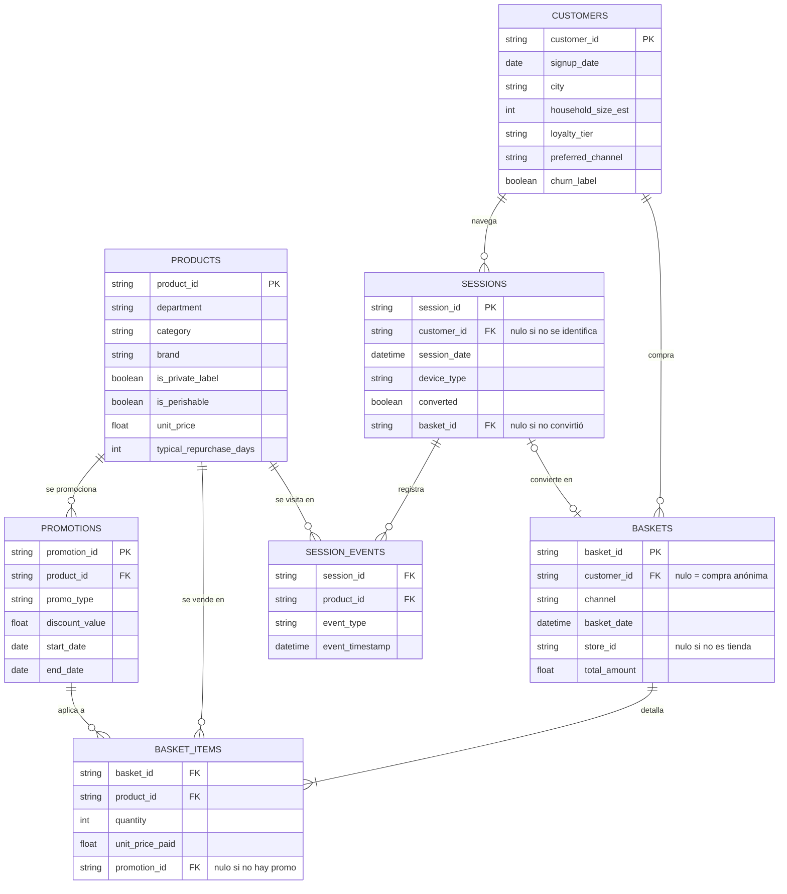

# Historia del proyecto, fase por fase

Este documento es la **narrativa**: qué se construyó en cada fase, qué se midió y qué
se aprendió por el camino. Se separó del [`README.md`](../README.md) en el punto B3 del
[diagnóstico](diagnostico-fase7.md), porque mezclar el estado actual con el histórico
hacía que no se viera ni una cosa ni la otra: el README pasaba de 1.000 líneas y había
que leerlo entero para saber cómo está hoy el proyecto.

El reparto es: **el README dice cómo está el sistema hoy**, este documento **cómo llegó
a estarlo**. El plan por fases, con el criterio de verificación de cada punto, sigue en
[`ROADMAP.md`](../ROADMAP.md); el enunciado, en [`CHALLENGE.md`](../CHALLENGE.md).

Todas las cifras son las del dataset de la Fase 8 salvo donde se diga lo contrario, y
todas las recalcula un script: ninguna está copiada a mano de un notebook.

---

## Resumen: qué hay implementado, fase por fase

| Fase | Qué se construyó | Cómo se verifica | Resultado |
| --- | --- | --- | --- |
| **0 · Setup** | Estructura del repo, entorno con `constraints.txt` y CI en GitHub Actions | El workflow instala y ejecuta la suite | ✅ |
| **1 · Generador** | `data_generation/generate_dataset.py`: 7 tablas, 4,4 M de líneas de ticket, con misiones de compra, ciclos de reposición, fidelidad de marca, complementos y sustitutos, estacionalidad, uplift de promoción, churn progresivo, embudo online y defectos de calidad inyectados a propósito | 44 tests; dos ejecuciones dan `sha256` idénticos | ✅ |
| **2 · ETL y features** | PySpark: limpieza documentada, Data Trust Score, RFM, `due_for_repurchase` (Tarea 2), afinidad de cesta y las 9 preguntas de negocio como funciones | 149 tests; informes regenerables en `reports/etl/` | Data Trust **91,38 (C) → 100,00 (A)** |
| **3 · Recomendador** | Dos etapas: cinco fuentes de candidatos (popularidad estacional, co-compra de SKU y de categoría, historial con recompra, ALS) + ranker LightGBM `LambdaRank` con relevancia graduada. Split temporal **y por cesta**, con las fuentes reajustadas por ventana | Tests de fuga de datos, historial as-of, paridad con la demo y objetivo; `reports/recommender/` y `verify_recommender_diagnostics` | **NDCG@5 graduada = 0,3015** [0,2981, 0,3052] · categoría 79,5 % · SKU 61,6 % · 94,9 % del techo teórico de categoría |
| **4 · Next Best Action** | Dos modelos de propensión (churn a 4 semanas, compra en categoría a 7 días) sobre cortes temporales, y política de valor esperado con catálogo de acciones y economía por departamento | 25 tests, incluida la aritmética del valor esperado a mano; `reports/nba/` | **AUC 0,8532 / 0,7591** · política **+3.078 €** vs. no actuar |
| **5 · Empaquetado** | Resumen de impacto en euros con su barrido de supuestos, informe de 8 hallazgos de negocio con figuras, y registro opcional de experimentos en MLflow | 37 tests; `IMPACT.md` y `reports/insights/` se regeneran con un comando | **229.608 €/año** por cada 100.000 clientes y 100.000 cestas online/mes |
| **6 · Demo** | Catálogo con 60 fotos reales de Pexels, inferencia sin Spark y app en Streamlit con cesta en vivo, top-5 explicado, NBA y cestas reales de test | 59 tests, incluida la paridad con el pipeline; arranque real verificado | ✅ acierto de categoría y exacto, lado a lado |
| **7 · Fidelidad de producto** | Fidelidad de marca y surtido de 8 referencias en el generador, y las Fases 2, 3, 4 y 6 rehechas encima | Tests nuevos del generador; comparación con las cifras congeladas en `reports/*/baseline_*.json` | **NDCG@5 ×5,1** · SKU acertado en el 49,5 % de las cestas (antes 11,8 %) |
| **8 · Estructura de la cesta** | Misiones de compra, tamaño con cola larga, sustitución entre categorías, segunda referencia y marca blanca en el generador, con las Fases 2 a 6 rehechas encima y el oráculo reescrito | 6 tests nuevos del generador, el oráculo contra una simulación por fuerza bruta, y comparación contra `snapshots/pre-fase-8/` | **404 pares** de categorías con lift controlado > 1,5 (antes 42) · **94,9 %** del techo teórico (antes 91,9 %) |

Fuera de alcance por ahora, declarado y no a medias: el **dashboard en Power BI** de la
Tarea 4.


---

## Fase 1 — Generación de los datos

`data_generation/generate_dataset.py` construye siete tablas relacionadas que simulan dos
años completos de operación (2024-2025) de un supermercado con canal físico y online.

| Tabla | Filas | Grano |
| --- | ---: | --- |
| `customers` | 20.000 | Un cliente |
| `products` | 496 | Un producto (8 departamentos, 62 categorías, 8 referencias en cada una) |
| `promotions` | 300 | Una promoción con su ventana de vigencia |
| `baskets` | 600.174 | Un ticket |
| `basket_items` | 4.357.007 | Una línea de ticket |
| `sessions` | 150.000 | Una sesión online |
| `session_events` | 1.106.225 | Un evento (`view` / `add_to_cart`) dentro de una sesión |

### Modelo relacional



### La lógica que hace el dato interesante

Un generador que sólo tirase dados daría un dataset inútil: sin correlaciones no hay nada
que aprender y cualquier modelo empataría con el azar. Estas son las reglas que se
inyectan, todas parametrizadas en `catalog.py` con los valores exactos de `DATA_SPEC.md`:

- **Ciclos de reposición.** Cada cliente tiene su propio intervalo por categoría, partiendo
  del típico de la categoría (leche ~6 días, detergente ~45, protector solar ~200),
  escalado por el tamaño del hogar y con ruido gaussiano. La probabilidad de que una
  categoría entre en la cesta crece según se acerca la fecha de reposición.
- **Fidelidad de marca** (Fase 7a). La primera compra de un cliente en una categoría le
  fija una referencia preferida, que repite después con la lealtad de esa categoría: 0,75-0,85
  en las de hábito (café, detergente, champú, pienso) y 0,25-0,40 en las de exploración
  (fruta, snacks, vino). Es lo que hace un cliente real con su leche de siempre, y es la
  señal que un recomendador de SKU necesita. Sin ella, el cliente cambiaba de referencia
  casi en cada compra (ver [Fase 7](#fase-7--fidelidad-de-producto)).
- **Misiones de compra** (Fase 8). Cada visita tiene un motivo latente que el dataset no
  publica: compra semanal, reposición rápida, desayuno, limpieza e higiene, cena o
  aperitivo, bebé y fiesta estacional. La misión decide qué categorías pesan más y cuántas
  entran, y su probabilidad depende del cliente (hogar, canal, bebé), del día de la semana
  y del mes. Es lo que hace que el contenido del carrito diga algo sobre el resto.
- **Tamaño de cesta con cola larga** (Fase 8). El número de categorías sale de una binomial
  negativa propia de cada misión: conviven la reposición de 1-3 artículos (**38 %** de las
  visitas) con la compra semanal de 30-50 (**6,6 %** pasa de 20 líneas). Media 7,1 líneas,
  coeficiente de variación 1,04 — antes era una Poisson recortada a 20 (media 5,1 y CV 0,42).
- **Afinidad de cesta.** 30 pares de categorías cuya probabilidad conjunta se multiplica
  cuando la disparadora ya está en la cesta: cerveza→snacks (3,0x), pañales→toallitas
  (4,0x), detergente→suavizante (3,5x), café→leche, harina→huevos, arroz→marisco... Es la
  señal que explota el recomendador.
- **Sustitución entre categorías** (Fase 8). Siete grupos donde llevar uno resta a los
  demás: agua/refrescos, pollo/ternera/pescado, lavavajillas/lejía, galletas/chocolate,
  pizza/precocinados, snacks/palomitas y cerveza/vino. Es la señal *negativa* que un
  recomendador de cesta debería aprender y que antes no existía.
- **Varias referencias por categoría y marca blanca** (Fase 8). En las categorías de
  exploración entra a veces una segunda referencia distinta (dos yogures, dos frutas:
  **11,9 %** de los casos), y cada cliente tiene su propia propensión a la marca blanca
  (cuota p10-p90 entre clientes: 0,12-0,44).
- **Estacionalidad.** 9 categorías con multiplicador en su mes pico: turrón en diciembre
  (8,0x), protector solar en verano (6,0x), torrijas en Cuaresma (5,0x).
- **Uplift de promoción.** Un producto en promoción triplica su peso dentro de su categoría
  mientras la ventana está activa. Como se aplica encima de la fidelidad de marca, solo
  puede llevarse la parte no fiel de la categoría, y el uplift observado se queda en
  **1,97x** — que es lo que pasa en gran consumo al promocionar contra un hábito.
- **Restricciones de hogar.** Sólo los hogares con bebé compran pañales, sólo los que
  tienen mascota compran pienso. Esto hace que el bloque de bebé sea una señal real y no
  ruido — y tiene una consecuencia medible que aparece en el EDA.
- **Churn progresivo.** A los clientes marcados como abandono se les reduce gradualmente
  frecuencia y ticket en las 6-8 semanas previas a su última compra, en vez de cortar en
  seco. Sin esa rampa, el churn no sería aprendible.
- **Defectos de calidad deliberados.** Duplicados de línea, cantidades negativas,
  categorías mal escritas, nulos, fechas incoherentes y outliers de importe. Son el
  material de trabajo de la Fase 2.

### Reproducibilidad

Semilla fija (`SEED = 42`) propagada a numpy, `random` y Faker, con un generador
independiente por etapa. Dos ejecuciones producen ficheros idénticos, y el manifiesto
guarda el `sha256` de cada tabla. Hay un test que lo comprueba.

`verify_dataset.py` cierra el círculo: recalcula desde los CSV el lift de cada par de
afinidad, el índice estacional, el uplift promocional, los ciclos observados, la
repetición de referencia y la señal de churn, y los compara con el objetivo. Cualquier
cifra de este README sale de ahí o de otro script, nunca copiada a mano de un notebook.

---

## Fase 2 — ETL y feature engineering (PySpark)

`python -m src.etl.run_etl` lee `data/raw`, mide la calidad, limpia las 7 tablas, construye
4 tablas de features y deja todo en `data/processed/` (Parquet) con los informes en
`reports/etl/`.

### Limpieza

El detalle está en [`docs/CLEANING.md`](CLEANING.md) y los recuentos en
[`reports/etl/cleaning_report.md`](../reports/etl/cleaning_report.md). Las tres decisiones que
importan:

**1. Corregir el signo antes de deduplicar.** El generador duplica líneas y *después*
invierte el signo de una muestra. Cuando la línea invertida es copia de una duplicada, el
par `(+2, −2)` deja de ser un duplicado exacto y sobrevive a cualquier `dropDuplicates`:

| Orden | Filas resultantes | `(basket_id, product_id)` duplicados |
| --- | ---: | ---: |
| Deduplicar → corregir signo | 4.293.013 | **518** |
| Corregir signo → deduplicar | 4.292.495 | **0** |

**2. Las cantidades negativas se corrigen, no se descartan.** Una devolución real tiene
enfrente la venta que anula. De las 17.253 líneas negativas, sólo 518 tienen una línea
positiva del mismo producto en la misma cesta — y esas 518 se explican por el mecanismo de
duplicados. El 97 % restante no anula nada: son ventas mal firmadas. Descartarlas sesgaría
los ciclos de recompra de la Tarea 2.

**3. `total_amount` se recalcula desde el detalle.** Incluso con la valla de valores
extremos (`Q3 + 3·IQR`), un filtro por IQR marca 21.318 cestas (3,6 %) cuando los outliers
inyectados son 1.208 (0,2 %): 17 de cada 18 serían cestas grandes legítimas. Con el tamaño
de cesta de cola larga de la Fase 8 esa cifra se multiplica por seis (antes eran 3.477), y
es justo el punto: un umbral estadístico sobre el importe no distingue un ticket inflado
por un error de la compra grande del sábado. Recalculando desde las líneas limpias no hace
falta adivinar, y quedan descuadradas exactamente esas **1.208** — el resto de descuadres
los causaban los duplicados y los signos.

Además: las 82 grafías de categoría se normalizan a las 62 canónicas deduciéndolas del
propio dato (la mayoritaria de cada clave normalizada), sin mirar el catálogo del
generador; se corrigen 58 altas posteriores a la primera compra; y **no se descarta ni una
fila** por tener un nulo legítimo — las 18.000 compras anónimas siguen ahí.

### Data Trust Score (Tarea 1)

79 comprobaciones en cinco dimensiones — *completeness, uniqueness, validity, consistency,
integrity*. Informe completo en
[`reports/etl/data_trust.md`](../reports/etl/data_trust.md).

| Dataset | Score | Nota | Comprobaciones con fallos |
| --- | ---: | :---: | ---: |
| `data/raw` | 91,38 | **C** | 9 de 79 |
| `data/processed` | 100,00 | **A** | 0 de 79 |

Cada dimensión mezcla a partes iguales dos lecturas: la **tasa de filas** que pasan cada
regla y la **tasa de reglas** que pasan sin una sola fila mala. Sólo con la primera, cuatro
defectos que afectan al 1-9 % de las filas quedan diluidos entre setenta reglas que pasan y
el dataset crudo saca un 99,6 con nota A — que no sirve para decidir nada.

(Con el dataset anterior a la Fase 7 el crudo sacaba 89,99 con 10 fallos. No es que se
inyecten menos defectos: al mover las altas corregidas, ninguna cae ya fuera del periodo
simulado, así que una comprobación deja de fallar. El detalle está en el `ROADMAP.md`, 7b.)

### Tablas de features

| Tabla | Filas | Qué contiene |
| --- | ---: | --- |
| `rfm` | 20.000 | Recencia, frecuencia, gasto, quintiles y segmento por cliente |
| `repurchase_features` | 689.212 | `due_for_repurchase` por cliente y categoría (Tarea 2) |
| `affinity_category` | 3.782 | Pares de categorías con soporte, confianza, lift y Jaccard |
| `affinity_product` | 9.795 | Top-20 consecuentes por producto, para los candidatos de la Fase 3 |

**`due_for_repurchase`** usa la cadencia observada del propio cliente cuando hay al menos
dos compras previas de esa categoría (el 78,1 % de los pares), y cae al intervalo típico de
la categoría ajustado por tamaño de hogar cuando no la hay. En la foto final, el 51,9 % de
los pares cliente-categoría tienen la recompra vencida.

**La afinidad** reproduce los 30 pares de complementos declarados en `DATA_SPEC.md`, todos
con lift claramente por encima de 1, y las cifras coinciden **hasta el segundo decimal** con
las que calcula `verify_dataset.py` en pandas sobre el dato crudo — dos implementaciones
independientes. Los diez originales:

| Disparadora → Asociada | Lift objetivo | Lift crudo | Lift controlado por tamaño |
| --- | ---: | ---: | ---: |
| Pañales → Toallitas húmedas | 4,0 | **16,32** | 21,11 |
| Champú → Acondicionador | 3,0 | 6,28 | 7,66 |
| Detergente → Suavizante | 3,5 | 5,73 | 8,54 |
| Pasta → Salsa de tomate | 2,5 | 4,97 | 3,54 |
| Café → Azúcar | 2,0 | 4,34 | 4,46 |
| Vino → Queso | 2,5 | 3,30 | 3,93 |
| Cerveza → Snacks | 3,0 | 3,29 | 4,20 |
| Palomitas → Refrescos | 2,0 | 3,09 | 3,32 |
| Cereales → Leche | 2,8 | 1,91 | 1,91 |
| Pan → Embutido | 2,2 | 1,64 | 1,78 |

Desde la Fase 8, "lift objetivo" es la **fuerza nominal** del par, no el lift que se va a
medir, y hay que leer las dos columnas de medida juntas:

- **El lift crudo sube con el tamaño de la cesta.** En una compra semanal de 30 categorías
  está casi todo, así que cualquier par co-ocurre más de lo que dicta el azar: la mediana
  de los 3.782 pares es 2,45 y 3.372 pasan de 1,5. No es afinidad, es tamaño.
- **El lift controlado** compara cada par dentro de su banda de tamaño y lo normaliza: ahí
  quedan **404 pares** por encima de 1,5, que son los que tienen estructura de verdad
  (misiones de compra y complementos). Antes de la Fase 8 eran 42.
- **Pañales → Toallitas se dispara a 16,3** porque ambas categorías están restringidas a
  hogares con bebé (18 % de la base). El lift observado suma la regla de afinidad *y* la
  composición de la clientela. Se ve claro en que todo el bloque de bebé — leche infantil,
  potitos — aparece arriba del ranking **sin que exista ninguna regla que los una**.
- **Cereales → Leche y Pan → Embutido se quedan por debajo del objetivo** por efecto techo:
  con la cesta más grande de la Fase 8, la leche está en más de la mitad de los tickets, y
  cuando el consecuente es tan habitual el lift no tiene margen. La confianza (81 %) sí
  refleja la asociación.

También hay **sustitutos**, que es señal nueva de la Fase 8: agua → refrescos tiene lift
controlado **0,43** y pollo → pescado **0,47**, es decir, llevar uno resta al otro. El
recuento completo está en
[`reports/etl/affinity_expected_pairs.md`](../reports/etl/affinity_expected_pairs.md).

La fidelidad de marca de la Fase 7 no movió ni un decimal de esta tabla: decide *qué
referencia* se lleva el cliente dentro de una categoría ya elegida, y la afinidad se mide
entre categorías. La Fase 8 sí la mueve entera, que era el objetivo.

---

## El EDA

[`notebooks/01_eda.ipynb`](../notebooks/01_eda.ipynb) — ejecutado de principio a fin, con las
salidas y las figuras guardadas. Abre con un **reconocimiento de las tablas** (esquema,
primeras filas, estadísticos y verificación de las 14 relaciones por las que se unen), sigue
con el **Data Trust Score** y después resuelve nueve preguntas de negocio, cada una con su
consulta Spark SQL sobre vistas temporales y su visualización.

Las nueve consultas **no viven en el cuaderno**: viven en
[`src/eda/questions.py`](../src/eda/questions.py), una función por pregunta, y el notebook las
invoca. El motivo es que una consulta dentro de una celda no se puede comprobar más que
mirándola — y una que esté mal devuelve igualmente una tabla con pinta razonable. Sacadas a
funciones, las nueve están fijadas por
[`tests/test_eda_questions.py`](../tests/test_eda_questions.py) sobre un dataset diminuto donde
cada respuesta se calcula a mano, y las reutiliza el
[informe de hallazgos](../reports/insights/business_findings.md) de la Fase 5 sin duplicar una
línea de SQL.

| # | Pregunta | Alimenta a |
| --- | --- | --- |
| Q1 | ¿Quién sostiene la facturación? | Segmentación, NBA |
| Q2 | ¿Qué se vende y cuánta marca blanca hay? | Catálogo del recomendador |
| Q3 | ¿Qué categorías son estacionales? | Candidatos por estacionalidad |
| Q4 | ¿Cómo es la cesta media por canal? | Contexto de la cesta en curso |
| Q5 | ¿Qué se compra junto? | **Candidatos de co-compra (Fase 3)** |
| Q6 | ¿Cuál es el ciclo de recompra? | **`due_for_repurchase` (Tarea 2)** |
| Q7 | ¿Qué diferencia a quien abandona? | **Propensión de churn (Fase 4)** |
| Q8 | ¿Funcionan las promociones? | Feature del ranker |
| Q9 | ¿Cómo es el embudo online? | Señal de sesión |

Tres hallazgos que condicionan lo que viene:

- **El nivel de fidelidad no cambia el ticket, cambia la frecuencia.** Los clientes `gold`
  son el 13,2 % de la base y traen el 21,7 % de la facturación, pero su ticket medio
  (39,90 €) es casi idéntico al de un `bronze` (39,79 €). La palanca sobre un cliente
  valioso es que vuelva antes, no que se lleve más.
- **El ciclo observado reproduce el teórico** con una correlación de rangos de Spearman de
  **0,969**, y se acorta de forma monótona al crecer el hogar. Eso es lo que respalda el
  ajuste por `household_size_est` de la Tarea 2 en vez de dejarlo como suposición.
- **⚠️ La señal de sesión estaba contaminada, y se arregló.** El solapamiento entre lo
  añadido al carrito y lo comprado salía del **100,0 %**: el generador emitía un
  `add_to_cart` por cada producto de la cesta y ninguno más, así que `add_to_cart` *era*
  el ticket escrito de otra forma. Al abordar la Fase 3 se comprobó que los `view` estaban
  igual de contaminados (cubrían también el 100 % de la cesta), así que la salida no podía
  ser "usar sólo las vistas": se arregló el generador. Ver [Fase 3](#fase-3--recomendador-de-cesta).

---

## Fase 3 — Recomendador de cesta

`python -m src.recommender.pipeline` entrena y evalúa el sistema de dos etapas de la
Tarea 3a, y deja el modelo en `models/`, las predicciones en `predictions/` y los informes
en [`reports/recommender/`](../reports/recommender/).

### El split, que es donde se gana o se pierde la credibilidad

Temporal **y a nivel de cesta**, en tres ventanas:

```
    |<---------- fuentes ---------->|<-- ranker -->|<-- test -->|
    2024-01-01                 2025-09-01     2025-11-01   2026-01-01
```

Ninguna cesta se parte entre train y test, y las fuentes de candidatos se **reajustan dos
veces**: una con el historial hasta septiembre, para las cestas con las que se entrena el
ranker, y otra con el historial hasta noviembre, para las de test. Sin ese doble ajuste el
ranker aprendería con *features* que ya contienen la respuesta — "lo que el cliente ya
compró" — y en test se desplomaría.

Dentro de cada cesta de test se simula un instante de la compra: un **prefijo** (lo que ya
está en el carrito) y un **target** (lo que falta por añadir). **El orden de las líneas no
aporta información.** En las cestas con sesión, el generador asigna los `add_to_cart` con
una permutación aleatoria del ticket, y en las demás el orden lo pone un hash. Un prefijo
de `k` líneas es, en la práctica, un subconjunto aleatorio de la cesta: el problema es
completar la cesta, no adivinar el siguiente artículo. La cifra de cabecera usa **un corte
por cesta**, igual que siempre, para no romper la serie: carrito vacío en la mitad de las
cestas y la mitad del ticket en la otra mitad, según un hash del `basket_id`
([`splits.py`](../src/recommender/splits.py)). El pipeline evalúa además **todos los cortes
`k = 1..n-1`** de una muestra de cestas, o `m` fracciones aleatorias con semilla
(`--cuts random_fractions`), y los desglosa por `prefix_size` y por fracción del ticket en
[`cuts.md`](../reports/recommender/cuts.md).

### Las cinco fuentes de candidatos

| Fuente | De dónde sale | Perfiles que cubre |
| --- | --- | --- |
| Popularidad × estacionalidad | Ventas de los últimos 90 días × índice estacional del mes | los cuatro (es el respaldo) |
| Co-compra de SKU | `affinity_product` recalculada sobre la ventana | 2 y 4 |
| Co-compra de categoría | `affinity_category` + los más vendidos de cada categoría | 2 y 4, y llega a la cola larga |
| Historial + recompra | Lo que el cliente ha comprado hasta el día anterior a la cesta, priorizando lo que "toca" (Tarea 2) | 3 y 4 |
| ALS implícito (Spark MLlib) | `customer_id × product_id` | 3 y 4 |

Unidas dan **140 candidatos por cesta** de los 496 del catálogo, y el pool contiene ya el
**77,8 %** de lo que hay que adivinar. Sobre ellos, un **LightGBM `LambdaRank`** de 70
árboles con 60 *features*, entrenado con relevancia graduada (SKU exacto y categoría),
ordena, y un re-ranking final (una referencia por categoría, nada de lo que ya hay en el
carrito) devuelve el top-5.

### La métrica principal: NDCG@5 graduada

El recomendador se juzga con una sola cifra, fijada en [`CHALLENGE.md`](../CHALLENGE.md): la
**NDCG@5 con relevancia graduada**. Cada hueco del top-5 vale 3 si es el SKU exacto de algo
que el cliente acabó comprando, 1 si solo acierta la categoría y 0 si no acierta nada
(`label_gain = [0, 1, 3]`). Siempre se publica junto a las dos cifras que se leen en
negocio: `cat_hit_rate@5`, que es lo que enseña la demo, y `sku_hit_rate@5`.

Hasta el punto A4 del [diagnóstico](diagnostico-fase7.md) el LambdaRank optimizaba la
NDCG@5 binaria de SKU exacto, mientras la demo presumía de acierto de categoría. Por eso,
en categoría, empataba con un baseline trivial ("las categorías que más compra el
cliente, dobladas si ya le toca reponer"). Reentrenado con la relevancia graduada, sobre
las mismas cestas, el mismo pool y el mismo re-ranking:

| | Relevancia binaria de SKU | **Relevancia graduada (servida)** | Mejor baseline | Techo (oráculo) |
| --- | ---: | ---: | ---: | ---: |
| NDCG@5 graduada | 0,2970 | **0,3015** | 0,2479 | 0,3406 |
| `cat_hit_rate@5` | 77,6 % | **79,5 %** (+2,0 pp [+1,6, +2,4]) | 75,9 % | 83,8 % |
| `sku_hit_rate@5` | 62,3 % | **61,6 %** (−0,7 pp [−1,1, −0,3]) | 54,4 % | 66,8 % |
| NDCG@5 de SKU | 0,2874 | 0,2815 | 0,2295 | 0,3283 |

El techo es el mejor de los dos oráculos del diagnóstico en cada fila. El cambio es un
intercambio consciente: casi 4 puntos más de cestas con la categoría acertada a cambio de
uno menos con el SKU exacto. Entre corchetes, el intervalo de confianza al 95 % de la
diferencia (bootstrap pareado por cesta, ver
[más abajo](#cuánto-ruido-hay-en-estas-cifras)). El LambdaRank pasa de empatar con el mejor
baseline de categoría a sacarle **3,6 pp [+3,0, +4,2]**, y alcanza el **94,9 %** del techo
teórico de categoría y el **92,2 %** del de SKU. El mejor baseline ya no es el de
frecuencia personal, sino el de **reglas de asociación** — desde la Fase 8 la cesta tiene
estructura que se aprende de la co-ocurrencia.

Dos matices:

- **El re-ranking pasa a ser imprescindible.** La relevancia graduada premia cualquier
  referencia de una categoría que toca, así que sin la regla de una referencia por
  categoría el **84 %** de las listas repetiría categoría.
- **El ranking personal de categorías no aporta.** Se añadieron tres *features* que
  comparan la categoría del candidato con el resto de categorías del cliente
  (`cat_freq_rank`, `cat_freq_share` y `cat_due_rank`, la última con el mismo criterio
  que el mejor baseline de entonces). Quedan en los puestos 5, 7 y 16 de 60 por ganancia,
  pero la ablación sin ellas da lo mismo: +0,1 pp de categoría, con un intervalo de
  [−0,1, +0,4] y p = 0,34. El árbol ya sacaba esa señal de las *features* de reposición y
  de `hist_rank`.

La idea más ambiciosa del punto A4, un modelo jerárquico (primero qué categoría toca,
después qué referencia), está valorada en el
[`ROADMAP.md`](../ROADMAP.md#objetivo-del-ranker-y-arquitectura-jerárquica-punto-a4) y **no
se implementa**: con el 95 % del techo de categoría alcanzado y la señal de categoría ya
en el objetivo, el margen no compensa hoy dos modelos más, duplicados en Spark y en la demo.
Todo se recalcula con `python -m src.recommender.pipeline` (sección "Objetivo del ranker"
de [`metrics.md`](../reports/recommender/metrics.md)) y `python -m
src.recommender.verify_recommender_diagnostics` (baselines y techo). El modelo de antes
está congelado en [`baseline_pre_a4.json`](../reports/recommender/baseline_pre_a4.json).

### El historial, al día de cada cesta

Popularidad, co-compra y ALS se ajustan una vez por ventana, que es el patrón habitual de
reentrenamiento periódico. El historial personal no: la fuente de historial, su
`due_for_repurchase` y las *features* de cliente, cliente × producto y cliente × categoría
se calculan **con todas las cestas del cliente anteriores al día de cada query**
([`history.py`](../src/recommender/history.py)), también las de dentro de la ventana.

**Las cifras de esta sección se midieron sobre el dataset anterior a la Fase 8** (el
antes/después de A1 no se puede rehacer sobre el dataset nuevo: el modelo "de antes" se
entrenó con otros datos). Están congeladas en
[`snapshots/pre-fase-8/`](../snapshots/pre-fase-8/), igual que las de los puntos A2 y A4 de
abajo; lo que se sigue midiendo en cada ejecución es la ablación, no el modelo viejo.

Hasta el punto A1 del [diagnóstico](diagnostico-fase7.md) eran una foto del inicio de
la ventana. Una cesta del 20 de diciembre no veía lo que el cliente había comprado el 5 o el
18, y el modelo daba por vencida una categoría recién repuesta, justo donde el generador más
penaliza volver a comprar. El 15,6 % de los huecos del top-5 caía en categorías compradas en
los 7 días anteriores, con un 4,7 % de acierto de SKU. Tras el cambio son el 2,4 %, y
aciertan el 16,7 %:

| | Antes (historial congelado) | Después (as-of, antes del punto A4) |
| --- | ---: | ---: |
| `cat_hit_rate@5` | 61,7 % | **67,4 %** (+5,8 pp) |
| `sku_hit_rate@5` | 49,5 % | **54,9 %** (+5,4 pp) |
| NDCG@5 | 0,1759 | **0,2028** |
| Huecos en categorías compradas hace ≤ 7 días (precisión SKU) | 15,6 % (4,7 %) | 2,4 % (16,7 %) |
| Huecos en categorías compradas hace ≤ 14 días (precisión SKU) | 27,2 % (7,7 %) | 9,9 % (16,3 %) |

En las 6.693 cestas donde el modelo de antes gastaba algún hueco en una categoría repuesta
hace ≤ 7 días, la precisión de SKU del top-5 pasa del 11,4 % al 15,5 % y el acierto de
categoría del 56,8 % al 69,6 %. Las cifras las recalculan `python -m
src.recommender.pipeline` y `python -m src.recommender.verify_recommender_diagnostics`
(sección "Huecos en categorías recién compradas" de
[`metrics.md`](../reports/recommender/metrics.md)). El modelo de antes está congelado en
[`baseline_pre_a1.json`](../reports/recommender/baseline_pre_a1.json).

Los baselines del diagnóstico también usan el historial as-of, para que la comparación
sea justa. Sobre el dataset de la Fase 8, el mejor baseline pasa a ser el de **reglas de
asociación** (75,9 % de acierto de categoría, el 90,6 % del techo), por delante de
"frecuencia personal × `due_for_repurchase`" (74,9 %): con misiones de compra, lo que hay
en el carrito dice más que antes. El LambdaRank les saca 3,6 pp [+3,0, +4,2].

La lógica existe en Spark (entrenamiento) y en pandas (demo). Las fórmulas del ciclo de
reposición se escriben una sola vez ([`formulas.py`](../src/recommender/formulas.py)) y las
usan los dos motores y el ETL de la Tarea 2. Los joins siguen duplicados y los atan
`tests/test_asof_features.py` y `tests/test_serving_parity.py`.

### La señal de sesión, que obligó a arreglar el generador

Se resolvió la deuda del EDA regenerando `sessions` y `session_events` con abandono de
carrito, productos que sólo se miran y un retardo entre ver y añadir. Ahora acaba en el
ticket el 88,0 % de lo añadido al carrito y el 59,0 % de lo que solo se mira, y sólo el
85,0 % de las líneas del ticket deja rastro online: ninguna de las tres cifras es 1. El
ranker la consume con un **corte temporal estricto** (`cut_ts`): sólo entran los eventos
anteriores al último `add_to_cart` del carrito simulado. Un test lo fija.

Aporta, y de forma medible pero modesta — lo que debe ser, porque sólo el 9 % de las cestas
tiene sesión detrás:

| Sistema | NDCG@5 | Recall@5 | hit_rate@5 |
| --- | ---: | ---: | ---: |
| Popularidad reciente × estacionalidad (sin aprendizaje) | 0,1565 | 0,1273 | 40,8 % |
| LambdaRank sin señal de sesión | 0,2753 | 0,2301 | 61,0 % |
| **LambdaRank completo** | **0,2815** | **0,2350** | **61,6 %** |

Las tres filas pasan por el mismo re-ranking final y son métricas de SKU exacto. La sesión
suma un **+2,3 %** de NDCG@5 (+0,61 pp de `sku_hit_rate@5` [+0,28, +0,96], p = 0,002),
pequeño pero fuera del ruido. Antes de la Fase 7 sumaba un +13 %: con el
historial prediciendo bien la referencia, lo que el cliente mira en la web aporta menos
información nueva.

### Resultado por perfil

Sobre 18.000 cestas de test. El ranker es **el mismo** para los cuatro perfiles: lo que
cambia es qué fuentes tienen algo que decir.

| Perfil | Cestas | NDCG@5 graduada | Acierta categoría | Acierta SKU | NDCG@5 SKU | Recall@5 |
| --- | ---: | ---: | ---: | ---: | ---: | ---: |
| 1 · nuevo, carrito vacío | 554 | 0,2330 | 71,1 % | 48,9 % | 0,2122 | 0,1810 |
| 2 · nuevo, con artículos | 388 | 0,2172 | 70,9 % | 43,0 % | 0,1965 | 0,1898 |
| 3 · recurrente, carrito vacío | 9.460 | 0,3148 | 80,6 % | 64,2 % | 0,2899 | 0,2246 |
| 4 · recurrente, con artículos | 7.598 | 0,2942 | 79,3 % | 60,2 % | 0,2804 | 0,2542 |
| **Total** | **18.000** | **0,3015** | **79,5 %** | **61,6 %** | **0,2815** | **0,2350** |

El cold-start rinde peor, como se esperaba, pero no se desploma: **el perfil 2 es el peor**
(NDCG@5 graduada 0,1110, un 44 % por debajo del 4). Tiene sentido — no tiene historial anterior a
la ventana ni ALS, como mucho las pocas compras que haya hecho desde entonces, y encima su
cesta ya va por la mitad, así que lo fácil de acertar ya está dentro. Y el perfil 3 es el
mejor en `hit_rate` (61,9 %) porque evalúa la cesta entera: cinco huecos contra 5,0
productos por adivinar en vez de 2,9.

### Cuánto ruido hay en estas cifras

Todas las métricas son medias por cesta, y con 421 cestas un *hit rate* se mueve varios
puntos por puro azar. Desde el punto M4 del [diagnóstico](diagnostico-fase7.md), cada
cifra de cabecera de [`metrics.md`](../reports/recommender/metrics.md) lleva su **intervalo de
confianza al 95 %**: bootstrap percentil con 1.000 remuestreos de cestas
(`evaluate.bootstrap_means`). Las comparaciones entre sistemas usan un **bootstrap
pareado** (`evaluate.paired_bootstrap`): cada remuestreo sortea las mismas cestas para los
dos sistemas, así que la dificultad de cada cesta se cancela y se ven diferencias pequeñas.
El p-valor es bilateral y no está corregido por comparaciones múltiples.

| LambdaRank servido frente a… | NDCG@5 graduada | `cat_hit_rate@5` | `sku_hit_rate@5` |
| --- | ---: | ---: | ---: |
| Mejor baseline (reglas de asociación) | +0,0898 [+0,0870, +0,0929] | +3,6 pp [+3,0, +4,2] | +21,4 pp [+20,8, +22,1] |
| Popularidad, mismo pool | +0,0927 [+0,0900, +0,0956] | +7,1 pp [+6,5, +7,7] | +20,7 pp [+20,1, +21,6] |
| Relevancia binaria de SKU | +0,0045 [+0,0031, +0,0059] | +2,0 pp [+1,6, +2,4] | −0,7 pp [−1,1, −0,3] |
| Sin señal de sesión | +0,0050 [+0,0038, +0,0063] | +0,4 pp [+0,2, +0,7] | +0,6 pp [+0,3, +1,0] |
| Sin *features* de carrito | +0,0024 [+0,0013, +0,0036] | +0,5 pp [+0,2, +0,8] | +0,4 pp [+0,1, +0,8] |
| Sin ranking personal de categorías | +0,0000 [−0,0011, +0,0012] | +0,1 pp [−0,1, +0,4] | +0,1 pp [−0,2, +0,4] |

Lo que se sostiene: el LambdaRank supera a todos los baselines, el objetivo graduado cambia
SKU por categoría y la sesión aporta poco pero algo. Las *features* de carrito suman medio
punto de categoría, porque el re-ranking ya hace casi todo ese trabajo. El ranking personal
de categorías sigue sin aportar nada. Con el dataset de la Fase 8 el baseline que más se
acerca ya no es el de frecuencia personal, sino el de **reglas de asociación**: la
co-ocurrencia entre categorías ha pasado a tener contenido.

**Reentrenar también mueve las cifras.** El entrenamiento del LambdaRank no es
determinista entre ejecuciones: con el mismo código y los mismos datos, dos ejecuciones
pueden parar en un número de árboles distinto (70, 150 o los 168 de la Fase 8) y mover la
NDCG@5 graduada dentro de su propio intervalo. Las cifras de este README son las de la
ejecución que hay en `reports/recommender/`.

**Cold-start con más cestas.** Los perfiles 1 y 2 son solo 942 de las 18.000 cestas de la
muestra. Por eso el pipeline evalúa además **todas** las cestas de la ventana de test sin
compras anteriores: 3.140 (1.495 anónimas y 1.645 de 496 clientes nuevos), cada una con
los dos cortes de cabecera, 5.802 queries en total. Esos clientes no aparecen en ninguna
fuente de candidatos ni en el entrenamiento del ranker, así que ningún modelo los ha visto.
Con el mismo modelo y las mismas fuentes:

| Perfil | Cestas | NDCG@5 graduada | Acierta categoría | Acierta SKU |
| --- | ---: | ---: | ---: | ---: |
| 1 · nuevo, carrito vacío | 3.140 | 0,2429 [0,2351, 0,2517] | 74,0 % [72,3, 75,6] | 50,5 % [48,8, 52,3] |
| 2 · nuevo, con artículos | 2.662 | 0,1991 [0,1914, 0,2070] | 69,5 % [67,8, 71,3] | 39,7 % [37,8, 41,6] |

Los intervalos pasan de ±4–5 puntos a ±1,7. Las cifras son compatibles con las de la
muestra de cabecera. Frente a la popularidad sobre el mismo pool, el LambdaRank gana
+2,1 pp de categoría en el perfil 1 y +5,9 pp en el 2, ambos con p < 0,001. Se eligió
sobremuestrear en vez de un split por `customer_id`: las ventanas temporales ya dejan fuera
de todo entrenamiento a estos clientes, así que no hace falta reentrenar sin una parte de
la base ni romper la serie de la cabecera. Detalle en la sección "Cold-start
sobremuestreado" de [`metrics.md`](../reports/recommender/metrics.md).

### Cuando el carrito se llena

La cabecera usa un corte por cesta. [`cuts.md`](../reports/recommender/cuts.md) evalúa
**todos** los cortes `k = 1..n-1` de 1.800 cestas de la muestra de test (12.947 queries,
intervalos por cesta):

| Parte del ticket ya en el carrito | Queries | NDCG@5 graduada | Acierta categoría | Acierta SKU | Productos por adivinar |
| --- | ---: | ---: | ---: | ---: | ---: |
| hasta el 25 % | 2.941 | 0,4902 [0,4712, 0,5088] | 95,1 % | 84,8 % | 15,3 |
| 25–50 % | 4.014 | 0,4119 [0,3916, 0,4313] | 88,3 % | 74,4 % | 9,2 |
| 50–75 % | 3.433 | 0,3552 [0,3329, 0,3759] | 82,1 % | 66,0 % | 6,0 |
| más del 75 % | 2.559 | 0,2540 [0,2343, 0,2729] | 66,4 % | 50,4 % | 2,6 |

El acierto cae a medida que el carrito se llena, en buena parte porque queda menos que
adivinar (de 15,3 a 2,6 productos): el `recall` va justo al revés (de 0,16 a 0,28), porque
con pocos huecos por delante cinco recomendaciones cubren más parte del target. Como el
orden de las líneas es aleatorio, un corte tardío es una cesta con más contexto y menos
target, no "el final de la compra". Con las cestas grandes de la Fase 8 estos cortes son
mucho más extremos que antes: un corte al 25 % de una compra semanal deja 15 productos por
adivinar.

### Categoría frente a SKU

La misma lista, puntuada dos veces. "Acierta la categoría" es recomendar un producto de una
categoría que el cliente sí compró, aunque fuera otra referencia:

| | Acierta la categoría | Acierta el SKU |
| --- | ---: | ---: |
| Al menos uno en el top-5 | **79,5 %** | **61,6 %** |
| Precisión media del top-5 | 32,7 % | 20,1 % |

La distancia entre las dos columnas es la parte del error que está en *elegir la
referencia* y no en *saber qué categoría toca*. Hoy es pequeña: el 77 % de las cestas que
aciertan la categoría aciertan también el SKU. **Antes de la Fase 7 era el 23 %**, y esa
brecha es la historia de la [Fase 7](#fase-7--fidelidad-de-producto).

### Carrito y diversidad

Con (casi siempre) una línea por categoría en cada cesta, recomendar otra leche cuando ya
hay leche en el carrito, o dos leches en el mismo top-5, es regalar un hueco. Sin las
reglas del punto A2 del [diagnóstico](diagnostico-fase7.md) pasaría en el **31,1 %**
de los huecos —con las cestas grandes de la Fase 8, mucho más que antes—: el 77,9 % de las
listas repetiría categoría y el 84,8 % de las listas con carrito tendría algún hueco
regalado. Tres *features* de carrito (`cat_in_cart`, `dept_n_in_cart`,
`dept_share_in_cart`) y un re-ranking final (`src/recommender/rerank.py`, el mismo en la
evaluación y en la demo) lo dejan en **0 %** y suben el acierto de categoría **+7,6 pp**
(71,96 % → 79,54 %) y el de SKU +2,0 pp. El desglose por variante está en
[`metrics.md`](../reports/recommender/metrics.md#carrito-y-diversidad-punto-a2).

### F1@5 frente a Kaggle

Para tener un orden de magnitud externo, el pipeline calcula también Precision@5
(**0,2008**) y F1@5 (**0,2165**; **0,1807** promediando el F1 de cada cesta) y lo pone al
lado del primer puesto de *Instacart Market Basket Analysis* (F1 ≈ 0,41).

**No es una comparación equivalente**, y el
[informe](../reports/recommender/metrics.md#f15-frente-a-kaggle-instacart-market-basket-analysis)
lo dice al lado de la tabla: Instacart predice solo recompras, con un conjunto de tamaño
variable elegido para maximizar el F1 de cada pedido; aquí el top-5 es fijo, mezcla
recompra con descubrimiento, el ranker optimiza NDCG graduada y se predice a mitad de cesta. Con
5,5 productos por adivinar de media, un top-5 fijo pone techo a la vez a la precisión y al
recall: el recall no puede pasar de 5/5,5.

### Un caso de cada perfil

[`reports/recommender/profiles_demo.md`](../reports/recommender/profiles_demo.md) enseña la
mecánica con una cesta real de cada perfil, incluyendo qué fuente propuso cada
recomendación. La tabla que lo resume:

| Perfil | Popularidad | Co-compra SKU | Co-compra categoría | Historial | ALS |
| --- | ---: | ---: | ---: | ---: | ---: |
| 1 · nuevo, carrito vacío | 95 % | 0 % | 0 % | 24 % | 0 % |
| 2 · nuevo, con artículos | 87 % | 9 % | 9 % | 24 % | 0 % |
| 3 · recurrente, carrito vacío | 74 % | 0 % | 0 % | 99 % | 39 % |
| 4 · recurrente, con artículos | 67 % | 8 % | 8 % | 97 % | 35 % |

Con fidelidad de marca, el historial personal está detrás de casi todas las
recomendaciones a clientes recurrentes (antes, del 42-49 %). Desde el punto A1 también
aparece en los perfiles 1 y 2: son clientes sin compras antes de la ventana, pero con
alguna dentro de ella antes de la cesta.

---

## Fase 4 — Next Best Action

`python -m src.nba.pipeline` entrena los dos modelos de propensión de la Tarea 3b y resuelve
la política de valor esperado, dejando la tabla `customer_id → acción → valor esperado` en
`predictions/nba_actions.parquet` y el informe en [`reports/nba/`](../reports/nba/).

### El split, otra vez temporal

Cuatro **cortes** de entrenamiento (abril a agosto de 2025), validación en septiembre y test
en noviembre. Un corte parte el mundo en dos: lo anterior es lo único que puede mirar una
feature, lo posterior lo único que puede definir una etiqueta. Un test lo fija añadiendo una
compra posterior al corte y comprobando que **ninguna feature se mueve**.

**No se usa `customers.churn_label` como target.** Está definido respecto al final del
dataset (60 días sin comprar hasta el 31-12-2025), así que en un corte de abril sería pedirle
al modelo que adivine algo de ocho meses después, y como *feature* sería fuga pura. El churn
se construye por corte de forma observacional, y `churn_label` se reserva para una
comprobación de cordura: coinciden en el **83,4 %**.

### Los dos modelos

| Modelo | Grano | Tasa base | AUC | PR-AUC | Lift decil 1 |
| --- | --- | ---: | ---: | ---: | ---: |
| Churn a 4 semanas | cliente | 0,4759 | **0,8532** | 0,8576 | 2,08x |
| Compra en categoría a 7 días | cliente × categoría | 0,0755 | **0,7591** | 0,2479 | 3,43x |

El PR-AUC se lee contra la tasa base, no contra 0,5. Y conviene un matiz honesto sobre el
primero: con una cadencia media de visita de ~24 días, **no comprar en 4 semanas le pasa a
media base sin ser abandono**. Las features dominantes (`n_baskets_90d`,
`avg_days_between_baskets`, `recency_days`) confirman que buena parte de lo que acierta es
frecuencia de compra. Es un modelo de inactividad a 4 semanas más que de churn, y queda
anotado como deuda en el `ROADMAP.md`.

### La política

    acción* = argmax_a ( P(conversión | a) × margen_esperado(a) − coste(a) )

Con tres decisiones de diseño que evitan hacer trampa:

- **Todo se mide incremental sobre no actuar**, así `ninguna_accion` vale 0 por construcción
  y una acción sólo gana si su efecto paga su coste.
- **El coste se parte en dos.** `send_cost` se paga siempre; el `discount` del cupón sólo si
  el cliente compra, así que entra multiplicado por la probabilidad y no como coste fijo.
- **Margen bruto por departamento** (18 % en Frescos, 35 % en Droguería/Higiene), y valor
  facial del cupón anclado a la media real de los cupones de `promotions`: 2,54 €.

| Política | Valor incremental | Actúa sobre |
| --- | ---: | ---: |
| No actuar siempre | 0 € | 0 % |
| Actuar siempre: recomendar | 927 € | 83,2 % |
| Actuar siempre: cupón | **−3.745 €** | 83,2 % |
| **Política de valor esperado** | **3.842 €** | **74,6 %** |

Sobre 18.729 clientes: **+3.842 €** frente a no actuar y **+2.915 €** frente a la mejor
alternativa trivial. Mandar el cupón a todo el mundo **destruye valor**.

### Lo que este dataset no puede medir

`P(conversión | acción)` **no es identificable aquí**. El generador aplica su
`PROMO_UPLIFT = 3.0` al reparto de cuota *dentro* de una categoría — qué SKU se elige —, no
a la probabilidad de comprar la categoría ni a la de volver: el tratamiento nunca varía. Las
propensiones se miden; el efecto de cada acción es un **supuesto declarado**.

Barrer ese supuesto cambió la lectura del resultado. El barrido obvio — el uplift de
conversión del cupón — resultó ser el parámetro equivocado: moverlo de 1,00 a 2,00 lleva el
total de 3.713 € a 4.928 €, apenas nada. La razón es económica: con un cupón de 2,54 €
persiguiendo un margen esperado de ~1,4 €, **el descuento es mayor que el margen**, así que
por cross-sell el cupón destruye valor haga lo que haga la conversión. Todo lo que aporta
viene de la retención, y el barrido que importa es el de `churn_reduction`:

| `churn_reduction` | Valor de la política | Cupones repartidos |
| ---: | ---: | ---: |
| **0,00** (no retiene a nadie) | **1.239 €** | 0 % |
| 0,05 | 1.767 € | 31,8 % |
| **0,10** (el supuesto) | **3.842 €** | 58,4 % |
| 0,20 | 8.469 € | 67,7 % |

La conclusión robusta es la primera fila: **incluso suponiendo que el cupón no retenga a
nadie, la política sigue ganando** — 1.239 € frente a los 927 € de "recomendar siempre" —, y
en ese escenario deja de repartir cupones por completo. Lo que depende del supuesto es el
tamaño del premio, no el signo.

Rehacer la fase sobre el dataset de la Fase 7 no movió nada de esto (AUC 0,8531 → 0,8527,
política 4.012 € → 3.938 €): el NBA trabaja a nivel de cliente y categoría, y la fidelidad
de marca cambia qué referencia se compra, no cuándo ni en qué categoría. Con el dataset de
la Fase 8 tampoco (AUC **0,8532**, política **3.842 €**), aunque sí sube la tasa base de
compra en categoría (6,2 % → 7,5 %): con misiones de compra, cada cesta toca más
categorías.

---

## Fase 5 — Empaquetado y storytelling

Las dos fases anteriores dejan métricas. Esta las convierte en algo que se pueda contar:
qué valen en euros, qué dicen del negocio, y cómo se comparan dos ejecuciones entre sí.

### El impacto de negocio, en euros

`python -m src.impact.pipeline` escribe [`IMPACT.md`](../IMPACT.md) y el detalle en
[`reports/impact/impact.json`](../reports/impact/impact.json). No es un documento redactado a
mano: lee las métricas de las Fases 3 y 4 y mide el resto sobre `data/processed`.

La estructura es la misma que la de la Fase 4 — separar lo medido de lo supuesto — porque
el problema es el mismo. **El `hit_rate@5` mide relevancia, no causalidad**: un acierto
significa que el producto estaba en la cesta de test, es decir que el cliente iba a
comprarlo igualmente. Convertir eso en venta extra exige una **tasa de incrementalidad**
que este dataset no permite estimar (haría falta un A/B con el panel apagado), así que va
declarada en `src/impact/config.py` y barrida entera en el informe.

Por **100.000 clientes activos y 100.000 cestas online al mes**:

| Pieza | Al mes | Al año |
| --- | ---: | ---: |
| Cross-sell del recomendador (margen, con incrementalidad al 10 %) | 2.747 € | 32.964 € |
| Política de Next Best Action | 20.513 € | 246.151 € |
| **Total** | **23.260 €** | **279.114 €** |

Dos lecturas que conviene no maquillar:

- **La mayor parte del valor sigue viniendo del NBA** (85 % del total). Tiene sentido: la
  política decide sobre el cliente entero y el recomendador sólo sobre cinco huecos de una
  cesta. Antes de la Fase 7 el recomendador ponía el 2 % (5.721 €/año); el cambio lo cuenta
  [`IMPACT.md`](../IMPACT.md), con las cifras viejas congeladas en
  [`reports/impact/baseline_fase5.json`](../reports/impact/baseline_fase5.json).
- **La cifra que no lleva supuestos dentro es la relativa**: el ranker deja una sugerencia
  relevante en un **51 % más de cestas** que el baseline de popularidad (61,6 % frente a
  40,8 %). Con el dataset de la Fase 8 esa distancia se estrecha —antes era el doble—,
  porque la popularidad también acierta mucho más cuando la cesta tiene estructura. El resto de la cadena hasta el euro son multiplicaciones sobre esa base.

### El informe de hallazgos de negocio

`python -m src.eda.findings` escribe
[`reports/insights/business_findings.md`](../reports/insights/business_findings.md) con ocho
hallazgos y sus figuras, cruzando el dato de la Fase 2 con lo que hacen los modelos. Los
tres que no estaban en ninguna fase anterior:

- **La política no responde a quien se va, sino a quien todavía vale algo.** La correlación
  entre el valor esperado de la acción y `P(churn)` es **−0,27** — negativa — y con el gasto
  de los últimos 90 días, **+0,63**. En el decil de más riesgo de fuga la política actúa
  sólo sobre el 25 % de los clientes y saca 0,023 € por cabeza; en el de menos riesgo actúa
  sobre todos y saca 0,303 €. Un AUC de 0,85 invita a perseguir al que más riesgo tiene, y
  la economía no lo sostiene: el valor de retener es `P(churn) × valor_de_retener`, y en un
  cliente hibernado el segundo factor es casi cero. **Un buen modelo de churn no es, por sí
  solo, una política de retención.**
- **La política se va al margen.** Droguería e Higiene son el 19,2 % de la venta y se llevan
  el 44,0 % de las acciones; Frescos, un tercio de la venta, se queda en un índice de
  0,33. Es aritmética: un cupón de 2,54 € se paga con el margen del ticket que provoque, y
  al 18 % de Frescos harían falta más de 14 € de compra sólo para empatar.
- **⚠️ Y ahí aparece un punto ciego nuevo.** La categoría que más elige la política es
  **protector solar**, que en el mes del corte (noviembre) vende **3,7 veces menos** que
  en su pico de junio. El modelo de propensión **no tiene ni una feature de calendario**, así
  que no puede descontar una categoría de temporada fuera de temporada, y la economía
  (precio unitario medio de 11,30 € × 35 % de margen) hace el resto. Queda anotado como
  deuda en el [`ROADMAP.md`](../ROADMAP.md); es barato de arreglar, porque el índice
  estacional ya se calcula en la Fase 2.

### Registro de experimentos (MLflow)

[`src/tracking.py`](../src/tracking.py). Opcional y desacoplado: si MLflow está instalado, las
Fases 3 y 4 registran cada ejecución; si no, no hacen nada y corren igual — que es lo que
pasa en la CI, donde MLflow no se instala.

```bash
pip install mlflow -c constraints.txt
python -m src.nba.pipeline
mlflow ui --backend-store-uri sqlite:///mlflow.db
```

El diseño separa **qué** se registra de **dónde**. Los constructores de parámetros y
métricas son funciones puras sobre la configuración y el resultado del pipeline, así que
están cubiertos por `tests/test_tracking.py` sin necesidad de MLflow; el gestor de contexto
`track` abre el run o devuelve uno inerte, y los pipelines llaman igual en los dos casos.

Se registran las tres variantes del recomendador en el **mismo** run — modelo completo,
ablación sin señal de sesión y baseline de popularidad — porque la comparación entre ellas
*es* el resultado. Y en el NBA se registran los supuestos económicos (`coupon_discount`,
`coupon_conversion_uplift`, `coupon_churn_reduction`) como parámetros: sin ellos, comparar
dos runs de la política sería adivinar.

Tres cosas que sólo aparecen al enchufarlo de verdad, y que están en el docstring del
módulo con su porqué:

- **El backend por defecto es SQLite**, no el almacén de ficheros: en MLflow 3 ese almacén
  está en modo mantenimiento y lanza una excepción, y además su URI `file://` no sobrevive a
  una ruta con espacios (`C:\Users\Diego Prieto\…` acaba en `PermissionError` sobre
  `C:\Users\Diego%20Prieto`).
- **MLflow no admite `@` en el nombre de una métrica.** Las métricas de ranking de este
  proyecto se llaman `ndcg@5`, así que el primer intento tumbó el pipeline *después* de
  haber escrito modelos e informes. `sanitize_name` traduce la arroba a `_at_`.
- **Y por eso el registro es ahora a prueba de fallos.** Cualquier error de MLflow se avisa
  por consola y se traga: es un canal lateral, y no puede llevarse por delante 20 minutos de
  entrenamiento ya terminado. Hay tests para las dos cosas.

---

## Fase 6 — Demo web

El entregable central del reto: una tienda online simulada donde se ve el recomendador y el
NBA trabajando, sin leer una métrica. Solo hace **inferencia** sobre lo ya entrenado: no
reentrena nada y no sale a internet.

```bash
streamlit run streamlit_app.py
```

### 6a · Un catálogo con fotos reales

Los productos se pintan como tarjetas con una **foto real** — de stock, ninguna generada
por IA — y la foto es **una por grupo visual**, no una por producto: 496 fotos distintas de
un dataset sintético no dirían nada que no diga ya la categoría. `category` resultó ser el
nivel justo (ni tan amplio como el departamento ni tan concreto como el SKU), con dos
fusiones de categorías que en la estantería son el mismo objeto: **62 categorías → 60
`visual_group`**.

`python -m src.catalog.build_assets` buscó una foto por grupo en la API de Pexels — con una
puntuación que descarta personas, cocinas y bodegones, y una huella perceptual para que dos
grupos no acaben con la misma imagen — y la guardó en `assets/`. **Es la única parte del
proyecto que usa internet**, se ejecutó una vez y el resultado está versionado: las
búsquedas de Pexels no son reproducibles por semilla, así que se tratan como un fixture. La
clave (`PEXELS_API_KEY`) vive en un `.env` que no se versiona. El criterio completo, con las
fotos que hubo que corregir a mano, está en
[`docs/VISUAL_CATALOG.md`](VISUAL_CATALOG.md).

Cuando la Fase 7 renumeró los productos, las 60 fotos siguieron valiendo (el mapa va por
categoría) y solo hubo que regenerar el mapeo, con `--offline` y **cero llamadas a
Pexels**. Hubo que aprender una cosa: el mapeo viejo **seguía cruzando** con los ids nuevos,
porque son correlativos, y la demo pintaba nombres y fotos de otra categoría sin ningún
error. Ahora la app se niega a arrancar con un mapeo que no corresponde al catálogo, y un
test lo fija.

### 6b · La cesta en vivo

- **Cliente recurrente o nuevo**, que decide qué fuentes de candidatos tienen señal. La
  página dice en todo momento en cuál de los **4 perfiles** está.
- **Catálogo navegable** por departamento y categoría, con buscador insensible a tildes.
- **Top-5 recalculado con cada cambio de la cesta**, con un motivo en cada tarjeta ("te
  toca reponerlo", "va con tu cesta", "clientes como tú"...) que sale de las mismas
  *features* con las que ordenó el ranker, no de una explicación escrita a posteriori.
- **Banner de Next Best Action** con la acción, la categoría objetivo, el valor esperado y
  las dos probabilidades.
- **Cestas reales de la ventana de test**: el carrito se siembra con lo que el cliente
  llevaba en el instante del corte — con el día y el canal de esa compra —, y la demo
  compara el top-5 con lo que añadió después.

La inferencia no levanta Spark: `src/serving/` reimplementa el top-5 en pandas sobre un
volcado de las fuentes ya ajustadas (`python -m src.serving.export_bundle`). Que sea **el
mismo** top-5 no se supone: `tests/test_serving_parity.py` lo compara con el pipeline
offline producto a producto, con el mismo orden y los mismos scores.

**Cómo comunica el acierto.** Sobre una cesta real, la demo dice

> **2 de 5** acertaron la categoría de lo que el cliente añadió después; de esas, **0**
> eran el producto exacto.

y marca las tarjetas en dos colores: "lo compró de verdad" y "categoría acertada". Antes
solo enseñaba el acierto exacto, y un "0 de 5" se leía como que el sistema no acierta
nada cuando había recomendado otra leche a quien compró leche. El número exacto sigue ahí,
en la misma frase; lo que se añade es contexto, con la misma definición de categoría que
usa el informe del recomendador y, debajo, la media del test (0,88 de 5 aciertan la
categoría y 0,64 el producto exacto) leída de `reports/recommender/metrics.json`.

La demo necesita `data/processed/`, `data/serving/`, `models/`,
`predictions/nba_actions.parquet` y `assets/`, es decir, haber ejecutado antes la secuencia
de [Cómo reproducirlo](../README.md#cómo-reproducirlo). Si falta el bundle o el mapeo de fotos, el error
dice qué comando los genera; sin la tabla del NBA la app arranca igual y el banner avisa de
que no hay acción calculada. La verificación de punta a punta (arranque real, carga de cestas y fotos
servidas) está en el `ROADMAP.md`, Fases 6 y 7e.

---

## Fase 7 — Fidelidad de producto

La motivó un hallazgo de uso, no una métrica: en la demo, casi todas las pruebas daban
"0 de 5" y parecía que el sistema no acertaba nada. El diagnóstico ya estaba en la Fase 3,
y apuntaba al dato.

### El problema

Con el generador original, el sistema acertaba la **categoría** en el 51,4 % de las cestas y
el **SKU** en el 11,8 %. Dos comprobaciones decían que no era el modelo:

- **Ampliar el pool no servía de nada.** Pasar de 92 a 155 candidatos por cesta subió el
  `pool_recall` del 21,7 % al 31,1 % y el NDCG@5 se quedó donde estaba (0,0344 → 0,0343).
- **La fidelidad del cliente estaba en la categoría, no en la referencia.** El 88,6 % de las
  líneas de una cesta futura eran de una categoría que ese cliente ya compraba, pero sólo el
  29,7 % eran un producto que ya había comprado. Con ~24 referencias por categoría elegidas
  casi al azar, un cliente se llevaba 0,85 referencias distintas por compra: casi nunca
  repetía SKU. Ningún modelo puede predecir algo aleatorio por construcción.

### El arreglo, y rehacerlo todo encima

- **7a · Generador.** Fidelidad de marca por categoría y un surtido de 8 referencias por
  categoría (496 productos en vez de 1.500). Las referencias distintas por compra bajan de
  0,850 a **0,440** y la cuota de la referencia favorita sube de 0,301 a **0,697**. El
  resto de patrones no se mueve, y dos ejecuciones siguen dando el mismo `sha256`.
- **7b · ETL.** Mismo código sobre el dato nuevo; no hizo falta tocar una línea.
- **7c · Recomendador.** Reentrenado sin cambios de código, con Precision@5 y F1@5 añadidas
  a la evaluación y la comparación con Kaggle.
- **7d · NBA.** Reentrenado; ninguna conclusión cambia.
- **7e · Demo.** Mapeo de fotos regenerado sin llamar a Pexels, y el acierto de categoría
  al lado del exacto.

### El resultado

Mismo código, mismas ventanas y mismas 18.000 cestas de test; cambia el dato. Las cifras de
antes están congeladas en `reports/recommender/baseline_fase3.json` y el pipeline hace la
comparación él mismo:

| Métrica | Antes | Después | Cambio |
| --- | ---: | ---: | ---: |
| NDCG@5 | 0,0343 | **0,1752** | ×5,1 |
| Recall@5 | 0,0332 | **0,1678** | ×5,1 |
| hit_rate@5 (SKU) | 11,8 % | **49,5 %** | ×4,2 |
| hit_rate@5 (categoría) | 51,4 % | **60,0 %** | ×1,2 |
| Cestas que aciertan la categoría y también el SKU | 23,0 % | **82,4 %** | ×3,6 |
| `pool_recall` | 31,1 % | **76,9 %** | ×2,5 |

La categoría apenas se mueve y el SKU se multiplica: la brecha casi se cierra, que es
justo el efecto que se buscaba. **Parte de la subida es el catálogo más pequeño**, porque
con 496 productos cualquier ordenación acierta más: el baseline de popularidad también pasa
de 0,0200 a 0,0868. Lo que es mérito del ranker es la distancia a ese baseline, que crece
de ×1,71 a **×2,02**.

---

## Fase 8 — Estructura de la cesta

La Fase 7 arregló *qué referencia* se lleva el cliente dentro de una categoría. Quedaba el
problema de al lado, y lo destapó el [diagnóstico](diagnostico-fase7.md): **dentro de
la cesta casi no había estructura**. Solo 40 de los 3.780 pares de categorías tenían lift
por encima de 1,5, el tamaño era una Poisson recortada a 20 líneas y cada cesta llevaba
exactamente una línea por categoría. Con eso, "dado lo que llevo, qué viene después" no
tenía mucho que aprender: el perfil 2 (cliente nuevo **con** carrito) era el peor de los
cuatro, y tener carrito llegaba a restar.

### Qué cambió en el generador

Los tres cambios van juntos porque cada regeneración obliga a rehacer las Fases 2 a 6:

- **Misiones de compra.** Siete motivos latentes de visita (compra semanal, reposición,
  desayuno, limpieza e higiene, cena o aperitivo, bebé, fiesta estacional), cada uno con su
  mezcla de categorías y su distribución de tamaño. La probabilidad de cada misión depende
  del hogar, del canal y del gate de bebé, del día de la semana y del mes, y **cada cliente
  tiene su propio reparto**. La tabla de complementos pasa de 10 a 30 pares.
- **Tamaño con cola larga.** `1 + BinomialNegativa` por misión, con tope de 50 categorías:
  media 7,1 líneas (antes 5,1), coeficiente de variación 1,04 (antes 0,42), p99 de 36
  (antes 11) y un 6,6 % de cestas de más de 20 líneas (antes, ninguna).
- **Sustitución y variedad.** Siete grupos donde llevar uno resta a los demás
  (agua/refrescos, pollo/ternera/pescado…), una segunda referencia con probabilidad 0,12 en
  las categorías de exploración, y una propensión a la marca blanca propia de cada cliente.

Lo que se buscaba se escribió **antes** de tocar el código, en la sección "Estructura de la
cesta" de [`DATA_SPEC.md`](../DATA_SPEC.md), con sus rangos objetivo y con lo que no debía
moverse (ciclo de reposición, fidelidad de marca, embudo de sesión, churn,
reproducibilidad). Todo eso se verifica en cada ejecución de
`python -m data_generation.verify_dataset`.

### Qué pasó con el modelo

| Métrica | Fase 7 | Fase 8 | % del techo teórico |
| --- | ---: | ---: | ---: |
| NDCG@5 graduada | 0,2148 | **0,3015** | — |
| Acierta la categoría | 71,8 % | **79,5 %** | 91,9 % → **94,9 %** |
| Acierta el SKU | 54,2 % | **61,6 %** | 91,5 % → **92,2 %** |
| Perfil 2 (nuevo, con carrito) | 44,7 % | **70,9 %** | — |
| Baseline de reglas de asociación | 61,0 % | **75,9 %** | 78,0 % → **90,6 %** |

Los números absolutos suben en parte porque el target es mayor (5,5 productos por adivinar
frente a 3,9), así que **la lectura honesta es la del % del techo**, que sí es comparable:
el sistema pasa de dejarse un 8 % de lo alcanzable a dejarse un 5 %. Y lo que de verdad
contesta al diagnóstico son las dos últimas filas: el perfil con carrito deja de ser el
peor, y un baseline que **solo** mira lo que hay en el carrito pasa del 78 % al 91 % del
techo. La estructura está, y se aprende.

### Lo que empeora, y por qué se cuenta

El impacto en euros del cross-sell **baja** de 44.327 € a 32.964 €/año, con el recomendador
acertando más. No es una contradicción: el impacto se mide como incremental *sobre la
popularidad*, y en un dataset con estructura la popularidad también acierta mucho más
(de 27,0 % a 40,8 % de SKU). Con datos más realistas, el mérito atribuible al ranker es
menor de lo que parecía. Es exactamente el tipo de cifra que un dataset de juguete infla.

### El oráculo hubo que rehacerlo

El techo teórico se calcula invirtiendo el proceso del generador, y ese proceso ya no es
una carrera de relojes exponenciales con pares disparadora → asociada: ahora hay una misión
latente, sustitutos que actúan en las dos direcciones y cadenas de efectos.
[`oracle.py`](../src/recommender/oracle.py) pasa a **muestreo secuencial por importancia**:
simula el sorteo paso a paso, forzando que el carrito quede dentro de la cesta y pesando
cada muestra por su probabilidad real. Se valida de dos formas: contra una simulación por
fuerza bruta del generador en siete casos (sustitutos, cadenas, tope de tamaño), y sobre el
dataset real comprobando que el techo *realizado* coincide con el *esperado* en 20
contrastes (máximo |z| = 2,26).

### Todo lo demás, rehecho encima

ETL (Data Trust 91,38 → 100,00), recomendador, NBA (churn AUC 0,8532; política 3.842 €),
impacto, informe de hallazgos y bundle de la demo. La Fase 6a **no** hubo que rehacerla:
`products.csv` sale idéntico, así que las 60 fotos siguen valiendo y no hubo ni una llamada
a Pexels. El estado completo de antes de la regeneración está congelado en
[`snapshots/pre-fase-8/`](../snapshots/pre-fase-8/), con los hashes de cada fichero.

---


---

### Los cuatro hallazgos que dan forma al proyecto

Cada fase produjo algo que no estaba en el plan y que cambió lo que vino después. Los cuatro
tienen la misma estructura: una métrica que parecía buena o mala resultó estar midiendo otra
cosa.

1. **La señal de sesión estaba contaminada** (detectado en la Fase 2, resuelto en la 3). El
   generador emitía un `add_to_cart` por cada producto del ticket y ninguno más, así que la
   sesión *era* el ticket escrito de otra forma; los `view` estaban igual. Usarla como
   feature habría dado un NDCG@5 espectacular y falso. Se arregló el generador con abandono
   de carrito, productos que sólo se miran y un retardo entre ver y añadir.
2. **El techo del recomendador lo ponía el dato, no el modelo** (Fase 3, resuelto en la 7).
   El sistema acertaba la categoría en el 51,4 % de las cestas y el SKU sólo en el 11,8 %, y
   ampliar el pool no movía el NDCG: dentro de una categoría la elección de referencia era
   casi aleatoria por construcción. Con fidelidad de marca en el generador, el mismo código
   pasó a acertar el SKU en el 49,5 % y el NDCG@5 se multiplicó por cinco.
3. **El efecto de una acción no es medible con este dataset** (Fase 4). El `PROMO_UPLIFT` del
   generador reparte cuota dentro de una categoría, no crea demanda ni retiene. Así que el
   uplift es un supuesto declarado, y al barrerlo apareció lo importante: el cupón sólo se
   justifica por retención, nunca por margen, porque su valor facial supera al margen que
   persigue.
4. **Un buen modelo de churn no es una política de retención** (Fase 5). La correlación
   entre el valor esperado de la acción y `P(churn)` sale **negativa** (−0,62), y con el
   gasto reciente **+0,95**. Con un AUC de 0,85 la tentación es perseguir al que más riesgo
   tiene; la economía dice lo contrario, porque en un cliente hibernado ya no queda nada que
   salvar.

Lo que estos cuatro tienen en común es el criterio que sigue todo el repo: **ninguna cifra
del README se copia a mano de un notebook**. Todas salen de ejecutar un script — `run_etl`,
`verify_dataset`, `recommender.pipeline`, `nba.pipeline`, `impact.pipeline`, `eda.findings`
— y las que sostienen una afirmación de negocio están fijadas por un test.
