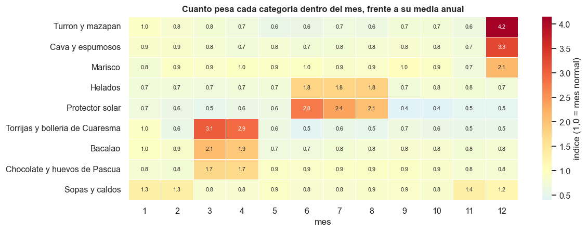
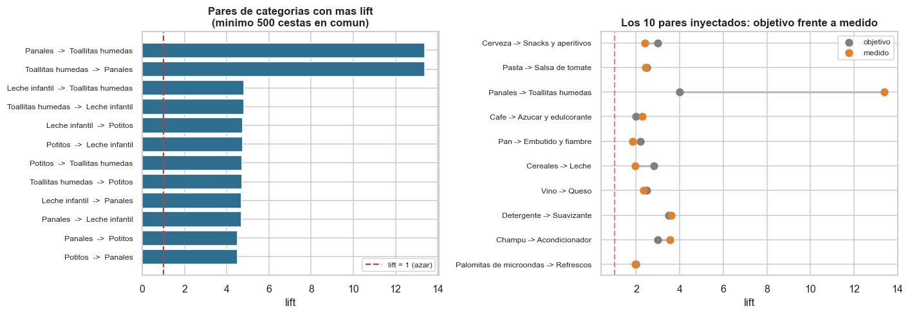
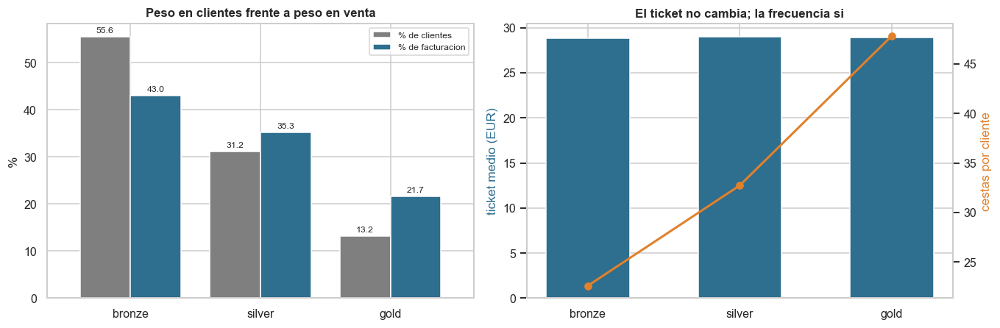
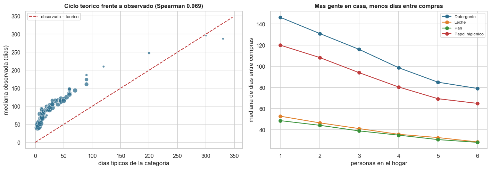
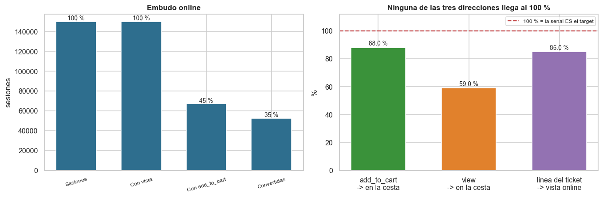
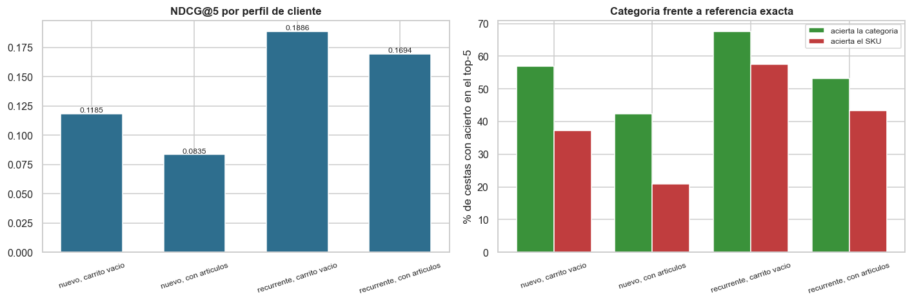
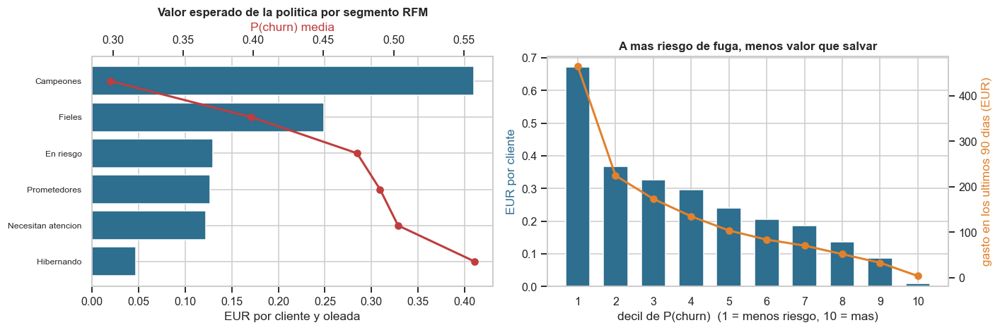
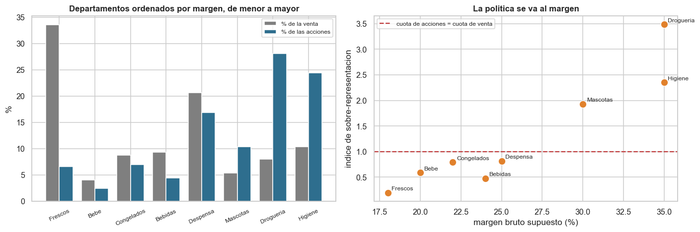

# Hallazgos de negocio

Ocho cosas que este dataset y estos modelos dicen sobre el negocio, y que cambian una
decision. No es el EDA pregunta a pregunta -- eso esta en
[`notebooks/01_eda.ipynb`](../../notebooks/01_eda.ipynb) -- sino lo que queda al cruzar el
dato de la Fase 2 con lo que hacen el recomendador (Fase 3) y la politica de Next Best
Action (Fase 4).

Lo escribe `python -m src.eda.findings`. Las consultas son las mismas funciones que usa el
notebook ([`src/eda/questions.py`](../../src/eda/questions.py), con tests en
[`tests/test_eda_questions.py`](../../tests/test_eda_questions.py)); los resultados de
modelo salen de `reports/*/metrics.json` y `predictions/*.parquet`. Ninguna cifra esta
tecleada a mano.

> Datos **100 % sinteticos**. Los "hallazgos" lo son sobre un supermercado simulado; lo
> que se puede llevar uno de aqui es el metodo, no las cifras.

---

## 1. El calendario mueve el surtido mas que el cliente

9 categorias tienen un pico estacional claro. El mas fuerte es
**Turron y mazapan**, que en el mes 12 pesa
**4,15 veces** lo que pesa un mes cualquiera dentro de
la venta total. No es que en diciembre se venda mas de todo: el indice esta calculado sobre
la *cuota del mes*, precisamente para separar las dos cosas.

**Por que importa.** Un recomendador que solo mire el historico personal del cliente nunca
propondra turron a tiempo, porque nadie lo compro en noviembre. Es la razon de que la
fuente de candidatos "popularidad x indice estacional" de la Fase 3 sea la unica que cubre
al 100 % al cliente nuevo con la cesta vacia. Y es tambien, como se vera en el hallazgo 8,
lo que le falta al modelo de propension.

---

## 2. Lo que se compra junto no siempre es complementariedad

Los 10 pares que el generador declara aparecen todos con lift por encima de 1
(10 de 10), pero el mas extremo se sale de escala:
**Panales -> Toallitas humedas** mide **13,39** frente a un
objetivo de 4,0.

La explicacion no es que la regla se aplicara mal, sino que **las dos categorias estan
restringidas a hogares con bebe**. El lift observado suma dos efectos: la complementariedad
real y la composicion de la clientela. Se ve claro en que todo el bloque de bebe -- leche
infantil, potitos -- sube al ranking sin que exista ninguna regla que lo una.

**Por que importa.** Para recomendar da igual: la senal es util venga de donde venga. Para
*decidir un surtido o un lineal* no da igual en absoluto, porque colocar toallitas al lado
de los panales no hara que las compre quien no tiene bebe. Es la diferencia entre una
correlacion que sirve para predecir y una que sirve para intervenir.

---

## 3. La palanca sobre un cliente valioso es la frecuencia, no el ticket

Los clientes `gold` son el **13,2 %** de la base y traen el
**21,7 %** de la facturacion, un indice de
1,64x. Lo interesante es de donde sale ese indice: el ticket medio
es practicamente identico en los tres niveles (28,95 EUR en gold
frente a 28,82 EUR en bronze). **La diferencia esta entera en la
frecuencia**: 48 compras frente a 23.

El tamano del hogar, en cambio, si mueve el ticket: de 23,60 EUR
en un hogar de una persona a 38,20 EUR en uno de
6.

**Por que importa.** Una campana que persiga subir el ticket medio de un cliente fiel esta
atacando la variable que no se mueve. Lo que se mueve es cuando vuelve, y eso es justamente
lo que hace accionable el ciclo de reposicion del hallazgo siguiente.

---

## 4. El ciclo de reposicion es real, y escala con el hogar

El ciclo observado reproduce el teorico con una correlacion de rangos de Spearman de
**0,978**, y se acorta de forma monotona al crecer el hogar en
las cuatro categorias dibujadas. Hoy, **52,4 %** de los
608.885 pares cliente-categoria tienen la recompra vencida, y eso alcanza
a 19.147 clientes.

La nube cae por debajo de la diagonal en los ciclos largos, y tiene explicacion: el
intervalo observado esta **truncado por la frecuencia de visita**. Nadie puede comprar
detergente cada 45 dias si solo pisa la tienda cada 60.

**Por que importa.** Es lo que convierte `due_for_repurchase` (Tarea 2) en una feature y no
en una corazonada, y lo que justifica escalar el ciclo esperado por `household_size_est` en
vez de usar un intervalo unico por categoria.

---

## 5. La sesion online no es el ticket, y por poco lo fue

150.000 sesiones, 35,0 % de conversion, y una
diferencia de solo 0,38 puntos entre el mejor y el peor
dispositivo: **el dispositivo, por si solo, no es una feature con senal**.

Lo que si la tiene es el panel de la derecha. De lo que se anade al carrito acaba en el
ticket el **88,0 %**; de lo que solo se mira, el
**59,0 %**; y en sentido contrario, solo el
**85,0 %** de las lineas del ticket dejo rastro online.

**Por que importa.** Las tres cifras estaban en el 100 % en la primera version del
generador, que emitia un `add_to_cart` por cada producto de la cesta y ninguno mas: la
sesion **era** el ticket escrito de otra forma. Usarla como feature habria dado un NDCG@5
espectacular y falso. Se arreglo el generador con abandono de carrito, productos que solo
se miran y un retardo entre ver y anadir. Es el hallazgo que mas trabajo ahorro: una fuga
de target encontrada antes de entrenar, no despues de presentar el resultado.

---

## 6. El techo del recomendador estaba en el dato

NDCG@5 = **0,1752** frente a 0,0868 del baseline sin
aprendizaje. El sistema acierta la **categoria** en el **60,0 %** de las
cestas y el **SKU exacto** en el **49,5 %**, y el pool de candidatos cubre el
76,9 % del target.

Por perfil, el peor es **2 - nuevo, con articulos** (NDCG@5 =
0,0835). Es el unico que no puede tirar ni de historial ni de ALS, y
encima su cesta ya va por la mitad, asi que lo facil de acertar ya esta dentro.

**Antes de la Fase 7 el mismo codigo daba NDCG@5 = 0,0343**, con la
categoria acertada en el 51,4 % de las cestas y el SKU solo en el
11,8 %. Ampliar el pool de 92 a 155 candidatos no movia el NDCG: el
limite no era el modelo sino el dato, porque el generador elegia la referencia casi al azar
entre ~24 por categoria. La Fase 7a le dio fidelidad de marca y un surtido de 8
referencias, y sin tocar una linea del recomendador la distancia entre categoria y SKU casi
se cierra.

Parte de la subida es el catalogo mas pequeno: el baseline tambien acierta mas
(0,0200 -> 0,0868). Lo que es merito del
ranker es su ventaja sobre ese baseline, que pasa de **x1,71** a
**x2,02**.

**Por que importa.** Un NDCG bajo se puede leer como "el modelo es malo" y no lo era.
Medir la categoria al lado del SKU fue lo que senalo al dato, y la demo ensena ahora las
dos cifras juntas para que un "0 de 5" en SKU no se lea como que el sistema no acierta
nada.

---

## 7. La politica no responde a quien se va, sino a quien todavia vale algo

Este es el hallazgo menos intuitivo del proyecto. La correlacion entre el valor esperado de
la accion y la probabilidad de churn es **-0,62** -- **negativa** --
y con el gasto de los ultimos 90 dias, **+0,95**.

| Segmento RFM | clientes | P(churn) media | gasto 90d (EUR) | valor (EUR/cliente) | con accion |
| --- | ---: | ---: | ---: | ---: | ---: |
| Campeones | 5.084 | 0,298 | 246 | 0,410 | 99,6 % |
| Fieles | 3.919 | 0,399 | 120 | 0,249 | 96,0 % |
| En riesgo | 3.112 | 0,474 | 57 | 0,129 | 57,8 % |
| Prometedores | 1.131 | 0,490 | 55 | 0,127 | 85,3 % |
| Necesitan atencion | 991 | 0,503 | 51 | 0,122 | 83,1 % |
| Hibernando | 4.492 | 0,558 | 19 | 0,047 | 37,3 % |

En el decil de mas riesgo de fuga la politica actua solo sobre el
**22 %** de los clientes y saca
0,009 EUR por cabeza; en el decil de menos riesgo actua sobre
todos y saca 0,671 EUR. El mejor segmento es
**Campeones** (0,410 EUR por cliente) y el peor,
**Hibernando** (0,047 EUR).

**Por que importa.** Un modelo de churn con AUC 0,85 invita a una conclusion que la
economia no sostiene: perseguir al que mas riesgo tiene. El valor de retener es
`P(churn) x valor_de_retener`, y en un cliente hibernado el segundo factor es casi cero,
porque no queda nada que salvar. **Un buen modelo de churn no es, por si solo, una politica
de retencion**: hace falta multiplicarlo por lo que el cliente todavia vale, y eso invierte
el orden de la lista.

---

## 8. La politica se va al margen, y sin calendario eso tiene un coste

Drogueria e Higiene son el **18,4 %** de la venta y se llevan el
**52,4 %** de las acciones. Frescos, que es mas de un tercio de
la venta, se queda en un indice de **0,20**.

| Departamento | de las acciones | de la venta | margen | indice |
| --- | ---: | ---: | ---: | ---: |
| Frescos | 6,6 % | 33,6 % | 18 % | 0,20 |
| Bebe | 2,4 % | 4,1 % | 20 % | 0,59 |
| Congelados | 6,9 % | 8,7 % | 22 % | 0,80 |
| Bebidas | 4,4 % | 9,3 % | 24 % | 0,48 |
| Despensa | 16,9 % | 20,6 % | 25 % | 0,82 |
| Mascotas | 10,4 % | 5,4 % | 30 % | 1,93 |
| Drogueria | 28,0 % | 8,0 % | 35 % | 3,49 |
| Higiene | 24,4 % | 10,4 % | 35 % | 2,35 |

Es aritmetica, no capricho: el cupon vale 2,54 EUR y hay que pagarlo con el margen del
ticket que provoque. Con un 18 % de margen en Frescos harian falta mas de 14 EUR de compra
solo para empatar; con un 35 % en Drogueria bastan 7,26 EUR.

**Y aqui aparece el punto ciego.** La categoria mas elegida por la politica es
**Protector solar** (1.443 veces), que en el mes del corte
(mes 11) vende **5,5 veces menos** que en su mes
pico (mes 6). El modelo de propension no tiene ni una feature de
calendario -- ni mes, ni indice estacional, ni nada -- asi que no puede descontar una
categoria de temporada fuera de temporada, y la economia (precio unitario alto por un 35 %
de margen) hace el resto.

**Por que importa.** Es un fallo barato de arreglar y caro de no ver: meter el indice
estacional de la Fase 2 en las features del modelo de propension. Queda anotado como deuda
en el [`ROADMAP.md`](../../ROADMAP.md).

---

## Lo que estos ocho tienen en comun

Cinco de los ocho son del mismo tipo: **una cifra que parecia buena o mala estaba midiendo
otra cosa**. El lift de 13 que era composicion de clientela; el solapamiento del 100 % que
era el target disfrazado; el NDCG bajo que era el techo del dato y no del modelo, y que subio al arreglar el dato; el AUC
alto que no basta para una politica; la categoria mas recomendada, que estaba fuera de
temporada.

Ninguno se ve mirando la metrica sola. Todos aparecieron al preguntar **de donde sale este
numero** y encontrar que la respuesta no era la esperada.
